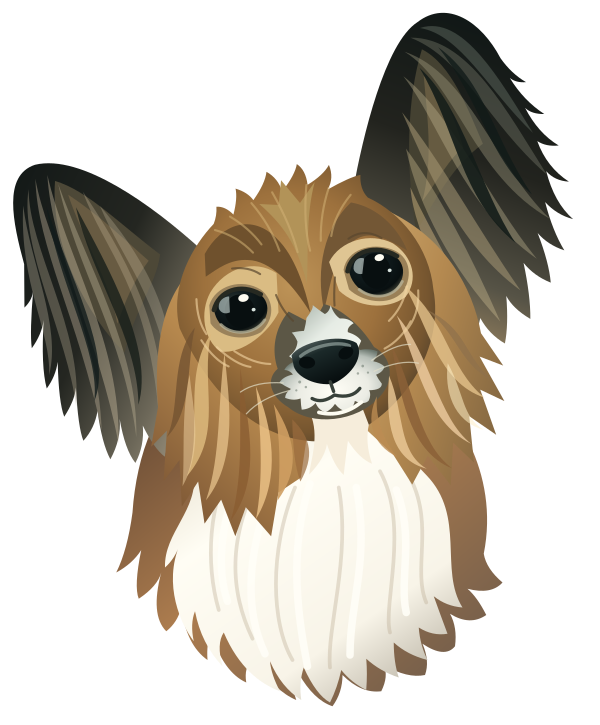

# Bozzard

<p align="center">
  
</p>
<p align="center">
  <em>In loving memory of Bozz ❤️<br />The inspiration behind Bozzard.</em>
</p>

A native 2D/3D game engine in Rust, with our own ECS and WebGPU rendering through `wgpu`. No Bevy dependencies.

The current slice includes scene objects, parent transforms, cameras, textured sprites, indexed cubes with depth, authored sun/ambient lighting, optional point/spot lights, baked diffuse GI, scene save/load, and a first native editor. PNG/JPEG textures and static OBJ/glTF/GLB models can be imported and reloaded while running, including base-color materials and transparency. The first playable third-person demo adds an authored controller, follow camera, kinematic box movement/jumping and simple trigger interactions. It is not yet a game exporter; full physics, audio, and networking remain future milestones.

## Run

Install [Rust through rustup](https://rustup.rs/) and Xcode Command Line Tools on macOS (`xcode-select --install`). The repository pins Rust 1.95.0.

```sh
# Start the rotating 3D scene on Metal (macOS), DX12 (Windows), or Vulkan (Linux).
cargo run -p bozzard-player

# Start in the 2D sprite view.
cargo run -p bozzard-player -- --view 2d

# Load the editable scene file rather than the embedded default.
cargo run -p bozzard-player -- --scene examples/demo/scenes/scene-lab.json

# Open the textured model workshop and asset browser.
cargo run -p bozzard-editor-app -- --scene examples/demo/scenes/model-lab.json

# Dark cube-built bonfire: Blueprint-spawned embers destroy themselves after 2.8 seconds.
cargo run -p bozzard-editor-app -- --scene examples/demo/scenes/bonfire-lab.json

# Load file-backed textures and meshes (edit the source assets to hot reload).
cargo run -p bozzard-player -- --scene examples/demo/scenes/asset-lab.json

# Run the same scene for 120 fixed ticks without a graphics adapter or window.
cargo run -p bozzard-server -- --ticks 120
```

Windows needs Rust's MSVC toolchain and Visual Studio C++ build tools. Linux needs a C linker, Vulkan drivers and window-system development packages; the CI workflow lists Ubuntu packages. `--backend metal|dx12|vulkan` selects one graphics API explicitly. `--software` requires a software adapter; `--hardware` requires a reported integrated/discrete GPU. Missing adapters fail visibly.

The [bonfire demo](docs/bonfire.md) demonstrates **Spawn Prefab / Destroy Prefab** in a dark, fire-lit scene. Press **Play**, then **Space** in the viewport to toggle emission and watch the remaining embers expire.

## Lighting and material galleries

Try the [material and lighting showcases](docs/showcases.md) for textured PBR samples, fog, colored lighting and transform controls:

```sh
cargo run -p bozzard-editor-app -- --scene examples/demo/scenes/material-gallery.json
cargo run -p bozzard-editor-app -- --scene examples/demo/scenes/neon-gallery.json
```

## Material effect demo

Open `cargo run -p bozzard-editor-app -- --scene examples/demo/scenes/shader-lab.json` (or use `bozzard-player`). Select a whole object and choose **Texture / material effect** in the Inspector: **World normals**, **Procedural checker**, or **Toon (3 bands)**. Tint colors checker/toon; UV repeat controls checker density (8 cells per repeat); rotating an object changes its world-normal colors. Toon uses the sun direction and shadow visibility, not full PBR/local lighting. Effects replace the texture slot and apply to every surface, including imported models; choose White to restore imported textures. They are view effects, not GI bake materials; the examples opt out of contributing to GI.

## First playable demo

```sh
# Select any object, click Play, and hover the 3D viewport — selection does not control the player.
cargo run -p bozzard-editor-app --locked --offline -- --scene examples/demo/scenes/first-trail.json
# The same authored level starts immediately in the native player.
cargo run -p bozzard-player --locked --offline -- --scene examples/demo/scenes/first-trail.json
```

**WASD** moves relative to the follow camera, **Space** jumps when grounded, and **right-drag** orbits (visible, unconfined pointer). Collect three gold cubes, cross the blue checkpoint and reach the green goal. Jump just before the brown step while moving forward. Falling off respawns at the latest checkpoint, retaining collected gold. Progress/win appears above the editor viewport and in the standalone window title. Editor **Stop / Play**, or standalone **physical R**, resets the run. Inspector **Player Controller** and **Trigger volume** author the settings; editor Save/Stop never publish simulated state.

See the [quick-start, fastest manual checklist, authoring contract and limits](docs/playable-demo.md). Dependencies must be cached for `--offline`; omit it on first download. The level reuses the repository's tiny static CC0 model, with no external assets.

## Player controls

For scenes **without** a Player Controller (including the embedded default):

| Key | Action |
| --- | --- |
| `1` / `2` | Switch to 2D / 3D |
| Space | Pause/resume fixed-step scene animation |
| Arrow keys | Pan the active camera in parent-space X/Y |
| F5 | Save current scene state to `work/saved-scene.json` |
| R | Reload the `--scene` source, or reset the embedded default |
| Escape | Close |

Use `--save-path FILE` to choose the F5 destination. Saving captures current object transforms (including animation and camera movement); it does not yet distinguish authored state from a play-mode world. Reload validates a replacement before changing the running world. A failed reload preserves the current scene and reports the error in the title/terminal. R reloads the original source, not the last F5 destination unless they are the same file.

```sh
# Write the embedded scene to a file without opening a window or requesting a GPU.
cargo run -p bozzard-player -- --write-scene work/my-scene.json

# Edit JSON, press R to reload, and F5 to save to the same file.
cargo run -p bozzard-player -- --scene work/my-scene.json --save-path work/my-scene.json

# Headless simulation can load and save the same document.
cargo run -p bozzard-server -- --scene work/my-scene.json --ticks 120 --save-scene work/simulated.json

# Open the native editor on a scene file (creates the path on first save).
cargo run -p bozzard-editor-app -- --scene work/my-scene.json
```

The headless executable runs finite ticks as fast as possible and exits. It does not listen for clients yet.

## Editor

The Hazel-inspired workspace stacks **Scene Hierarchy** and **Properties** on the left, keeps the viewport central, puts **Scene Settings** on the right, and docks **Content Browser** below. Panel dividers resize; **View** toggles settings, the browser, and renderer statistics. **File** holds scene/import commands; **Edit** holds history and entity actions. The centered **▶ / ■** controls start and stop Play. Component sections collapse independently per entity, with colored XYZ fields. The browser groups scene assets into textures/models, supports search and previews, and offers double-click **Add to scene**, right-click actions, and a **Details** toggle. No node-graph editor is implied by this visual layout.

For Khronos Sponza, run `python3 tools/download_sponza.py`, then `cargo run -p bozzard-editor-app -- --scene examples/sponza/scene.json`. Assets remain gitignored; see [source, licensing and verification](docs/sponza.md).

`bozzard-editor` is a native egui/wgpu shell over the same scene document and renderer. It edits the authored scene with validated commands: hierarchy with create/duplicate/delete of subtrees, an inspector for names, parents, transforms, cameras, spin, and drawable layers/meshes/textures/colors, and a GPU viewport with click selection plus move/rotate/scale axis handles. Rotation rings are draggable along their arcs, with one undo entry per gesture. Hover highlights the nearest axis with a warm outline; the captured axis stays emphasized throughout the drag. In 3D, right-drag captures the mouse for world-upright noclip look (release right mouse or press Escape to release); hold right mouse and WASD to fly forward/back/sideways, Space up / Ctrl down, and Shift to move faster. Middle-drag pans and scroll dollies forward/backward. In 2D, right/middle-drag pans and scroll zooms. Reset view restores the authored camera viewpoint; navigation never changes the scene document. The 2D/3D toggle switches the edited layer.

Scene opens, asset imports, the initial catalog load for a file opened in the editor, periodic editor refreshes, and save preparation run in bounded background jobs with visible progress stages. The final atomic scene-file write happens on the UI thread only after save preparation succeeds and the document revision is unchanged. Cancelling stops publication; an importer or codec may finish its current call, after which the result is discarded. “Save and continue” waits for the save job before proceeding. Player startup and CLI scene loading stay synchronous. CPU decoding and validation happen in the worker where applicable, while GPU uploads and replacement stay on the render thread; a failed hot reload leaves the last-good asset visible.

During explicit editor open, import, and save jobs, authoring controls are temporarily disabled. Hot reload leaves authoring available; cancelling editor reload pauses automatic checks until **Reload** is clicked. Undo and redo reuse decoded asset data retained in history instead of rereading source files.

GPU residency prepares resources on one background worker per residency from a shared immutable CPU snapshot, then uploads them in staged slices of at most 4 MiB per frame with a soft 4 ms CPU slice. Buffer encoding and level-0 texture copy/alpha-scan operations are each capped at 256 KiB; texture writes use rows, and vertex, index, PBR attribute, and mip generation work is chunked as well. The final install waits until all writes and mip passes are submitted. Editor progress shows **Preparing** and **Uploading** with **Cancel this upload**; initial GPU resources block the viewport while other panels remain responsive. Player startup and CLI loading drain the same queue synchronously, while hot reload stays active. This budget is scheduling guidance rather than a hard wall or GPU-time guarantee.

Imported glTF/GLB model maps use GPU-generated mipmaps and their authored wrap, minification, magnification, mipmap, and independent UV-set settings. The renderer applies metallic/roughness GGX shading, normal mapping, indirect-only ambient occlusion, sRGB emissive, double-sided materials, and reflected transforms. Scenes can author a global sun and diffuse ambient term: sun direction points toward the sun and defaults to linear white intensity 3, while ambient defaults to white intensity 0.03; finite nonzero directions, RGB 0..1, and intensities 0..100000 are validated. Both PBR and legacy lit surfaces use these settings, with Lambert sun/π plus ambient for legacy lighting; unlit surfaces remain unlit. The editor's Scene Settings panel exposes azimuth/elevation, colors, intensities, reset, shadow enable, resolution, and biases, using normal history and Play-mode rules. sRGB base-color/emissive and linear normal/metallic-roughness/occlusion textures are shared per source and color space. Standalone images and procedural pixel-art textures retain nearest repeat filtering; OBJ imports remain diffuse-only.

Sun shadows use one camera-independent `Depth32Float` map over all lit world geometry, with texel-snapped XY center and 3×3 PCF plus depth, slope, and normal bias. Shadows are enabled by default at 2048 resolution; the supported range is power-of-two 256–4096, with UI choices 512/1024/2048/4096. `shadow_bias` defaults to 0.005 and `shadow_normal_bias` to 0.01 world units, each validated in 0..1. Casters honor base alpha cutoff, authored sampler/UV/tint opacity, PBR double-sided state, and reflected winding; alpha-blended surfaces receive shadows but do not cast them. Ambient, emissive, and unlit contributions are unaffected. The map spreads its finite resolution over the whole scene, so detail decreases as scene bounds grow. Point and spot lights can opt into camera-independent local shadows with the shared `shadow_bias` and `shadow_normal_bias` settings. Up to four authored shadow-enabled points (including disabled ones) use six overlapping-border 512px `Depth32Float` face maps each (about 6 MiB per active point, up to 24 MiB); up to eight authored shadow-enabled spots use fixed 1024px layers (up to 32 MiB). Point maps use 3×3 PCF with per-face frustum culling. Inactive, black, or zero-intensity lights do not allocate or render a map. Local shadows affect only their light's direct contribution; sun, ambient, emissive, and baked GI remain unchanged. No hardware ray-tracing feature or new rendering dependency is required. Cascades, local reflection probes, and auto-exposure remain future work. See [point and spot lights](docs/lighting.md) and [bloom](docs/lighting.md#bloom).

Undo/redo is bounded to 100 changes and coalesces each drag into one entry. Play starts a separate simulated world; editing is disabled while it runs and Stop restores the untouched authored scene. Saving always writes the authored document, even during Play. The Content Browser offers previews, search, filters, and undoable add/assign/remove actions. Imports copy PNG/JPEG/OBJ/glTF/GLB files into an `assets/` folder next to the scene before adding them to the catalog. glTF/GLB imports become `assets/<id>/model.gltf` with flat external buffer and image files, preserving metadata without large base64 expansion; material-bearing OBJ imports retain the existing packed single glTF path. A cancelled, stale, or failed glTF/GLB import removes its owned directory, while accepted imports and remove/undo retain files. Dropped files import (or open, for `.json`). Unsaved changes prompt before New/Open/close, and the workspace layout persists in the platform application-data directory. New scenes default to fresh filenames under `~/Documents/Bozzard Projects` (`%USERPROFILE%/Documents/Bozzard Projects` on Windows); use Save As to choose another location.

The 3D display pipeline shades and blends into bounded `Rgba16Float` scene color, caps scene radiance at 60000, optionally composites scene-linear bloom, then applies exposure and optional per-channel Reinhard tone mapping once before sRGB display encoding. `exposure_ev` defaults to 0 and accepts -16..16 stops; each positive stop doubles radiance. Bloom is disabled by default; its intensity defaults to 0.15 (0..10), threshold to 1 (0..60000 scene-linear radiance before exposure), and Spread/scatter to 0.7 (0..1). Disabling tone mapping bypasses only the curve. 2D extraction bypasses exposure, bloom, and tone mapping but keeps display encoding. Auto-exposure is not implemented; the `draw_linear` diagnostic path bypasses display transforms, including bloom, for numeric fixtures and requires a non-sRGB target.

Scenes also include one procedural distant environment by default: zenith `[0.15, 0.32, 0.65]`, horizon `[0.65, 0.70, 0.80]`, ground `[0.12, 0.10, 0.08]`, intensity `0.35`, and a background toggle. Colors are linear RGB in 0..1 and intensity is 0..1000. The GPU precomputes diffuse cosine-convolved and GGX specular IBL resources on first use; later color/intensity edits update uniforms only. PBR surfaces use diffuse and roughness-dependent specular environment light, legacy surfaces use diffuse environment light, and 2D extraction disables it. HDR panorama import, local reflection probes, and atmospheric simulation are not implemented. Baked diffuse GI is available as one bounded static probe volume with diffuse transport; CPU transport samples source textures at mip level zero, while runtime evaluates probe SH and trilinear visibility. Glossy GI, caustics, multiple volumes, and runtime rebaking are not implemented. The split-sum approach follows [Filament's material documentation](https://google.github.io/filament/main/filament.html); the implementation is Bozzard's own. See [baked global illumination](docs/lighting.md#baked-global-illumination).

The renderer uses a conservative per-surface homogeneous AABB culling test in the color pass. Sun shadows retain camera-independent bounds for all offscreen casters, while each local-light shadow map culls against its own light frustum or face frustum. Compatible consecutive draws reuse pipeline and shared shadow/environment bindings without changing draw or alpha order. The viewport can show compact `FrameStats` metrics for scene items, visible/culled surfaces, color triangles, shadow draws/triangles, pipeline binds, and CPU total/prepare/encode/submit times; these are not GPU time or FPS. The `--smoke --scene FILE --benchmark-frames N` mode (1–1000) compares reference, culling, and full-cache configurations with warmups, interleaved timings, and per-frame GPU waits, reporting CPU and synchronized CPU+GPU+wait medians. Diagnostic culling/state-cache toggles are available; GPU timestamps, multidraw, instancing, and occlusion culling remain unsupported.

Ordinary viewport clicks select the nearest imported surface, updating its outline and material properties. **Alt-click** selects the whole model for transforming; surfaces can also be searched in **Properties → Imported surfaces**. The selected surface has its own Move/Rotate/Scale gizmos and **Properties → Transform** controls, using a model-space offset and a pivot at its source bounds center. **Select whole model** returns to owner editing. Source node/mesh/primitive and material names, factors, map dimensions, and sampler details remain read-only; **F** / **Frame surface** frames one surface and **Shift+F** frames the layer. Picking pauses while CPU model data differs from the GPU's last-good resident data, and outlines/framing wait for matching graphics. Selection is transient, but per-instance surface transforms and material overrides are saved. Enable **Override texture / effect** in Properties to replace its base-color map; import images through Content Browser and choose them in Properties or **Assign to selected**. Tint, UV repeat and PBR metallic/roughness are also editable. **Reset override** restores its material without moving it; **Reset transform** restores its pose. Undo/redo, Play, picking, shadows and GI all honor these edits without changing shared source assets. Imported surface entities own independent components, including physics; legacy surface overrides remain readable. See [submesh editing](docs/assets.md#editing-a-submesh). An unpartitioned OBJ remains a whole object with no synthetic surface list, and OBJ remains diffuse-only.

Imported surfaces support per-object material overrides: tint multipliers and opt-in metallic/roughness replacements for PBR maps, with **Reset override** returning to the source material. Overrides follow duplicate, Undo/redo, save/reopen, and Play isolation; source-signature mismatches leave them stored but inactive with a warning. Shared GPU data is unchanged, and OBJ diffuse surfaces support tint only.

Shortcuts: Cmd/Ctrl+S save, Cmd/Ctrl+Z undo, Cmd/Ctrl+Shift+Z redo, Cmd/Ctrl+D duplicate, Delete removes the selected subtree. An active camera's subtree cannot be deleted.

### 3D box colliders

Objects may have an optional `BoxCollider` with a local-space center, full local dimensions, and an enabled flag. The inspector adds or removes the component and edits these values; the box follows the object's complete parent transform, including rotation, nonuniform or mirrored scale, and shear. Collision detection is discrete: touching counts as overlap. `SceneInstance::collisions(&World)` is available headlessly and returns sorted, unique overlap pairs by object ID. `SceneInstance::move_box(&mut World, id, world_delta)` sweeps one box through enabled boxes and static triangle Mesh Colliders, stops and slides on contact, and reports the requested and applied motion plus contacts in `MoveResult`; the world delta is converted into the moving object's parent-local space. Rotation sweeps, dynamic rigid-body impulses, and pushing are not included.

Use **Add Component → Mesh Collider** to bake actual triangles from a mesh or imported surface. It is an optional static component; moving bodies still use Box Collider + Rigidbody. See [Mesh Collider setup, rebuild workflow and limits](docs/mesh-colliders.md).

Enable **Colliders** in the 3D viewport to see cyan wire boxes and green mesh guides; overlapping boxes turn orange and the overlay lists pairs. These debugging wires show through scene geometry. The default demo includes colliders on the hero cube, coral cube, and floor.

For scenes without an authored Player Controller, select an enabled collider object and start Play, hover the 3D viewport, and use WASD for world-horizontal movement, Space/Ctrl for up/down, and Shift for faster movement.

Try `cargo run -p bozzard-editor-app -- --scene examples/demo/scenes/response-lab.json`, select **Move Me**, and press **Play**. Move toward the walls with WASD or down onto the floor with Ctrl; Stop resets the authored scene.

Movement supports one collider at a time; movers carrying enabled child colliders are rejected. Deep initial penetration is recovered within a bounded budget or returns an error without changing the world. Pair scanning remains unaccelerated, suitable for these initial demo scenes.

## Gameplay Blueprints

Use **Properties → BLUEPRINTS → + New** (or **+ Spin example**) to author gameplay without code in the dedicated **Blueprint** pane. Connect typed nodes, bind object references in the Inspector or node editor, save/load reusable `.blueprint.json` graphs, and attach multiple ordered graphs to an object or prefab member. Mesh instances remain independent; coded behavior still works alongside graphs.

Try `cargo run -p bozzard-editor-app -- --scene examples/demo/scenes/blueprint-lab.json`: select **Hero Cube**, open Blueprint, then Play. In the Scene viewport, Space toggles its visibility while another graph keeps it spinning. See [the no-code workflow, node catalog, and current limits](docs/blueprints.md).

Try `cargo run -p bozzard-editor-app -- --scene examples/demo/scenes/pressure-plate-lab.json` for two independently bound pressure-gate prefab instances. Walk the orange player onto either teal plate to raise its amber door; leaving closes it. The scene also demonstrates **Sensor (Blueprints)** triggers without built-in gameplay effects.

## Prefabs

The prefab authoring workflow saves a selected hierarchy as a linked JSON asset, places linked instances, and supports component-level overrides with refresh, apply, and unpack operations. See the [prefab workflow and current limits](docs/prefabs.md).

Try the linked-instance fixture with `cargo run -p bozzard-editor-app -- --scene examples/demo/scenes/prefab-lab.json`. Select the first **Body**, change its tint, and choose **Apply to prefab**: the second body follows, the orange third body keeps its local override, and all three root placements stay unchanged. This applies to the example's source asset; use your own Save-as-prefab copy for experiments or restore the example with Git afterward.

## Workspace

| Package | Responsibility |
| --- | --- |
| `bozzard-ecs` | Generational entities, sparse-set storage, safe queries, resources, commands |
| `bozzard-app` | Serial system scheduling, compiled-in plugins, fixed ticks, bounded catch-up |
| `bozzard-scene` | Versioned JSON, persistent IDs, validated hierarchy, camera math, ECS instances, box overlap queries |
| `bozzard-assets` | CPU image/OBJ/glTF/GLB imports, store-scoped handles, load states, last-good hot reload |
| `bozzard-render-assets` | Shared editor/player GPU upload conversion bridge; importer and renderer remain independent |
| `bozzard-render` | Native WebGPU, indexed geometry, texture sampling, depth, GPU readback |
| `bozzard-demo` | Embedded reference scene, movement/rotation systems, scene file helpers |
| `bozzard-editor` | Validated document transactions, undo/redo, play isolation, imports, ray picking |
| `bozzard-player` | Window/input, scene controls, render extraction, GPU verification |
| `bozzard-editor-app` | Native egui editor shell: hierarchy, inspector, assets, viewport gizmos |
| `bozzard-server` | Graphics-free scene simulation and snapshots |

Our crates forbid unsafe Rust. ECS/app use only the standard library. Scenes add `glam`, Serde, and JSON; the renderer never depends on the ECS or scene document crate. The player and editor add the image/model importers; the server still has no image decoder, GPU, or window dependency. See [asset imports](docs/assets.md), [Sponza reproduction](docs/sponza.md), [scene format](docs/scenes.md), [architecture](docs/architecture.md), and [milestones](docs/roadmap.md).

## Verification

```sh
cargo fmt --all -- --check
cargo clippy --workspace --all-targets --locked -- -D warnings
cargo test --workspace --locked
python3 tools/check_headless.py
cargo run -p bozzard-player -- --smoke --backend metal
cargo run -p bozzard-player -- --frames 3
cargo run -p bozzard-player -- --view 2d --frames 3
cargo run -p bozzard-editor-app -- --smoke work/editor-smoke --backend metal
```

Ordinary Cargo tests require no GPU. They cover entity lifetimes, scheduling, scene hierarchy/validation, projection conventions, animation, scene round-trips, control commands, CLI save behavior, asset reload failure/recovery, relocated asset references, and editor document transactions (subtree commands, gesture coalescing, bounded history, play isolation, save/Save As, project-local imports, and ray picking). Graphics checks are explicit and never silently skip.

The editor smoke opens the real native UI, exercises create/transform/undo/redo/play/save/load, captures a window screenshot, and verifies the viewport rendered more than a clear color. Collider verification covers the editor's Colliders viewport toggle, orange overlap/cyan non-overlap wire boxes, and the overlap-pair overlay; headless checks exercise `SceneInstance::collisions(&World)`. Diagnostics land in `work/editor-smoke/`.

The smoke suite preserves the original triangle check, then verifies texture quadrants, indexed cube depth occlusion in both draw orders, camera translation, resized targets, animated 2D/3D scenes, and identical images after save/reload. Imported-asset checks verify UV orientation, sRGB decoding, corrupt-file recovery, and mesh replacement. Actual scene PPM diagnostics appear in `work/gpu-smoke/` and now contain display-encoded output, matching the display transform. Numeric material fixtures use diagnostic linear readback instead. Reference color checks tolerate two byte values; same-device save/reload and draw-order comparisons are exact. These checks are correctness fixtures, not performance or image-quality benchmarks.

Foundation CI passed on all three hosted platforms at [`d319721`](https://github.com/kaz0r/Bozzard/actions/runs/34019215092), including Linux presentation. The initial run exposed a missing X11 keyboard runtime, which is now installed explicitly. The asset slice adds CPU and GPU acceptance checks to the same matrix; see the latest run for its remote validation status.

## Development bundles

```sh
cargo build --release --locked -p bozzard-player -p bozzard-server -p bozzard-editor-app
python3 tools/package.py --verify --window --editor-window
```

This builds a host-native ZIP in `dist/`, including macOS `.app` bundles for the player and editor on macOS, editable built-in/imported scenes, and their image and model files. `--editor-window` additionally runs the packaged editor smoke and captures its UI. Default scene data, shaders and procedural textures are embedded, so the executables can run without the source checkout. Verification extracts the ZIP, runs a headless imported-scene save, loads that snapshot in the GPU suite, and optionally presents both native views from an empty working directory.

This is development demo packaging, not a general user-game export pipeline. OS runtimes and drivers remain prerequisites. Public distribution still needs license/notices, signing/notarization, installer choices, and minimum OS/runtime baselines.

## Cross-platform CI

[CI](.github/workflows/ci.yml) defines native Ubuntu x86-64/Vulkan, Windows x86-64/DX12, and macOS Apple Silicon/Metal jobs. Each runs lints, CPU tests, headless dependency checks, release builds, and rendering from extracted packages. Linux uses Mesa software Vulkan; Windows requests WARP; macOS requests Metal. Linux also presents both player views and runs the packaged editor UI smoke under Xvfb. No missing-adapter skips are allowed.

[Hardware GPU](.github/workflows/hardware.yml) runs manually on a provisioned desktop runner with labels `self-hosted`, `bozzard-gpu`, and the OS label. It requires Rust, Python 3, Bash (Git Bash on Windows), working graphics drivers, and an interactive desktop. It verifies real GPU classification and both windows. Only the currently booted OS of a dual-boot computer is available. Run trusted revisions only on a personal hardware runner; external PR code is never dispatched there automatically.

Local Metal checks have passed on an Apple M2 Pro. The foundation matrix has passed on Linux/Vulkan (llvmpipe), Windows/DX12 (WARP), and GitHub-hosted macOS/Metal. Hosted offscreen checks do not establish native Windows/macOS desktop presentation; macOS presentation is tested locally, and Windows desktop presentation remains a hardware-runner check. OS labels and Cargo dependencies are pinned, while runner image contents and OS packages continue to receive updates. Additional GPU vendors and Intel macOS remain separate future coverage tiers.

### Gravity

Open `examples/demo/scenes/gravity-lab.json`, select **Falling Box**, and press **Play**. The box falls onto the floor; use WASD over the viewport to move it off an edge. Stop restores the authored scene.

The inspector's **Gravity** component adds a box collider when needed, with positive world-down acceleration and a maximum fall speed. Play displays Grounded/Falling. Gravity runs at the shared fixed simulation timestep in editor, player and headless server. Disabling gravity or its collider resets fall velocity; Space/Ctrl vertical movement is available only without enabled gravity. Configuration saves with the scene; velocity and grounding reset on spawn.

This is kinematic box gravity, with no dynamic pushing or rigidbody simulation. Bodies step sequentially in object-ID order. `SceneDemo::check_simulation()` surfaces simulation failures; built-in applications check it.

In editor Play, press **Space** over the 3D viewport to jump with the selected grounded gravity box (set **Jump speed** under Gravity; default 5 units/s). Midair presses and held-key repeats do not jump. Ceiling contact cancels ascent. The headless API is `SceneInstance::jump_box(world, id, speed)`, returning whether a jump was accepted.

Jump speed is saved per object with the scene. Existing scenes that omit it retain the 5 units/s default. Adjust it before Play; higher values produce higher jumps.

The Gravity inspector estimates jump height and airtime (landing at the same height without obstacles, including the fall speed limit). **Reset gravity defaults** restores tuning values while preserving Enabled; Undo restores your previous settings.

Hierarchy branches have disclosure arrows plus **Expand all / Collapse all** controls. Collapse state is editor-only and resets on New/Open; newly selected descendants and successful reparenting reveal their ancestors. The Hierarchy search filters object names and IDs without case sensitivity, including nested objects even under collapsed branches. Search remains a flat list and temporarily disables Expand/Collapse all without changing stored branch state. Clear it with **×** to restore the full tree. Select an object and press **⌘Return** on Mac / **Ctrl+Enter** elsewhere, **F2**, or click **Rename** to edit its name inline in Edit mode: **Enter** applies one undoable change, while **Escape** or clicking away cancels. Starting a rename clears the search so the selected row is visible. Right-click a Hierarchy row for **Rename**, **Duplicate** (⌘D / Ctrl+D), **Frame Selection** (⌘Shift+F / Ctrl+Shift+F), and **Delete** (⌘Backspace on Mac, or Delete). Menu actions target the clicked row and show platform-specific primary shortcuts: Mac shows Cmd+Return, Cmd+D, Cmd+Shift+F and Cmd+Backspace; Windows/Linux show F2, Ctrl+D, Ctrl+Shift+F and Delete. Alternate rename bindings remain available. Shortcuts are inactive while typing; these actions are Edit-only. The existing F / Shift+F viewport framing shortcuts remain available. In Edit mode, drag a Hierarchy object onto another row to make it a child, or onto **Scene root** or the blank area below the Hierarchy rows to unparent it. You can also right-click a child and choose **Unparent** (disabled for root objects). Drop targets highlight; this works in filtered results too. Reparenting preserves the object and descendants' world transforms and is one undoable change. Cycles and local transforms requiring unsupported shear (often rotated, nonuniformly scaled parents) are rejected with a status error rather than moving/distorting the object. This does not reorder siblings. Double-click an object in the Hierarchy (including search results) to select and frame it and its children in the current viewport layer while in Edit mode; this does not change the authored camera or undo history. During Play, the Gravity inspector displays **Rising**, **Falling**, or **Grounded** and signed vertical speed.

Creating a Cube switches to 3D; creating a Sprite switches to 2D. Successful creation or duplication clears the hierarchy filter so the new object is listed. Duplicate/Delete require a selected object; their tooltips show shortcuts and explain that children are included.

### Transform snapping

Choose **Move / Rotate / Scale** in the viewport toolbar, or press **W / E / R** over the idle viewport (shortcuts are inactive during text entry, navigation, dragging, and Play). Drag Move arrow tips or shafts, Rotate rings, or Scale squares/shafts; the white **All** center square scales uniformly when dragged up/right (down/left shrinks). Rotation rings follow the authored Y-X-Z Euler axes, scale handles follow the object's rotated local axes, and Move uses parent-space axes. Enable **Snap** in the viewport toolbar, then drag a Move, Rotate, or Scale gizmo. **Snap settings** sets the increments (defaults: 0.5 local units, 15°, and 0.1 scale multiplier). Hold **Ctrl** while dragging to temporarily invert Snap. Changes are relative to the start of each drag, preserving existing offsets; this is not absolute world-grid alignment. Scale snapping preserves mirrored axes and avoids zero scale. Numeric inspector edits remain exact, each drag remains one Undo action, and preferences persist between editor sessions. Move uses a captured ray/axis constraint rather than pixels per projected unit, including perspective depth and rotated, scaled or mirrored parents. Nearly end-on constraints preserve the last valid position. Handles stay screen-sized at long distances; larger hit areas, solid arrowheads, contrasting outlines and axis badges improve targeting. Gizmos remain visible during right-drag, middle-drag and fly navigation, but cannot edit transforms until navigation ends.

Press **Escape** during a gizmo drag to restore its starting transform without adding an Undo entry or clearing Redo history. Document keyboard shortcuts are paused while dragging.

### Framing the viewport

For trackpads, hover the 3D viewport and press **Tab** to toggle fly mode. Look around without holding a button; WASD, Space/Ctrl and Shift use the same controls as RMB flight. Press **Tab** or **Escape** to release the cursor; once navigation is released, **Escape** clears the selected object or inspected imported surface and its outline. Focus loss, Play, dialogs and switching to 2D also release fly mode. RMB navigation remains available.

In Edit, use **Frame selected** (**F** over the viewport) to fit an object and its descendants, or **Frame all** (**Shift+F**) to fit drawable objects in the active layer. Imported mesh geometry and parent transforms are included. Selections without visible geometry center on their origin. Framing retains the 3D viewing direction and works in perspective and orthographic views; **Reset view** restores the authored camera view. It changes editor navigation only, without modifying scene cameras or Undo history. If geometry exceeds the authored camera's depth clipping range, the editor reports this instead of changing that camera.
