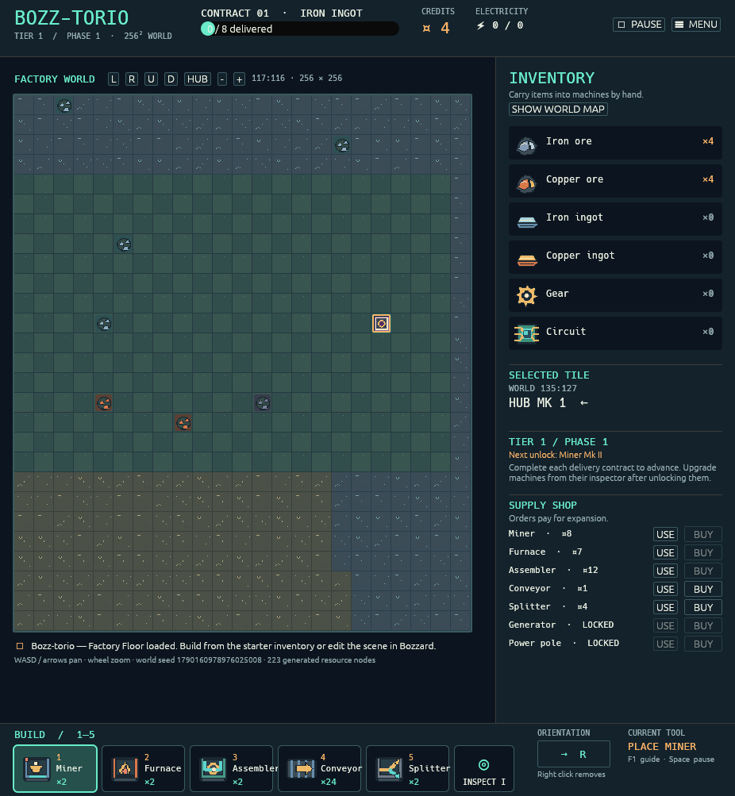

# Bozz-torio

Bozz-torio is a standalone 2D factory game in the Bozzard workspace. Each new factory has a **256 × 256 world** with seeded, scattered iron, copper, and coal nodes and eight broad terrain biomes. The authored starter district is the editable Bozzard scene [`scene/bozz-torio.json`](scene/bozz-torio.json), named **Bozz-torio — Factory Floor**. Its **100 original pixel-art sprites** (84 more than the first atlas) are generated by `tools/generate_sprites.py`, stored in [`assets/sprites.png`](assets/sprites.png), and indexed in the [sprite manifest](assets/sprite_manifest.json). The simulation runs at a fixed five ticks per second, independently of rendering.



The [main menu](docs/menu.png) has a matching original visual style.

The supplied starter district has two miners, two furnaces, two assemblers, 24 conveyors, two splitters, a small item stash, and four credits. Place a miner on an iron deposit, a furnace immediately to its right, and a conveyor line to the delivery hub. Deposits never deplete. Panning reveals the generated world around this district. Its seed is saved with the factory, so nodes stay put when you continue.

Every tier has three delivery phases. Finish a phase to receive credits and conveyors and unlock the next upgrade. Tier 1 unlocks Miner Mk II, Furnace Mk II, then electricity. Tier 2 unlocks Assembler Mk II, Generator Mk II, and Power pole Mk II; Tier 3 unlocks faster conveyors, splitters, then Mk III machines. Later tiers continue the upgrade sequence. Use the selected machine's **UPGRADE** button after its phase is complete. Mk II improves mechanical speed; electricity adds another boost and enables the full speed of Mk III and later machines.

Once electricity unlocks, buy a generator and place it on a coal seam. Its six-tile radius supplies up to 12 power per tick. Place power poles within its coverage to extend the connected network. Upgraded producers consume power while boosted; upgraded conveyors and splitters can move an extra item hop when powered. Generator and pole upgrades raise capacity and reach.

## Edit the game scene

From the repository root, open the factory in the Bozzard editor:

```sh
cargo run -p bozzard-editor-app -- --scene apps/bozz-torio/scene/bozz-torio.json
```

Use the **2D** viewport to edit the 22 × 15 starter district: move its iron, copper, or coal deposits and delivery hub, paint the tilemap, or duplicate a machine template onto a cell. The surrounding world is generated when a new factory starts. A miner must sit on iron or copper; a generator must sit on coal. Rotate placed machines in 90-degree steps to set output direction. The scene blackboard holds starter supplies, credits, first-order settings, and `world_seed`: `0` generates a fresh world each time, while a positive value reproduces the same world. Save the scene, open Bozz-torio, and choose **NEW FROM EDITOR SCENE** to play your layout. **CONTINUE FACTORY** resumes the existing save. The editor's **Play** button previews the authored district; the native game runs the factory simulation, progression, and HUD.

The source game is in [`src/`](src/). For a different scene file, start the game with `--scene PATH` and choose **NEW FROM EDITOR SCENE**. The game loads the sprite atlas named by that scene's `assets.sprites.path` entry.

## Run

```sh
cargo run -p bozz-torio -- --offline
cargo run -p bozz-torio -- --steam-app-id 480
```

`--offline` skips Steam initialization. Without it, the game connects to Steam when the client is available and runs offline when it is not. App ID selection is, in order: `--steam-app-id`, `SteamAppId`, a `steam_appid.txt` next to the executable, then the test ID `480`. The latter is only for local development. `--play` opens the factory immediately. `--screenshot PATH` captures the current menu or factory screen and exits.

Controls: `WASD` or arrow keys pan eight cells, the mouse wheel or `+`/`-` buttons zoom, and **HUB** returns to the starter district. **SHOW WORLD MAP** opens a clickable overview for jumping across the plane. `1`–`5` select a basic machine; **USE** in the supply shop selects generators or poles once unlocked. `I` inspects, `R` rotates placement, left click places or loads an item, drag lays conveyors, right click recovers a building, `Space` pauses, `F1` opens the field manual, and `Esc` returns to the menu. Inspect a machine to upgrade it or change an assembler recipe. The game autosaves every ten seconds and on exit to `$XDG_DATA_HOME/bozz-torio/factory.json`, or `~/.local/share/bozz-torio/factory.json` when `XDG_DATA_HOME` is unset. Saves from the original 22 × 15 version are moved into the larger world when loaded.

## Steam depot

Build and stage a depot for your assigned Steamworks App ID:

```sh
python3 apps/bozz-torio/tools/package.py --app-id YOUR_APP_ID --out dist/bozz-torio
```

The package contains the executable, its adjacent Steam API redistributable, `steam_appid.txt`, the editable scene, the sprite atlas, and its manifest. Keep the scene and assets beside the executable in their packaged directories; the game loads them at startup. The Steam client overlay and rich presence are integrated. The game sends achievements after the stats callback succeeds; configure these API names in the same Steamworks app before testing a release: `BOZZ_FIRST_INGOT`, `BOZZ_FIRST_DELIVERY`, `BOZZ_FACTORY_BUILDER`, and `BOZZ_CIRCUIT_AGE`. Set the Steam launch option to the packaged executable, upload the depot, and test from an account licensed for that app. The app stays playable without a Steam client.

For development without a network, add `--offline` to the package command if the Cargo cache is already populated. The build script in `tools/steam_build.rs` locates the SDK matching the locked `steamworks-sys` dependency; set `STEAM_SDK_LOCATION` when using a separate Steamworks SDK installation.
