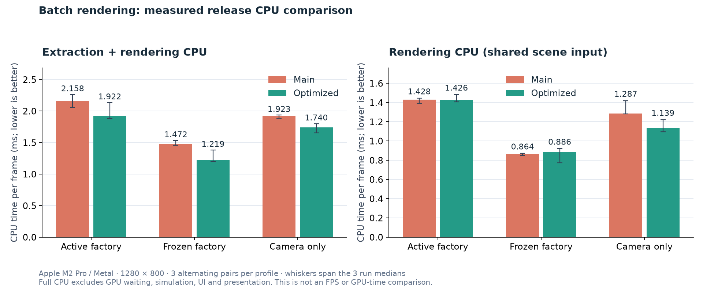
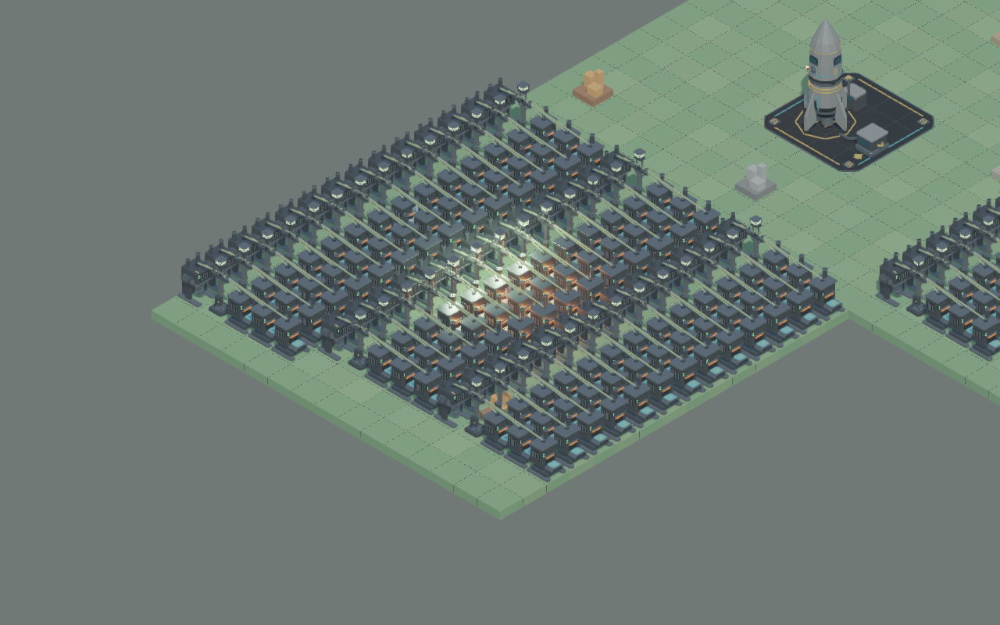

# Batch rendering optimizations: implementation and proof

All 43 reviewed areas have an implementation, a conservative fallback and a linked validation case in the [coverage table](batch-rendering-coverage.md). The [original roadmap](batch-rendering-roadmap.md) is preserved against the reviewed main revision. This report separates measured factory CPU comparisons from work reductions in targeted fixtures.

## Release comparison

| Profile / workload | Main → optimized median (ms) | Change | Three-run median ranges, main / optimized (ms) |
| --- | ---: | ---: | --- |
| Extraction + rendering: Active factory | 2.158 → 1.922 | 11.0% lower | 2.057–2.262 / 1.879–2.134 |
| Extraction + rendering: Frozen factory | 1.472 → 1.219 | 17.2% lower | 1.458–1.534 / 1.201–1.382 |
| Extraction + rendering: Camera only | 1.923 → 1.740 | 9.5% lower | 1.887–1.935 / 1.651–1.800 |
| Rendering only: Active factory | 1.428 → 1.426 | 0.1% lower; effectively flat | 1.391–1.445 / 1.407–1.483 |
| Rendering only: Frozen factory | 0.864 → 0.886 | 2.6% higher | 0.850–0.871 / 0.773–0.921 |
| Rendering only: Camera only | 1.287 → 1.139 | 11.5% lower | 1.283–1.420 / 1.094–1.222 |

Extraction-plus-rendering medians are lower in all three measured workloads. Rendering alone is effectively unchanged in the active scene; its frozen median is 0.022 ms higher (2.6%), with overlapping observed ranges. These three pairs do not establish a frozen renderer CPU gain. Camera-only renderer CPU is 11.5% lower. Remaining native preparation still walks stable membership, metadata, revision/mask rows and visible IDs, despite zero warm uploads.



Measurements use saved release executables: main `2b4351083dfb6dbb25221c75e8e3c1dabc72c835` and production `3fff7d91e4d1a972ba8f3d90af885e496fd21671`. The machine is an Apple M2 Pro using Metal at 1280 × 800. Three independent process pairs per profile alternate execution order: six pairs and twelve processes across both profiles. Each process runs active, frozen and camera-only Earth Factory scenes, with 12 warmup frames and 60 measured frames per mode. Both versions use their default production mode. Builds and other GPU tests finish before timing starts.

The full profile measures extraction + renderer CPU + retained-frame retirement. It excludes GPU waiting, simulation, UI and presentation. The graph profile measures renderer CPU with an already extracted, shared scene. The synchronized metric includes GPU waiting and must not be read as interactive FPS. Sparse GPU timestamp results are retained in the raw JSON; they do not establish a GPU timing improvement.

The [raw comparison](measurements/batch-rendering-optimizations/summary.json) includes every run median, per-frame report, sample count, executable SHA256 and capture digest. The [execution manifest](measurements/batch-rendering-optimizations/execution.json) records the command, successful process results, original log hashes and helper hash; [selected adapter/result lines](measurements/batch-rendering-optimizations/profile-results.log) keep those outcomes easy to inspect. `tools/profile_batch_rendering.py` uses those saved executables without rebuilding between runs.

## Image and gameplay checks

All twelve release processes passed: **144 internal exact RGBA paired assertions**, with scene/save-game state preserved. All **144 cross-main RGB comparisons** passed the explicit gate: **96 were byte-exact; 48 differed at exactly one pixel, in one channel, by one 8-bit level**. No larger differences passed. The 24 captures in each pair had the same outcomes across all three runs.

This representative active-factory production capture is byte-exact between main and optimized. Both images are lossless PNG conversions of the recorded 1280 × 800 RGB captures; their source/PNG digests are in the [capture manifest](measurements/batch-rendering-optimizations/representative-captures.json).

| Main | Optimized |
| --- | --- |
|  |  |

Each executable independently asserts exact RGBA equality against its own individual/rebuild reference at four camera headings for all three workloads. Captured scene state and save-game checkpoints are unchanged by rendering. Cross-version PPM comparisons check RGB, because PPM does not store alpha.

The main comparison exposed a real native lighting regression: pipeline changes could drop the PBR material group while retaining the same shared object, shadow and environment bindings. The later Metal resource registers then needed a fresh assignment. Direct draws and bundle recording now explicitly clear occupied bind-group slots on a pipeline transition before assigning them again. Caching still avoids repeated bindings on an unchanged pipeline.

The correction restored exact individual-versus-instanced factory images. A new native-versus-portable fixture covers 300 stock, PBR and numeric-graph objects, all four material maps, 32 local lights, nonzero group ranges and 72 frames of edits, insertion/removal and visibility changes. It asserts exact RGBA and warm upload reuse. Temporary native GPU readbacks also verified object, numeric-parameter and instance-ID bytes before the failing draw; those diagnostics were removed from production.

Numeric graphs retain the old literal shader hash as their opaque ordering identity, separate from the shared pipeline ID. This preserves coplanar depth winners through value changes and insertion. Opaque shadow specialization also requires sampler addressing to preserve alpha: custom transparent/zero borders retain the masked path, even when every image texel is opaque.

The graph-order fixture passed twelve exact ordinary/instanced comparisons across edits, insertion, removal and reorder, with two draws reduced to one. The sampler fixture enabled both border features on Metal and passed eight exact comparisons with outside UVs and filtered edges; it also checked zero-cutoff occluder eligibility. The CPU sampler matrix covers all eighty U/V/border combinations.

A prior 24-capture diagnostic restored byte equality when shader optimizations were disabled. The final comparison records its own image differences; the earlier diagnostic does not prove that every final difference has the same cause. Neutral normal-map values retain the original `[128,128,255]` UNorm bias, normal scale and tangent transform. Changed shader compilation and sampling arithmetic can affect rounding; that explanation is an inference. The comparison records exactness, changed channel/pixel counts and the maximum 8-bit delta for every capture. Its default is strict equality; this run explicitly admits at most one changed channel at one pixel by one level per 1,024,000-pixel image. Any larger difference fails the comparison.

## Targeted work reductions

These comparisons come from named regression fixtures. They establish reductions in commands, geometry or CPU-side work for those workloads; percentages cannot be added or translated into factory FPS.

| Area | Before → after | Correctness evidence |
| --- | --- | --- |
| Expensive static sun/local shadow layers | 40,012 → 13 rasterized triangles | Exact images after restore, mover departure, same-ID asset upload, budget rejection and retirement. |
| Local caster broad phase | 28,672 → 704 visibility checks | Identical accepted casters, point faces, offscreen cases, refits, triangles and images. |
| Fragmented local depth batches | 80 → 1 draw; same 960 triangles | Original accepted set checked once; 7,680 compact bytes. |
| Fragmented sun depth batches | 14 → 3 draws in a winding fixture; 8 → 2 across seven spatial chunks | Exact depth/color images and unchanged triangles; warm zero uploads, one changed row 96 bytes. |
| Local receiver records | Warm 0 bytes; one edit/retirement 80 bytes each | Exact row invalidation and clearing. |
| Graph parameter validation | 132 cold scans → 0 warm scans; one edit scans one record | Portable/native exact images, equal values in a fresh Arc, invalid values and failed/reverted retries. |
| Native object arena | 157 → 10 draws for 10,000 instances | Metal reports native storage active, 40,000 ID bytes and zero individual object allocations; warm membership skips all object-ID hash insertions. |
| Repeated direct resource state | Pipeline binds 80 → 1; vertex 160 → 2; index 80 → 1; groups 240 → 82 | Same 80 draws, exact pixels and identical output masks; mixed-layout lighting regression also passes. |
| Retained bundles | 192 draw commands: warm zero compile, one bundle replay | Exact images; resource/range edits recache, uniform edits reuse. GPU draw count stays 192. |
| Per-instance occlusion | 1,154 → 50 color triangles | Exact reference image; camera, bounds and occluder changes invalidate results. |
| Unchanged instance-occlusion inputs | Warm zero projection refreshes and zero query packing | Productive and zero-savings results reuse exact inputs; camera, source, asset bounds, membership and failed/reverted retries invalidate. |
| Unproductive occlusion cooldown | 30 frames with zero projection refreshes and zero packed query rows | Moving images remain exact; preparation resumes, and productive cached compaction remains enabled. |
| Factory ordering certificate | X-axis sweep: 238,232 neighbor candidates; new tree: 151,769 query visits + 19,787 activation updates | Same 3,111 inverted overlaps on the captured 2,891-object bounds/rank fixture. New discovery fits the unchanged 185,024 work cap; constructor/sort work is separate. These are different work primitives, not a timing ratio. |
| Sparse spatial planner | 16,384 objects retain 128 visible groups through 24 camera/visibility changes | Zero projected-bound refreshes/order checks; per-axis cells also preserve 4,096 long-thin bounds without budget fallback. |
| Hidden-surface planner admission | 160 fallback draws → 4 portable / 2 native draws | Dense hidden populations cannot promote an exhausted or inferior plan; camera/visibility churn and legitimate superset reuse pass. |
| Shared/cull-first skinning | 12 → 1 dispatch, 4 → 1 color draws, 12 → 1 shadow draws | Current and previous GPU bytes and images match across divergence, reentry, toggles and offscreen shadow needs; zero follower-current copies. |
| HUD runs | 280 → 3 draws | Exact order, clipping, textures and density edits; zero warm geometry copies, uniform bytes and layout rebuilds. |
| World text/sprite runs | 400 → 2 draws | Exact alpha/order/motion/content/insertion/removal/failure retry/particle parity; zero warm geometry and ID work. |
| Lossless model streams | 6 → 3 vertices; 96 fewer GPU vertex bytes | Exact ordinary/cooked static, alpha and skinned images; bit/UV seam/part/picking oracles. |
| Lazy shader preparation | First draw zero compilations after explicit prewarm | Signed-zero custom graph images remain exact; invalid warmup requests validate before insertion. |
| Stock shader variants | 73 exact image comparisons; all 16 map masks | Mirroring, double-sided faces, unlit/lit materials and auxiliary consumers. |
| Zero-contribution lighting | 30 exact paired comparisons | Diffuse and both stock BRDF hosts, generic/specialized shaders, ranges/backfaces and hard/soft spot shadows. |

The first release comparison caught a planner regression: a bounded construction fallback was being retained as a successful hidden-surface plan. The planner now compares admitted visible work and rejects exhausted or inferior plans, retaining that rejection until relevant membership or metadata changes. The same comparison led to moving the occlusion cooldown ahead of projection and packing, and compacting accepted sun casters across compatible spatial chunks. The next release diagnostic exposed repeated camera rebuilds, immutable occlusion packing and native membership hashing. Initial certification now sweeps source order through a balanced bounds hierarchy, activating only preceding draws; query visits and activation updates share the same work cap; per-axis spatial cells handle later envelope renewal; exact immutable-input certificates skip projection and packing, stable identities skip hash remapping, and accepted sun topology is retained. The final release measurements use all of these corrections.

The coverage table also links CPU proofs for bounded planner construction, spatial certificate renewal, perspective reuse, stable rows, sparse revisions, extraction mutation journals, asset dependencies, immutable part bounds, GI freshness, graph numeric slots, canonical resource aliases, rest palettes and text/sprite metadata. Those mechanisms have validation and work counters; this report does not invent separate timing gains for each one.

## Validation and resource limits

The recorded validation contains **354 unique Rust test passes across 27 target suites, seven ignored tests, six Python passes and six successful non-test gates**. The gates are workspace Clippy with warnings denied, Steam-feature Clippy, factory-editor Clippy, formatting, the headless dependency boundary and the measured release harness build. Workspace Clippy, formatting and the release build were rerun at the final planner source; feature checks and the headless boundary retain their recorded source scope. These are the executed scopes; they are not a claim that every workspace test or every hardware backend was run locally.

The selected renderer evidence contains 158 test passes, with five ignored tests. After the final planner fix, 112 library tests and 15 instancing tests passed at `3fff7d9`. Two preparation, seven submission and four shader-variant tests retain their completed `356b3ab` run, which also covers graph-value validation. The remaining eighteen renderer integration passes retain their earlier recorded source and commands. The final 25-case CPU planner filter is supporting evidence and is not counted again.

An earlier aggregate run stopped at a camera-reuse fixture whose 256-object population correctly triggered the admission guard. The test was corrected to keep each key within portable capacity, retaining all exact-image and reuse assertions and adding a two-draw check. A later grid revision was checked against an existing long-thin-bounds test, which exposed scalar-cell crowding; per-axis sizing corrected it. The final affected native target run passed.

The manifest identifies current runtime source `3fff7d9`, the retained `356b3ab` scopes, the test-only fixture correction `dd14ec7`, and earlier recorded renderer/upstream/editor scopes. Deduplicated totals count each selected target once. They do not imply one final full-workspace or full-renderer aggregate command.

The [validation manifest](measurements/batch-rendering-optimizations/validation/validation.json) records exact commands, result counts, original command status, selected log sections and SHA256 hashes. Focused reruns are not counted again. Earlier aggregate failures and their corrected target runs are identified in the manifest rather than presented as successful aggregate commands.

Optional retained GPU depth payload is capped at 64 MiB for sun, 32 MiB for spot and 32 MiB for point maps, 128 MiB total. Each cache entry admits at most 16,384 keys and 4 MiB of owned metadata. Unused layers retire after 60 updates; disabled, oversized or unprofitable entries release their sources and use the full render path. These are logical payload limits, separate from working maps, shared backing, driver overhead and in-flight resources.

Planner candidates, edges, renewal pairs and spatial cells are bounded. Initial ordering discovery counts every hierarchy query visit and source activation update against the existing shared cap; balanced construction and result sorting remain outside that traversal counter. The temporary hierarchy has at most 2N−1 nodes and is discarded before retained renewal. Native batches cap at 1,024 members and retain the portable 64-record path. The private multi-draw geometry arena caps at 32 MiB; world/HUD merged geometry follows per-run device bounds and current live entries. Variant caches bound unused entries; upload reservations account for original and optimized CPU siblings. Animated actors keep private spare buffers, so shared dispatch work is not claimed as a VRAM reduction.

True native multi-draw is implemented behind the required enabled features and has an exact direct fallback. This Metal adapter did not expose native multi-draw count support. The private geometry-arena test executes indexed-indirect rebasing, authored order and nonzero first-instance parity; native multi-draw performance still needs an eligible Vulkan/DX12 hardware run.

The roadmap's conditional experiments remain deliberately conservative: no speculative depth/resource timing weights, unchanged-gap upload merging, atlas/array migration, drawable-only transform validation narrowing or primitive overdraw reordering. Lossless welding and fetch ordering preserve authored primitive order. GI freshness still conservatively invalidates on any owned component mutation; asset publication can still scan the catalog once.

## API changes and reproduction

`ShaderSource` adds `numeric_parameters: Arc<[[f32; 4]]>` and `opaque_sort_id`; callers with no graph numeric data use an empty Arc and keep their existing `id` as the sort ID. Retained text adds `RenderView.shared_texts` and `MeshKind::SharedText`; renderer matching and its internal `MeshKind::text()` helper handle both text representations. `ShaderWarmup` and `prewarm_shader_variants` allow bounded explicit prewarming. Workspace callers were updated and compiled.

Build the existing ignored `retained_render` integration target in release mode at each recorded revision with `cargo test --release --locked --offline -p bozzard-editor --test retained_render --no-run`. Save each executable with its required Steam library beside it, and keep the corresponding source checkout available for the fixture's compile-time example paths. Then run:

```sh
python3 tools/profile_batch_rendering.py \
  --baseline /path/to/main/retained_render \
  --optimized /path/to/optimized/retained_render \
  --baseline-commit 2b4351083dfb6dbb25221c75e8e3c1dabc72c835 \
  --optimized-commit 3fff7d91e4d1a972ba8f3d90af885e496fd21671 \
  --runs 3 --profile both \
  --max-channel-delta 1 --max-differing-pixels 1 --max-differing-channels 1
```

Omit the three tolerance flags to require byte-identical RGB. For work-count proof, run `cargo test --locked --offline -p bozzard-render -- --nocapture --test-threads=1` on a native graphics host; the printed `*_proof` records correspond to the table above. The raw command logs preserve adapter and backend details.
