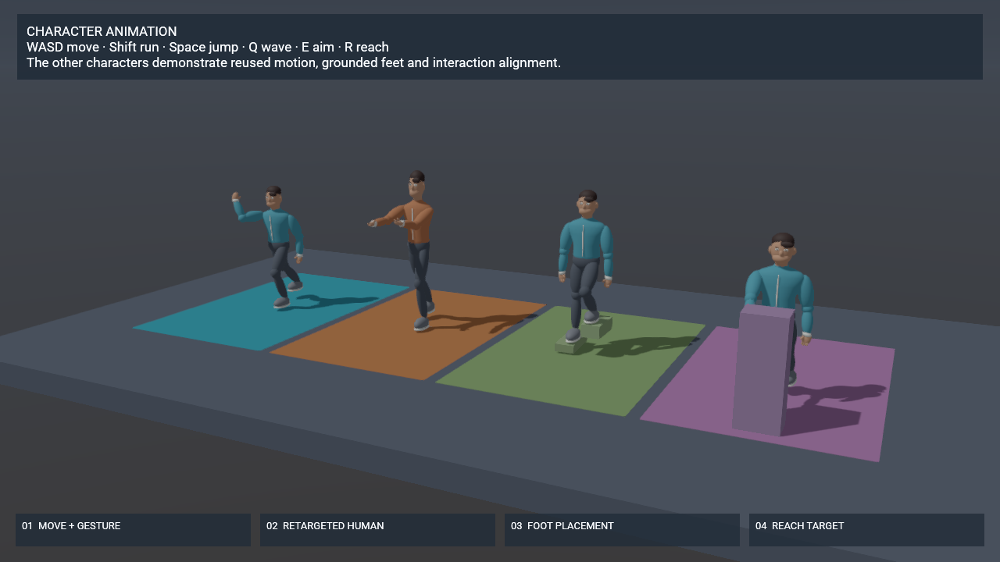

# Character animation

Open the character lab and press **Play**:

```sh
cargo run --release -p bozzard-editor-app -- --scene examples/demo/scenes/animation-lab.json
# Or run the demo without editor panels:
cargo run --release -p bozzard-player -- --project examples/demo/animation-lab.bozzard.json
```

Four original Blender humans demonstrate directional movement with a gesture, motion reused on a taller skeleton, feet on independently moving step and slope supports, and a reach action aligned to a scene target with hand IK. The green station's supports rise and fall under each foot while the actor stays in place, showing knee bending and foot alignment throughout the six-second capture. **WASD** takes control of the first character; **Shift** runs forward, **Space** jumps, **Q** toggles waving, **E** toggles aiming and **R** reaches. The first character stays within its demonstration station. The other three run their demonstrations automatically.



[Watch the captured animation loop](images/character-animation.gif).

## Build a controller

1. Import a skinned glTF/GLB and assign its mesh to the object's **Animator → Model**. Choose **Import skeleton and clips**. Reimport resets the controller and can be undone.
2. Create parameters under **Parameters**, then open **States and blend trees**. A motion can be a clip, a speed blend or a directional blend. Speed blends interpolate adjacent samples. Directional blends use two parameters, such as Strafe and Forward, and clip positions such as idle `[0,0]`, left `[-1,0]`, right `[1,0]` and forward `[0,1]`.
3. Review the directional diagram and drag its green cursor to preview parameter values. Three non-collinear, unique positions are required. Samples outside the convex hull clamp to its nearest edge. Clips share normalized phase so changing speed or direction keeps the gait cycle continuous. Author clips with corresponding left/right foot contacts.
4. Add ordered transitions in the form or connect states in **State graph**. Fade duration blends from the outgoing base pose. Conditions can use a parameter threshold and an exit phase. State names, transitions and warp references follow rename/delete through Undo.
5. Use **Preview animation** to select a state and scrub its cycle while editing. The isolated preview runs the animation sampler, including layers and IK, without running gameplay scripts or emitting clip events. **Show rest pose** clears it. Previewing does not change authored transforms or mark the scene dirty.

## Actions while moving

**Body layers** add a gesture or aim pose to the movement state. Choose **Replace selected bones** for an override, or **Add movement to the base pose** for additive motion. An additive reference can be the rest pose or a clip's first frame. Select a spine bone to affect the upper body; the legs retain the movement pose. **Individual bone weights** provides precise overrides without changing the children's subtree weights.

A layer has a fixed weight, an optional weight parameter, a fade duration, repeat mode and playback speed. Independent layers have their own clocks. **Follow the movement cycle** uses the base movement phase. Restart an independent layer when an action should begin again. Pausing freezes clocks and fades. Layer events use `Layer name/Event name`; the dominant contributing clip supplies events once.

## Feet and inverse kinematics

**Set up humanoid feet** matches named left/right upper-leg or thigh chains. Otherwise add a chain manually, selecting an upper limb, its direct child and that child's foot/hand. Invalid intermediate bone choices are excluded from the pickers.

Choose ground probing for feet, a world point for a procedural reach, or a scene object with a local offset for an interactive target. Set influence, optional weight parameter and contact smoothing. Ground probes use ordinary collision geometry, ignore the character itself and support collision-layer filtering. **Plant contacts** retains a contact in the support object's local space, so it follows moving and rotating platforms. Animated lift releases the contact; **Align to ground normal** follows a slope. Probe distances and sole height are world metres. Scale those settings when scaling the actor.

**Adjust body height to reach the ground** moves a selected pelvis bone within bounded raising/lowering limits before solving the legs. Set a knee bend direction in the character's model space to keep a straight chain stable. Targets beyond a limb's reach clamp to its reachable distance. Foot IK adjusts poses; gameplay movement and stepping over obstacles remain the controller's responsibility.

## Reuse motion on another skeleton

Under **Reuse an animation from another character**, select a loaded source model, its clip, a unique destination name and a sample rate. Bone-name matching supplies an editable starting map. Namespace prefixes and punctuation are normalized; ambiguous names remain unmapped. Review the source/destination bone pairs. Copy scaled translation for roots/hips while keeping the target's limb proportions elsewhere.

Import runs as a bounded, cancellable background job. If the destination skeleton or clips change before completion, the result is discarded with an explanation. A completed import is a normal undoable controller edit. The first clip creates a playable default state on a bare skeleton. Baked clips keep the source duration and events and play without a retargeting cost. Uniform resampling approximates curved source tracks; increase the sample rate when needed. This is explicit bone mapping, rather than an automatic humanoid solver that infers missing joints.

## Align an action to a target

Enable **Root motion**, select the root bone and the translation/yaw axes it drives. Then add a window under **Align root motion with a target** for a state that plays once. Window times are normalized cycle phases. The target can be a world point/yaw or a scene object/local offset. The window distributes the remaining endpoint correction over the remaining time, including ticks that cross window boundaries. Multiple windows in one state must not overlap.

Move an interaction target while the action is running, or override a named window through scripting/Blueprints. Clear the override to use the authored target again. A warped state keeps Once repetition until its windows are removed. Root motion and a navigation agent cannot both drive the same actor. Warping aligns the actor; use hand IK when the hand must meet a precise surface.

## Runtime controls and persistence

Blueprints provide Play/Pause/Stop/Seek Animation, Set Animation Parameter, Restart Animation Layer, Set/Clear Animation Warp Target, state/progress queries and On Animation Event. Rhai exposes the corresponding functions:

```rhai
set_animation_parameter(me, "Forward", 2.0);
set_animation_parameter(me, "Wave", 1.0);
restart_animation_layer(me, "Wave");
set_animation_warp_target(me, "Interact", [3.0, 0.0, 1.0], 180.0);
play_animation(me, "Reach", 0.15);
```

`animation_state`, `animation_progress` and `animation_playing` read the current transport. Save/load game state preserves base/layer clocks, fades, parameters, planted contacts, pelvis offset, pose/palette and warp overrides. Prepared triangulations and scratch buffers are rebuilt lazily after restore. Sampling and IK run on the CPU without a graphics device; GPU skinning shares deformation across PBR, depth, shadows and motion vectors.

Controllers allow 64 states, 128 parameters, 16 layers, 16 IK chains and 64 warp windows. A directional blend supports 3–64 samples. Retargeting supports 1–120 Hz, at most 4,096 keys per scalar curve and one million scalar keys per bake. Rig/import limits remain documented in [Middleware](middleware.md). Morph targets, more than four influences per vertex, animation compression of moving tracks, full-body IK and ragdoll blending are outside this implementation.

## Rebuild and measure

```sh
blender --background --factory-startup --python tools/generate_animation_character.py
cargo run --release -p bozzard-editor --example animation_lab
cargo run --release -p bozzard-scene --example animation_bench
cargo run --release -p bozzard-editor --example animation_capture -- /tmp/animation-frames
```

The Blender sources, original asset provenance and clip list are in [assets/animation-human](../assets/animation-human/README.md). The scene generator is the editable source for the large cooked scene. The capture example renders 120 frames at 20 Hz through the production simulation, GPU skinning and HUD paths. The benchmark measures CPU animation ticks, with 64 joints per actor and separate basic playback, paused playback and directional/layer/two-IK workloads. It does not measure GPU time or application FPS. See [measured results](character-animation-performance.md).
