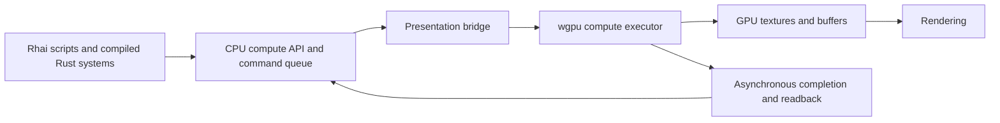

# Script-accessible compute — implementation plan

Status: all six stages implemented on `codex/scriptable-compute`, based on `main` at `aba4ec3`.
See [the shipped API](compute.md) and [verification and measurements](compute-validation.md).
Native platform CI remains a merge gate for the implementation PR.

Build a general compute authoring feature on the existing WGSL/wgpu renderer. A game author
should be able to import a compute kernel, create reusable buffers or textures, dispatch it from
an ordinary script, display its output, and optionally collect CPU results without blocking a tick.
Compiled-in Rust systems and Rhai scripts should use the same validated command API.

The first milestone assumes visual effects and procedural content. Gameplay with authoritative
server state needs an explicit CPU implementation and a separate determinism contract.

**What already exists**

- Compute pipelines already power skinning, particles, and auto exposure in
  `crates/bozzard-render/src/scene/`. Keep those implementations working while adding authoring.
- The workspace uses wgpu 30.0.1, with Naga 30.0.1 already in the lockfile. GPU device creation
  currently requests baseline limits, plus optional profiler timestamp support.
- `.rs` gameplay files are Rhai, not compiled Rust. `script_runtime.rs` snapshots CPU state and
  applies queued commands. Shader code will be WGSL; Rust/Rhai will configure and dispatch it.
- The renderer accepts extracted data rather than an ECS world. The server dependency tree
  excludes wgpu, windowing, and importers. Preserve this boundary.
- Asset refresh already retains the last good version after an import failure. The debug console
  and profiler provide places for kernel diagnostics, dispatch timing, and memory accounting.

**Architecture**



Add `bozzard-compute` for GPU-free resource descriptions, packing, handles, commands, capability
reports, job states, and WGSL validation/reflection. It may depend on the CPU-only Naga WGSL
frontend, with its dependencies explicitly reviewed in `tools/check_headless.py`. It must not
depend on wgpu, the ECS, the scene crate, or importers.

`bozzard-scene` owns per-world/per-attachment compute state and exposes script calls.
`bozzard-assets` imports source assets. `bozzard-render-assets` transfers immutable requests and
results across the boundary. `bozzard-render` owns the executor, pipelines, and GPU allocations.
Player/editor frame coordination drains jobs once per play world, independently of the number
of viewports. The renderer continues to receive data rather than access the ECS.

**First-version scope**

Support WGSL compute entry points, one reflected `params` uniform block per entry point,
explicit storage buffer layouts, numeric arrays and
structs, sampled 2D textures/samplers, and writable 2D storage textures. Expose 1D/2D/3D dispatch
dimensions with an extent-based helper that calculates workgroup counts. Start texture outputs
with validated baseline formats such as `rgba8unorm`, and reject unsupported formats/features.

Include reusable GPU resources, ordered multi-dispatch workloads, asynchronous buffer readback,
a material texture output, shader hot reload, diagnostics, export, and a runnable example scene.
Read/write feedback uses separate resources that swap roles between dispatches.

Keep indirect dispatch, GPU mesh generation, arbitrary render-stage injection, subgroup-specific
optimizations, and runtime Rust compilation as later extensions. Blueprint nodes can wrap the
same API after it stabilizes; GPU handles do not become new Blueprint scalar/blackboard types.

**Behavior to settle before implementation**

| Area | Proposed contract |
| --- | --- |
| Resource identity | Opaque handles include world/device generation and ownership. Reject stale and cross-world handles. Named resources persist in attachment runtime state between hooks; sharing requires an explicit scene scope. |
| Script persistence | Add a dedicated compute resource/job registry. Existing scalar blackboards cannot hold GPU objects, and top-level Rhai variables are not persistent hook state. |
| Commands | Reserve handles on the CPU, then queue create/write/dispatch/readback/release operations in call order. Earlier CPU reservations are visible to later calls in that hook. |
| Scheduling | Retain fixed-tick and submission sequence numbers. Preserve all accepted dispatches across catch-up ticks; do not replay a batch for each viewport. |
| Upload ordering | Snapshot per-dispatch parameters. Use distinct upload ranges or ordered encoder copies so a later write cannot overwrite the values an earlier dispatch should read. |
| Submission | Commit a batch as submitted only after queue submission. Abandoning an encoder must not lose requests; failing presentation after submission must not replay them. |
| Missing presentation | A compute-only submission path can make progress without a drawable frame. Minimized windows or offscreen tests must not leave jobs pending forever. |
| Completion | A dispatch returns a ticket, not its CPU result. Publish completed results at a later tick boundary; never promise exactly one-frame latency. GPU callbacks only enqueue completion data. |
| Readback | Explicit request/poll/take operations, bounded staging buffers, validated offsets and sizes. Do not block a script or map the live storage buffer. |
| Pause/debugging | Already submitted work may finish, but result delivery waits for the next permitted simulation boundary. Repainting a paused editor cannot submit the job again. GPU instructions are not Blueprint-steppable. |
| Lifetime | Destruction, scene unload, Stop, and restart invalidate logical handles. Retain referenced GPU resources until submitted work finishes, then release them. Late completions cannot touch a replacement world. |
| Save/load | Persist authored settings, seeds, and CPU gameplay state. Recreate visual compute resources after load; do not serialize GPU handles or assume a save captures GPU memory. |
| Headless | Capability queries explicitly report GPU compute unavailable. Optional visual paths can skip it; required compute must fail clearly or use a registered CPU implementation. A test backend validates command behavior, not arbitrary WGSL results. |
| Failures | Report the kernel asset/entry point, owner, attachment, request, and source location when available. Bound memory, outstanding jobs, uploads/readbacks, and dispatch sizes. Device loss fails affected jobs through the existing device-error path. |

Allocation and dispatch limits do not impose a hard execution-time limit on arbitrary shader
loops. Do not promise that Rhai's instruction budget can interrupt a submitted GPU kernel.

**Implementation sequence**

1. **Contracts, shader assets, and validation — M.**
   Add the common crate and `AssetKind::ComputeShader`, with `.compute.wgsl` import and stable
   catalog IDs. Parse and validate with the pinned Naga version; reflect entry points, workgroup
   sizes, bindings, access modes, and host layouts. Build explicit binding layouts rather than
   duplicating handwritten schemas. Validate numeric conversions, buffer sizes/strides,
   alignment, and texture formats. Put shader assets through existing scene/prefab dependencies
   and export cooking, including assets named dynamically by scripts in the declared catalog.
   Gate: valid kernels load without a GPU; malformed WGSL, wrong entry points, and incompatible
   bindings produce source-linked errors; relocation preserves all declared shader assets.

2. **GPU executor and reusable resources — L.**
   Implement pipeline and bind-group caches, resource ownership, uploads, dispatch, completion,
   and staging-buffer readback in `bozzard-render`. Validate against the limits/features actually
   enabled on the device. Use validated shader creation and scoped pipeline errors. Keep source
   compilation and resource creation out of steady-state dispatch. Integrate with the existing
   command encoder/profiler where possible, while supporting compute-only submissions.
   Gate: an offscreen buffer kernel matches an independent CPU oracle on Metal, Vulkan, and
   DX12; a chain of writes/dispatches/readbacks preserves ordering and does not wait in the
   interactive frame loop.

3. **Rust and Rhai integration — L.**
   Expose the same API to compiled-in Rust systems and register Rhai wrappers in
   `script_runtime.rs`. Add named per-attachment resources, controlled scene sharing, tickets,
   result polling, and clear capability checks. Integrate the queue with player/editor timing,
   scene transitions, script disable/destruction, save/load, and debugger pause boundaries.
   Queued cancellation succeeds before submission; cancellation after submission suppresses
   delivery and retires resources when safe, without claiming to stop GPU execution.
   Gate: a script can allocate once, dispatch repeatedly, retrieve results, and restart without
   leaks or stale handles. A headless run follows its declared unavailable/CPU-fallback policy.

4. **Visible output and an authorable demo — M.**
   Add a runtime generated-texture reference and material binding override through the render
   bridge, separate from imported image asset IDs. Let compute output feed a material slot and
   the shader graph's existing texture sampling. Track generation/revision so resize or hot
   replacement invalidates stale views/bind groups. Set color-space and alpha behavior explicitly.
   Ship a procedural water/noise texture driven by a Rhai script, plus a numeric buffer/readback
   example. Gate: scripts visibly change rendered pixels without reading them back to the CPU;
   the exported examples run from a relocated folder.

5. **Editor workflow, hot reload, and diagnostics — M.**
   Add compute asset import/inspection, entry-point selection, binding/parameter information,
   compile status, and source navigation. Add a small resource/job inspector with texture preview
   and bounded buffer inspection. Failed reloads retain the last good pipeline. Compatible
   replacements switch at a submission boundary; incompatible resource layouts need validated
   recreation rather than silently reinterpreting old memory. Pending work pins its old revision.
   Extend the profiler with kernel labels, optional GPU timing, queued jobs, memory, and transfer
   bytes. Gate: editing a kernel updates the demo, an intentional error keeps it running with an
   actionable diagnostic, and Play/Stop preserves authored state.

6. **Integration and optimization gate — M.**
   Run and document the test matrix below; profile upload cost, dispatch cost, and readback
   separately. Compare CPU and GPU approaches at small and large workloads. Reuse pools and
   immutable resources; update only changed parameters/ranges. Verify stable memory across
   repeated Play/Stop, resizing, reload, and scene changes. Ship the API reference and both sample
   scenes before considering the feature complete. Every earlier stage also includes its own
   tests; this stage verifies the assembled workflow.

The implementation follows this dependency order in one integrated feature branch, allowing
the complete script/editor/export workflow to be reviewed and platform-tested together.

**Proposed script experience**

These API names are implemented. Resource names below are scoped to the
current script attachment, and `waves_kernel` is a declared compute shader asset.

```rust
// Rhai in a .rs gameplay file; the GPU kernel lives in a separate .compute.wgsl file.
fn on_start(me) {
    if !compute_available() { return; }
    compute_create_texture("surface", 512, 512, "rgba8unorm");
    compute_bind_material(me, "base_color", compute_texture("surface"));
}

fn on_update(me, dt) {
    if !compute_available() { return; }
    compute_dispatch_extent(
        "waves_kernel", "main",
        #{ output: compute_texture("surface") },
        #{ time: elapsed_time() },
        [512, 512, 1]
    );
}
```

The reflected `params` schema describes the uniform block represented by the parameter map.
The API packs it using verified WGSL offsets. The extent helper rounds up workgroup counts;
kernel templates still include bounds checks for the final partial workgroup. Named readback
requests and a `compute_poll`/`compute_take_result` pair let later hooks receive CPU results without
needing a persistent Rhai global or polling in a busy loop.

**Completion and performance gates**

- CPU tests cover parsing/layout packing, numeric overflow, binding mismatches, invalid ranges,
  stale/cross-world handles, ownership, quotas, job ordering, cancellation, and unload/restart.
- GPU tests cover non-multiple workgroup extents, buffer math against a CPU oracle, a texture
  checked by pixel readback, dispatch dependencies, upload ordering, and readback pool saturation.
  Use tolerances for floating-point outputs rather than promising bit-identical backends.
- Integration tests cover multiple fixed ticks per rendered frame, multiple viewports, zero-size
  presentation, paused/stepped playback, failed encoding, and late results after a scene switch.
- Hot reload tests cover invalid source, compatible edits, changed layouts, and in-flight old
  pipelines. Export tests exercise the actual packaged executable and declared shader dependencies.
- Unused compute introduces no compute-specific allocations, dispatches, or readbacks. Warm
  repeated workloads reuse pipelines, bind groups, and allocations. All queues and caches remain
  bounded; backpressure returns a documented status instead of growing indefinitely.
- Keep outputs on the GPU for visual consumers. Measure rather than assume that compute is faster
  than the CPU, especially when workloads require per-frame uploads or readbacks.
- Formatting, strict workspace Clippy, the full workspace tests, the headless dependency audit,
  and native Metal/Vulkan/DX12 CI must pass before merging each completed stage.

**Reference constraints**

Use explicit pipeline layouts so resource bindings can be validated and reused across compatible
pipelines. This follows the pinned [wgpu compute pipeline documentation](https://docs.rs/wgpu/30.0.1/wgpu/struct.ComputePipelineDescriptor.html).

Readback needs separate staging storage and asynchronous completion: a mapped buffer cannot
simultaneously be used by GPU commands. See [wgpu buffer mapping](https://docs.rs/wgpu/30.0.1/wgpu/struct.Buffer.html#mapping-buffers).

Pack buffer values according to WGSL alignment and stride rules rather than Rust/Rhai memory
layouts; vectors, matrices, structs, and arrays can contain padding. See
[WGSL memory layout](https://www.w3.org/TR/WGSL/#memory-layout).

Capability checks must use the features and limits enabled on the device, which can be lower than
the adapter's maximums. See [wgpu device capabilities](https://docs.rs/wgpu/30.0.1/wgpu/struct.Device.html#method.limits).
