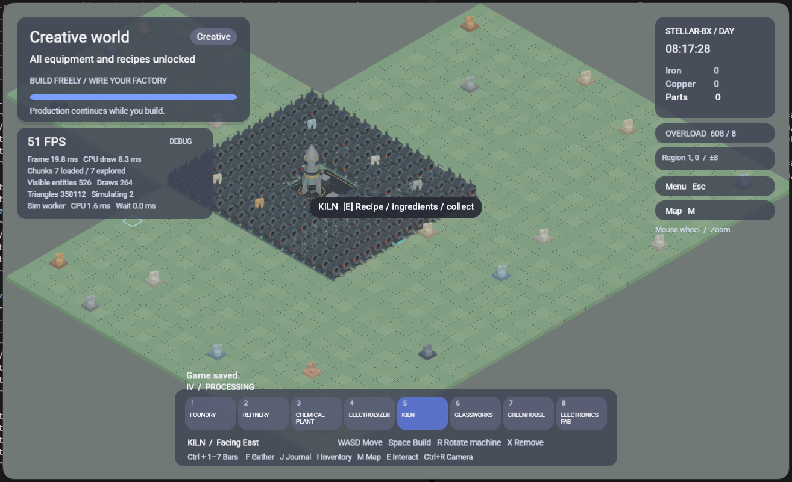
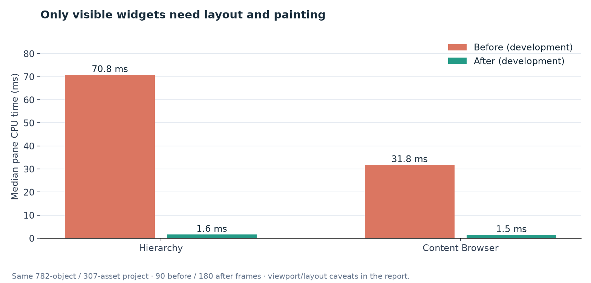
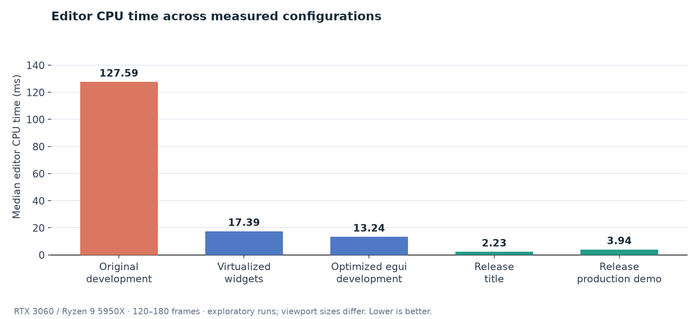
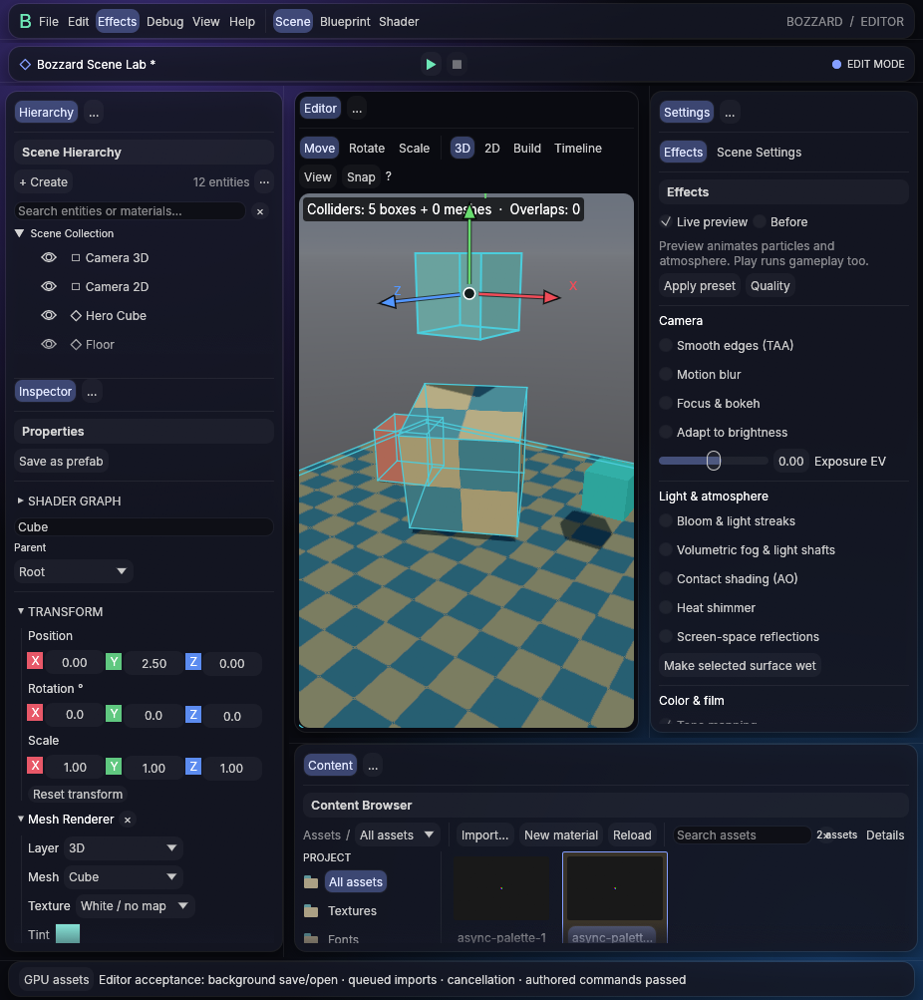
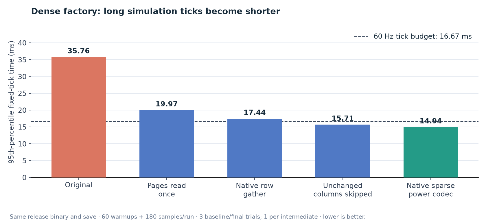
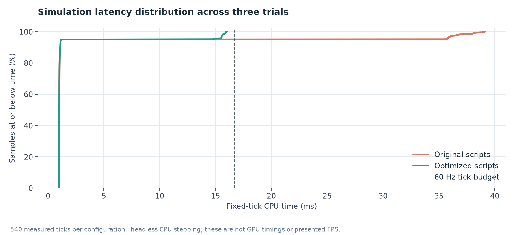
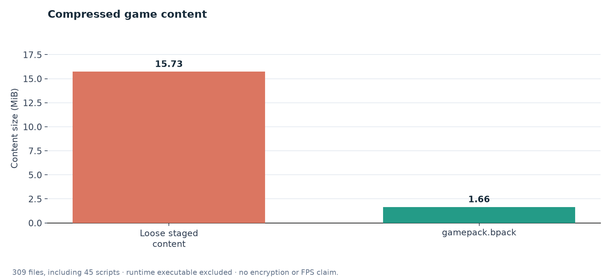
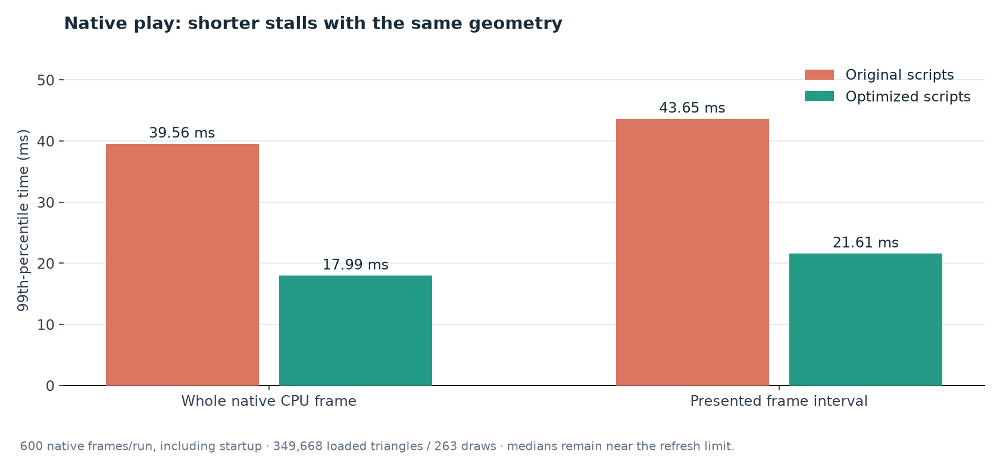

# Earth Factory, editor performance, and packed exports

Measured October 1–2, 2026. This report covers the work on
`codex/further-optimizations`, including the earlier gamepack and editor fixes that
were still uncommitted when this follow-up investigation began.

## Findings

There were three distinct problems:

1. **The editor spent most of its CPU time constructing offscreen UI.** The
   782-object Earth Factory project took about 128 ms of editor CPU per frame in
   development. An instrumented run attributed 70.8 ms to Hierarchy and 31.8 ms
   to the Content Browser. Virtualizing these panels removed the dominant cost.
2. **The standalone export used a development player.** The installed game
   executable matched the local debug player byte for byte. With comparable
   dense-world geometry, renderer CPU submission fell from 8.73 ms to 2.43 ms
   when using a release player. GPU measurements were already a few milliseconds;
   the triangle count alone did not explain the poor frame rate.
3. **Dense factory simulation had periodic expensive script ticks.** Median ticks
   were about 1 ms, but production beats reached roughly 38 ms. Repeated storage
   page copies and interpreted numeric serialization were the main targets of
   this pass. The measured final results appear below.

Packing content addresses distribution size and loose editable files. It does not
account for the editor FPS improvement or replace gameplay/render optimization.



The supplied screenshot is a standalone game: 51 FPS, 19.8 ms frame time, 8.3 ms
renderer CPU, 264 draws, and 350,112 triangles. Its simulation HUD reports the last
completed worker batch; a small displayed value does not exclude occasional long
production ticks. CPU submission, GPU pass time, worker CPU, main-thread waiting,
and presentation interval are different measurements and can overlap. They should
not be added together as an exact frame-time breakdown.

## Measurement conditions and limits

Local hardware: AMD Ryzen 9 5950X, NVIDIA GeForce RTX 3060, Linux x86-64, Vulkan.
Release builds use thin LTO and one codegen unit. Development already optimized
Rhai, `bozzard-scene`, and `bozzard-render` at level 2; this work also optimizes egui
and epaint. Application code remains unoptimized in development.

The committed [measurement directory](measurements/further-optimizations/) contains
compact editor frame records, player profile summaries, pack sizes, and simulation
samples. [The chart script](../tools/chart_further_optimizations.py) regenerates the
PNG figures with Matplotlib. The figures plot recorded timings, not projected gains.

The initial editor runs were exploratory. Window resizing changed their viewport
sizes, including temporarily very short viewports. The stable pane attribution run
used 756 × 509; optimized development/release runs used 336 × 518. Therefore the
editor table demonstrates the observed bottleneck and resulting configurations,
but **is not an exact same-viewport FPS A/B test**. The hierarchy still contains the
same authored objects and the catalog the same 307 assets. The final seeded
production-demo run captured exactly 180 frames without concurrent compilation.

The headless dense-world comparisons use the same release benchmark executable,
entry wrapper, copied save, fixed time steps, and warmup/sample counts. A local
copy of the user's save is deliberately excluded from Git. Tests and benchmarks
operate on isolated data directories; the user's original saves are not modified.
The intermediates are diagnostic script variants, not shipped game modes.

Native player percentile summaries include startup/loading frames. They establish
runtime-build cost and help find stalls; they are not a clean steady-state latency
comparison. Renderer HUD samples were filtered for loaded dense geometry. Native
runs are capped by presentation scheduling near 144 Hz, so 6.94 ms intervals do not
establish an uncapped maximum FPS. These results apply to the fixtures and hardware
measured here, not every possible factory, graphics configuration, or device.

## 1. Virtualized hierarchy

**Before:** the scroll panel built object and imported-surface widgets for all
expanded rows on every frame, even when most rows were outside its visible area.
Each row performed text layout, response/interaction setup, painting, and surface
controls. A large authored document therefore taxed the UI independently of how
little of the world the renderer displayed.

**After:** one cheap traversal builds a flattened row description in the same
order. `ScrollArea::show_rows` constructs egui widgets only for visible rows.
Object and surface IDs stay stable. The traversal retains the complete object
order for Shift selection, descendant traversal, search, expand/collapse, and
reparenting; surfaces use a shared single-row renderer.

**Why it helps:** widget work scales with visible panel height rather than the
number of expanded scene rows. Metadata traversal still scales with the document;
this is intentionally not a claim of constant total hierarchy cost. The panel also
continues to read the current authored scene instead of caching a stale copy.

**Checks:** editor unit/interaction tests and native acceptance exercise selection,
surfaces, object references, prefabs, hierarchy operations, and Play/Stop isolation.
No mesh decimation, reduced effects, or changed game geometry is involved.

## 2. Virtualized asset tiles and lazy thumbnails

**Before:** the grid visited and constructed every matching asset tile, generating
thumbnails for entries that had never scrolled into view. Each tile also repeated
selected-object eligibility work.

**After:** the asset catalog is still inspected for current load state and details,
but the visual grid is virtualized by rows. Column count comes from available
width. A consistent tile height reserves the preview, name, type, and an error
line when needed; this keeps scrolling and the last row reachable. Stable IDs use
the asset identity. Thumbnail generation and assignment eligibility run only for
visible tiles. Existing blueprint/shader graph browsing keeps its established path.

**Why it helps:** expensive widget and preview work is limited to the visible
rows. Catalog snapshot creation remains and can be revisited if it becomes a
measured bottleneck; no additional revision cache was introduced speculatively.

**Checks:** a new 100-image regression verifies fewer than 15 thumbnails before
scrolling, no premature final-asset thumbnail, successful scrolling to asset 99,
fewer than 30 total visited thumbnails, and an unchanged scene. Existing drag,
assignment, delete, model-preview, and prefab tests continue to pass.



## 3. Optimized development UI dependencies

`[profile.dev.package.egui]` and `epaint` now use `opt-level = 2`. Development keeps
debug information and assertions, while layout and painting avoid paying the full
cost of unoptimized third-party code. This follows the existing policy for Rhai
and the scene/render engine. The application itself and release profile are
unchanged. The first build recompiles these dependencies; step-by-step debugging
inside them may require a local opt-level override.

| Configuration | Samples | Median editor CPU | Median interval | Approx. observed FPS |
| --- | ---: | ---: | ---: | ---: |
| Original development, title | 120 | 127.59 ms | 138.45 ms | 7.2 |
| Virtualized widgets, original UI dependency profile | 120 | 17.39 ms | 27.71 ms | 36.1 |
| Virtualized widgets + optimized UI dependencies | 180 | 13.24 ms | 20.83 ms | 48.0 |
| Release, title | 180 | 2.23 ms | 6.94 ms | 144.0 |
| Release, seeded production demo | 180 | 3.94 ms | 6.94 ms | 144.0 |

Read this table with the viewport and scheduling caveats above. The observed
original-to-optimized development CPU reduction is approximately 89.6%; it should
not be interpreted as a universal tenfold game-speed improvement.



## 4. Editor instrumentation and reproducible capture

The Debug panel now records editor stages and individual panes separately from
simulation and GPU statistics. This exposed the hierarchy/asset costs instead of
attributing all slowness to triangle count or a single aggregate frame value.
`--benchmark-frames 1..240` waits for scene/asset readiness, warms 30 ready frames,
collects exactly the requested number of recent frames, prints JSON, and exits.
`--benchmark-play` starts the same native Play path first. Loading/upload frames
are excluded, but window/layout stability still needs to be controlled by the
person running a benchmark.

Instrumentation measures work; it is not itself an FPS optimization. The new
headless benchmark `--output FILE` records individual fixed-tick and stage samples,
which makes p95 and latency-distribution figures auditable. Its label now says
"factory fixed ticks" because an optional scene can be a busy saved factory.



This is a native acceptance-test capture demonstrating the working editor. It is
not the dense-world benchmark viewport and is not an image-quality A/B comparison.

## 5. Storage pages are read once per region

**Before:** inside the loop over storage machines, the Rhai code assigned page
arrays from a map to local variables. Rhai assignments copy array values. For a
live region, a page contains 900 numbers even though one machine needs four. Four
kind pages and four amount pages were consequently copied repeatedly for machines
that had not changed at all. Multiple populated regions amplified the problem.

**After:** each page is read once while processing its region. Live pages use real
cell indices; compact archived pages use their corresponding compact row indices.
The resulting machine storage still has 16 slots, interleaved as 32 kind/amount
values in the original page and slot order. No schema, storage capacity, production
rule, or transfer order changes.

**Why it helps:** removes repeated large-page copies. The intermediate page-once
implementation alone substantially reduces production-beat tail latency. It was
measured independently before introducing the native gathering helper.

**Checks:** a new real-scene test creates three machines in each of two regions,
writes a different value into every one of their 16 slots, then verifies all six
snapshot rows while one region is live and the other archived. Existing storage,
collection, transport, and unloaded-planet tests exercise the full write path.

## 6. Bounded native numeric gathering

`gather_numeric_pairs(kind_pages, amount_pages, cells, stride)` assembles selected
rows in Rust instead of running thousands of interpreted slot-index assignments.
It preserves each selected integer or float exactly; it does not round values,
change machine order, or cache mutable gameplay state. Archive decoding remains
compatible with the existing literal/run-length pages.

It requires matching page counts and paired lengths, sorted unique in-range cells,
a positive stride, finite numeric selected values, and at most 65,536 total input
and output numbers. Checked multiplication prevents size overflow before allocation.
Native execution does not consume interpreter operations one element at a time,
so these independent bounds are essential to retaining a bounded scripting API.

Tests enumerate sparse masks with multiple pages and strides, compare every row
against an independent expected order, preserve mixed numeric types/fractions,
and reject malformed pages, duplicate/reversed cells, NaN/infinity, bad stride,
and oversized input/output shapes. The API is documented in [scripting](scripting.md).

## 7. Skip unchanged columns using bounded native comparison

A factory snapshot records the original eight writable numeric columns and counts.
Writing the snapshot compares each final column to its original values. A column
that is identical needs neither a new 225-cell live array nor remote archive
reconstruction or a host command. Changed columns follow the previous full write
path. Storage retains its explicit changed-machine tracking.

A first attempt used ordinary Rhai array equality. That comparison dispatched
numeric operators repeatedly and offset much of the avoided write work. The
retained implementation uses `numeric_arrays_equal` with a 65,536-element bound,
finite numeric validation, full integer precision for integer pairs, and Rhai's
FLOAT conversion for mixed pairs. Unequal lengths and first unequal values return
false. It does not rely on revisions or previous ticks, so it cannot become stale
when another system changes the game state.

The benefit depends on how many columns actually remain unchanged. This is most
useful with empty inputs, full output buffers, or stalled production. Snapshot
copies still cost memory and CPU; the measured intermediate is reported below.
Tests compare the native result to the interpreter's equality on equal, unequal,
empty, differently sized, mixed, negative-zero, and large-integer inputs, and check
allocation/input limits. Full production and transport tests guard the integration.

## 8. Native sparse power-page codec

Power connectivity uses sparse text pages: 75 possible cells per page, pipe
separators between cells, and comma-separated integer entries. The previous Rhai
reader split strings and parsed each integer in nested loops; the writer built
text rows and repeatedly indexed map-held page arrays.

`unpack_integer_rows` and `pack_integer_rows` perform those pure transformations
in one bounded native operation. The power graph, BFS connectivity rules, cable
limits, daylight/wind triggers, overload behavior, light reconciliation, and live
power updates are unchanged. This work moves serialization; it does not move the
whole game simulation into native code.

The codec preserves full-width canonical pages on write and reads legacy short
pages, empty cells, and empty pages. It bounds total cells and numeric values to
65,536 and total text to the engine's script-string limit. It rejects malformed
integers, excess page width, negative/noncanonical/out-of-range map keys, invalid
page dimensions, oversized arrays, and nonfinite/non-numeric encoded values.
Canonical serialization and round trips across multiple pages are tested.
Existing game save/load, power, renewables, wire, and off-world tests pass.

## Dense-world simulation measurements

| Implementation | Trials | Median tick | Trial p95 median | Longest measured tick |
| --- | ---: | ---: | ---: | ---: |
| Original scripts | 3 | 1.009 ms | 35.757 ms | 39.094 ms |
| Storage pages read once | 1 | 1.016 ms | 19.973 ms | 22.244 ms |
| Native row gathering | 1 | 1.025 ms | 17.436 ms | 19.347 ms |
| Skip unchanged columns with native comparison | 1 | 1.018 ms | 15.709 ms | 16.959 ms |
| Add native sparse power codec (final) | 3 | 1.018 ms | 14.942 ms | 16.030 ms |

The median of baseline trial p95 values was **35.757 ms**; final was **14.942 ms**,
a **58.2% reduction**. The longest final measured tick was 16.030 ms. Typical
non-production ticks remain around 1 ms. The earlier 37.6 ms baseline profile
was confirmed by repeated controlled trials ranging from 35.6 to 37.7 ms at p95.





Each trial warms 60 fixed ticks and measures the next 180 ticks. Baseline and final
have three trials each; intermediate variants have one each. Reported medians of
trial p95 values avoid implying a larger number of independent full-world runs.
The CDF pools 540 individual samples for each endpoint and shows why the median
alone masked the production-beat problem. A 60 Hz fixed tick has a 16.67 ms budget;
headless stepping does not measure rendering, presentation, or main-thread waiting.
The save contains an overloaded/stalled dense factory, not maximum active throughput.

## 9. Compressed, verified gamepack distribution

Native exports now contain a compiled player plus `gamepack.bpack`, rather than
loose scene JSON, scripts, prefabs, and assets. Both the generic editor/player
exporter and the dedicated Bozz-torio exporter use the format. Cooking and
transitive model/prefab dependencies still run first; their relocatable staged
content becomes the pack. macOS puts it in app resources; Linux/Windows place it
beside the executable. The inventory records its relative location.

The 48-byte header contains magic `BOZZGAME`, version 1, uncompressed JSON index
length, and SHA-256 of that index. One zlib stream contains the sorted index and
file bytes. Index entries store relative path, uncompressed size, and SHA-256 of
each file. Identical staged input produces identical packs; content changes during
packing fail rather than publishing an inconsistent package.

The exporter opens and verifies the finished pack before deleting loose staging
content and publishing the fresh output folder. Existing destination refusal,
background progress, cancellation, and failed-stage cleanup are preserved. The
Python dedicated-game tool calls the native exporter, checks the pack header, and
retains legacy loose-package verification. Full payload validation is native.

| Earth Factory content | Bytes | MiB |
| --- | ---: | ---: |
| Uncompressed staged files | 16,491,528 | 15.728 |
| gamepack.bpack | 1,736,826 | 1.656 |

The pack contains 309 files, including 45 scripts: **89.47% less content storage**.
The separate final Linux release player is 46,310,664 bytes (44.17 MiB).



This size comparison excludes the executable and Steam redistributable. Compressing
already-compressed assets may yield less saving. The pack does not reduce GPU
triangle count, GPU texture memory, or necessarily improve loading time: opening
adds decompression, integrity checks, and temporary file I/O.

### Runtime mounting and lifetime

Existing importers take filesystem paths. The player verifies and decompresses the
pack into a private temporary directory and owns a `GamePack` guard for the whole
runtime lifetime. The directory is created atomically, uses mode 0700 on Unix, and
is removed when the final guard drops. Crashes can leave temporary directories;
Windows permissions follow the platform's normal temporary-directory behavior.
A virtual filesystem and independent compressed-file random access remain future
options for very large games.

The custom runtime's scene reload clones its pack guard. Without that lifetime
fix, replacing the old scene source could delete the mounted files while the new
source still referred to them. A reload/drop regression verifies those paths remain
usable until the last owner is gone.

Player discovery checks only executable-relative distribution locations, never
arbitrary cwd projects. Explicit `--project FILE.bpack` works as well. Missing,
truncated, unsupported, corrupt, trailing, or malformed packs fail clearly; a
packaged game does not silently substitute an engine example. Legacy loose project
loading still works. Explicit diagnostic `--write-scene` copies pack content to a
new `.game-data` sibling so a requested snapshot outlives the temporary mount.
Packed assets disable periodic source hot reload, avoiding repeated file probes
for immutable package content; loose development scenes retain hot reload. No
separate numerical FPS benefit is claimed for this I/O reduction.

### Integrity and practical limits

The reader bounds file count to 8,192, index bytes to 8 MiB, one file to 512 MiB,
and total expanded content to 4 GiB. It rejects traversal/absolute paths, empty
components, backslashes, colons, control characters, case-insensitive duplicate
names, links/special files, declared-size mismatches, bad hashes, and trailing data.
These limits bound allocation and decompression; games exceeding them need a future
format/version change.

**Compression is not encryption or anti-cheat.** A technically capable user can
extract the scripts, inspect temporary files, alter content, and rebuild hashes.
Checksums detect corruption; they do not authenticate the publisher. This removes
casual loose-file editing from the shipped folder and reduces size. Trusted
multiplayer state still needs authority/validation, and stronger distribution
integrity would need a signed manifest or a separate trust system.

## 10. Prefer a compatible release companion for export

The previous editor copied the player next to itself. A development editor therefore
shipped a development player even when a release runtime was already built. The
local exported `Game` was about 721 MB and identical to `target/debug/bozzard-player`.
This explained much of the screenshot's renderer CPU cost.

For Cargo development editors, export now probes the sibling `release` player once
at export time. It uses that executable only when `--runtime-info` reports a release
profile and a compatible engine, native script API, gamepack format, OS, architecture,
and Steam library hash. Missing, unreadable, or incompatible release binaries fall
back to the adjacent companion, which is validated before publication. Installed
bundles continue to use their adjacent player. Dedicated Bozz-torio uses the same
profile preference and contract validation. The development editor's export dialog
explains that a development player may run slower.

Build profile is excluded from compatibility comparison because it changes code
performance, not the data contract. Native script API version is included so an
older player with the same Cargo package version cannot be selected when it lacks
the new script helpers. Future native API changes must bump that contract version.
No fallback bypasses the reported runtime contract. No subprocess probe is added to the
ordinary editor-frame loop. A final native acceptance export from the development
editor produced a `Game` executable byte-identical to the release player, confirming
that this preference works in the real background export path.

| Comparable loaded dense geometry, before script optimization | Development | Release |
| --- | ---: | ---: |
| Renderer CPU HUD median | 8.73 ms | 2.43 ms |
| Whole native CPU frame median | 11.09 ms | 3.83 ms |
| GPU pass sum median | 2.94 ms | 1.66 ms |
| Presented interval median | 14.66 ms | 6.94 ms |
| Native CPU frame p99, including startup | 47.17 ms | 38.43 ms |

Both loaded HUD captures reported 349,680 triangles and 263 draws. The runs were
sequential and not interleaved; warmup/startup and timing definitions differ from
the editor and headless benchmarks. These numbers motivate runtime selection;
they should not be substituted for the final simulation latency results.

## Final validation and remaining opportunities

| Check | Result |
| --- | --- |
| `bozzard-project` complete suite | 55 passed; includes loopback HTTP fixtures |
| Earth Factory integration suite | 151 passed, 3 explicitly ignored |
| Native numeric helper/codec unit suite | 8 passed |
| Editor/player/Bozz-torio unit and integration suites | 147 passed, 8 explicitly ignored |
| Python packager tests | 3 passed |
| Scoped all-targets Clippy | Passed with `-D warnings` |
| Rust format and diff whitespace checks | Passed |
| Release editor, player, dedicated runtime and benchmark builds | Passed |
| Native Vulkan editor acceptance | Passed authoring, gizmos, lights, GI, prefabs, Blueprints, references, Play isolation and packed export |
| Dedicated packaged runtime from unrelated cwd | Passed offline factory route |
| Development editor export runtime selection | Exported executable byte-identical to release player |

Native verification includes the full editor acceptance route, packed background
export, relocated generic exports, the dedicated game route, and Vulkan player
runs. Unit/integration coverage includes deterministic packs, corruption/truncation,
path/size limits, cancellation/cleanup, offline relocation without source/tools,
snapshot rebasing, solo and Steam export capability checks, custom pack-guard
reloads, and the scene/gameplay cases described above.

A final pair of 600-frame native player runs used the **same release executable**
and save, replacing only the baseline/optimized script variants. Loaded views
reported **349,668 triangles, 263 draws, and 489 visible entities in both runs**.
CPU frame p99 fell from **39.556 to 17.988 ms**; presented interval p99 fell from
**43.645 to 21.605 ms**. Median CPU frames were 3.886/3.908 ms, median intervals
7.136/7.141 ms, and median GPU pass sums 2.604/2.601 ms. The improvement is shorter
stalls, while ordinary frame cost and geometry remain essentially the same.
Startup is included and each endpoint has one native run; the repeated headless
trials provide the cleaner simulation comparison.



Final release editor Play with the dense save measured **6.903 ms median CPU**,
**9.009 ms CPU p95**, and **13.802 ms median interval** over 180 frames (about
72.5 observed FPS), with a much larger **1272 × 547** viewport and 349,752 drawn
triangles. Median panes were Scene 4.622 ms, Hierarchy 0.347 ms, and Assets 0.518 ms.
This directly checks the busy Play workload; it is separate from the small-viewport
seeded-demo result. Scene drawing is now the largest pane cost, while offscreen
hierarchy/assets are no longer the dominant work.

No new rendering-quality reductions were introduced. This pass changes UI work,
serialization, redundant state writes, build selection, and distribution. The
remaining Rhai production/transport logic, scene extraction, and graphics
submission still have costs. Larger active factories and changing power graphs
should be profiled with the committed tools. Further changes such as moving graph
resolution or gameplay algorithms into native code would increase maintenance and
behavioral risk, and are not justified solely by these measurements. The measured
high-value issues are addressed; there is no claim that optimization is exhausted.

## Reproduce and inspect

```sh
cargo build --release --locked --offline -p bozzard-editor-app -p bozzard-player -p bozz-torio
# Use a fixed layout/window size, then compare the same scene and profile.
target/release/bozzard-editor --scene examples/earth-factory/scenes/earth.json \
  --hardware --backend vulkan --benchmark-play --benchmark-frames 180

cargo run --release --locked --offline -p bozzard-runtime --example benchmark_factory -- \
  examples/earth-factory/scenes/earth.json --output work/factory-ticks.json
# For a busy-save comparison, use an isolated scene wrapper and copied save.
# Do not point that harness at a production save directory.

cargo test --locked --offline -p bozzard-runtime --test earth_factory
cargo test --locked --offline -p bozzard-scene numeric_archive --lib
cargo test --locked --offline -p bozzard-project
cargo test --locked --offline -p bozzard-editor-app -p bozzard-player -p bozz-torio
PYTHONPATH=tools python3 -m unittest test_package test_bozz_torio_package
cargo clippy --locked --offline -p bozzard-project -p bozzard-scene \
  -p bozzard-player -p bozzard-editor-app -p bozz-torio -p bozzard-runtime \
  --all-targets -- -D warnings
cargo fmt --all -- --check
python3 tools/chart_further_optimizations.py
```

The project content HTTP fixtures bind localhost and require an environment that
permits loopback sockets. Native graphics/acceptance requires display and Vulkan
access. Explicitly ignored interactive/environment-specific tests are not counted
as passing by an ordinary test command. To regenerate charts, install Matplotlib
in a Python virtualenv; its packages are not vendored into the repository.

## Detailed commit log

Each optimization commit describes the trigger, implementation, measured benefit,
validation, and practical limits. Relevant PNG charts and their measurements are
in the corresponding code commit. The report and regeneration script are saved
in the final documentation commit. The existing starter project is included
unchanged in its own housekeeping commit.

- [`447797b` — feat(export): ship verified gamepacks and prefer compatible release runtimes](https://github.com/kaz0r/Bozzard/commit/447797b3bda038680d0933597241e041c88c6428)
- [`f163a22` — perf(editor): virtualize hierarchy and asset grids and profile native frames](https://github.com/kaz0r/Bozzard/commit/f163a223117acda26948e88f63787cfcef5e5fe4)
- [`b94b843` — perf(factory): bound native numeric work and remove repeated snapshot copies](https://github.com/kaz0r/Bozzard/commit/b94b843cdce6d577a676a7285c5b0e5600071e8c)
- [`766e6b0` — chore(examples): include the existing generated starter project](https://github.com/kaz0r/Bozzard/commit/766e6b077a18b1864ce1fb8a4ffc77325b051f29)

Inspect full messages locally with:

```sh
git log --reverse --format=fuller main..codex/further-optimizations
```
