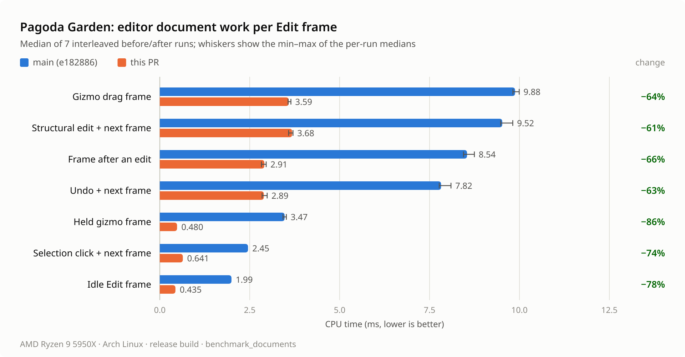
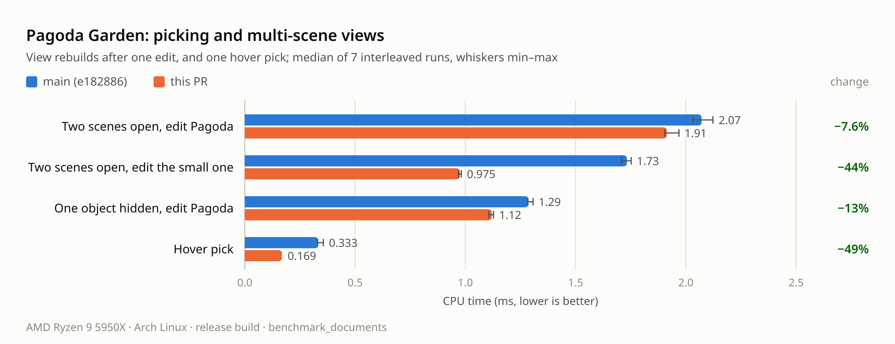
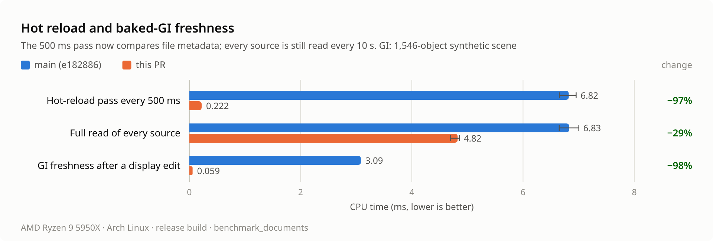

# Editor document measurements

This report measures branch `perf/editor-documents` (PR #59) at `cb8647f` against
`main` at `e182886`. The branch removes repeated whole-document work from the
native editor's Edit frames and from hot reload:

- `c4c61c5`: Edit frames compose world matrices once per document revision instead
  of validating the document and building ID-keyed maps for the light overlay and
  the gizmo. A held gizmo no longer copies the document, and the dirty flag is
  memoized per revision.
- `570646f`: picking reads dense edit-world matrices, and split model surfaces test
  their part bounds before walking the model's BVH.
- `c39241a`: an edit builds one runtime world instead of two. The effects preview
  keeps its render cache, its particles and its display clock across edits that keep
  the same emitters.
- `5674350`: baked-GI freshness is kept across edits that change none of its inputs.
- `1cab50e`: the inspector's prefab overrides are cached per revision.
- `5889047`: multi-scene views reuse the documents an edit did not change.
- `3aa77f9`, `6b3631d`: hot reload keeps digests instead of source bytes, and the
  editor's and player's 500 ms pass compares file metadata. Every source is still
  read every 10 s; see [hot reload](../assets.md#background-jobs-and-hot-reload).
- `cb8647f`: the Scene Hierarchy indexes each document snapshot once. This benchmark
  does not run egui panels, so it does not measure this change.

`7cd355a` adds the Pagoda Garden cases to the `benchmark_documents` example. All
timings are CPU time of document work. They exclude GPU execution, egui layout and
painting, and window presentation; they are not frame rates.

## Machine and build

- AMD Ryzen 9 5950X (16 cores), 32 GB RAM, Arch Linux, kernel 7.2.9-arch1-1,
  x86-64. Scenes and sources were read from a local NVMe drive.
- cpufreq driver `amd-pstate-epp` in active mode, governor `powersave`,
  energy-performance preference `balance_performance`. The boost flag read 0, but
  cores reported about 4.4 GHz. Frequency was not pinned and no CPU affinity was set.
- Rust 1.95.0 (`59807616e 2026-04-14`). Both binaries were built with
  `cargo build --release --locked -p bozzard-editor --example benchmark_documents`.
  The release profile uses thin LTO and one codegen unit.
- No builds or other benchmarks ran during the timed runs. The one-minute load
  average stayed between 1.20 and 1.42, about the benchmark's own process. The 5- and
  15-minute averages were still falling after earlier builds; see the
  [load log](editor-documents/load.log).

## Method

**Before** is `e182886` with the branch's final
`crates/bozzard-editor/examples/benchmark_documents.rs` copied in and two calls
changed to the APIs that `e182886` has
([`before-benchmark.diff`](editor-documents/before-benchmark.diff)):

1. The light and camera overlay calls `Scene::global_transforms`, which validates the
   document and builds an ID-keyed map, as the overlay at `e182886` did. After calls
   `Editor::world_transforms`.
2. `pagoda_hot_reload_changed_scan` calls `AssetStore::refresh_with`, the pass the
   editor at `e182886` ran every 500 ms, because `RefreshScan` does not exist there.

The rest of the benchmark is identical. `e182886` has the same tree as `d2ad869`, the
merge of PR #55 into `main`.

**After** is the branch head. Its binary was built from `0fab691`, which has the same
tree as `cb8647f` (`b7dbc48`); the two commits differ only in author and committer
email. [`environment.txt`](editor-documents/environment.txt) records both builds and
their SHA-256.

Each process runs `benchmark_documents all`: the synthetic cases, then the Pagoda
Garden cases. Every case runs 10 untimed samples, then 200 timed samples (100 for
edits, Undo and workspace views, 40 for the full hot-reload pass), and prints their
median and 95th percentile. A case that changes state runs an untimed setup step
before each sample, so every sample starts from the same document. The run also
checks that selection leaves the document clean and that Undo restores the saved
scene.

One warm-up pair was discarded. Seven pairs then ran in the order before, after,
before, after. A before process took 17–18 s and an after process 7–8 s. The tables
give the median of the seven per-run medians and, in parentheses, their range.
[`summary.md`](editor-documents/summary.md) adds the median per-run 95th percentiles.
The [raw output](editor-documents/) of every process is kept; standard error was empty
for all of them.

To reproduce, from a checkout of the branch:

```sh
cargo build --release --locked -p bozzard-editor --example benchmark_documents
target/release/examples/benchmark_documents all

git worktree add ../bozzard-before e182886
git show cb8647f:crates/bozzard-editor/examples/benchmark_documents.rs \
  > ../bozzard-before/crates/bozzard-editor/examples/benchmark_documents.rs
git -C ../bozzard-before apply "$PWD/docs/measurements/editor-documents/before-benchmark.diff"
cargo build --release --locked --manifest-path ../bozzard-before/Cargo.toml \
  -p bozzard-editor --example benchmark_documents
../bozzard-before/target/release/examples/benchmark_documents all
```

The example also accepts `synthetic` or `pagoda`, and a path to another scene for the
Pagoda cases. It finds its scenes through paths fixed at compile time, so run each
binary from its own checkout. Alternate the two binaries and repeat; one run is not
enough to separate a few percent from noise.

## Results

### Pagoda Garden Edit frames

The Pagoda Garden (`examples/pagoda-garden/scenes/pagoda.json`) has 1,056 objects,
139 assets (meshes and scripts), four particle emitters and five lights. A frame is
the native editor's document work for one Edit frame, in the app's order: the
workspace view, a 16 ms effects-preview step and its extraction from the fly camera,
the widget frame, and the overlays (hidden objects, the selected surface outline, light
and camera markers, the gizmo transform and its parent, and the dirty title). The
selected object is `c-pagoda`, a legacy whole model under the view center.



| Case | Measures | Before, ms | After, ms | Change |
| --- | --- | ---: | ---: | ---: |
| `pagoda_idle_frame` | One frame without a document change | 1.993 (1.974–2.015) | 0.435 (0.430–0.439) | −78% |
| `pagoda_select_click` | Click a surface of the model (pick and select it), next frame | 2.453 (2.439–2.493) | 0.641 (0.637–0.646) | −74% |
| `pagoda_gizmo_held_frame` | Re-apply the same transform during a gizmo drag, next frame | 3.471 (3.425–3.519) | 0.480 (0.469–0.484) | −86% |
| `pagoda_gizmo_drag_frame` | Move the model 1 mm during a gizmo drag, next frame | 9.878 (9.819–9.993) | 3.586 (3.566–3.645) | −64% |
| `pagoda_structural_edit_frame` | Create an empty object, next frame | 9.522 (9.477–9.814) | 3.680 (3.582–3.703) | −61% |
| `pagoda_structural_edit_only` | Create an empty object | 0.965 (0.958–0.981) | 0.779 (0.763–0.800) | −19% |
| `pagoda_frame_after_edit` | The frame after creating an empty object | 8.543 (8.445–8.747) | 2.907 (2.827–2.958) | −66% |
| `pagoda_undo_frame` | Undo creating an empty object, next frame | 7.821 (7.769–8.096) | 2.893 (2.844–2.986) | −63% |
| `pagoda_idle_overlays` | The overlays alone, with the model selected | 1.524 (1.512–1.540) | 0.001 (0.001–0.001) | >−99% |
| `pagoda_dirty` | The dirty flag for the title bar | 0.040 (0.039–0.042) | <0.001 | >−99% |
| `pagoda_effects_preview_build` | A new effects preview, with its particle prewarm | 4.080 (4.054–4.119) | 3.917 (3.906–3.967) | −4% |

### Picking and multi-scene views

`OpenScenes::sync_view` rebuilds the combined authoring view after an untimed edit
(creating an empty object, or undoing it). Scene Lab
(`examples/demo/scenes/scene-lab.json`, 10 objects) is the second open scene.



| Case | Measures | Before, ms | After, ms | Change |
| --- | --- | ---: | ---: | ---: |
| `pagoda_hover_pick` | Pick the nearest point under the view center | 0.333 (0.329–0.356) | 0.169 (0.164–0.171) | −49% |
| `pagoda_hidden_object_view` | Pagoda Garden alone with one object hidden; edit it | 1.286 (1.283–1.307) | 1.120 (1.107–1.128) | −13% |
| `pagoda_two_scene_view_small_edit` | Both scenes open; edit Scene Lab | 1.733 (1.708–1.752) | 0.975 (0.968–0.982) | −44% |
| `pagoda_two_scene_view` | Both scenes open; edit the Pagoda Garden | 2.071 (2.031–2.123) | 1.914 (1.904–1.969) | −8% |

### Hot reload, GI freshness and prefab overrides

The hot-reload cases run on a copy of the editor's Pagoda Garden catalog; nothing
changes on disk. The other two cases use the synthetic document: the demo scene with
1,536 static cubes added (1,546 objects) and a small synthetic GI bake whose
fingerprint matches. The prefab case selects instance `cargo-2` in
`examples/demo/scenes/prefab-lab.json` (18 objects).



| Case | Measures | Before, ms | After, ms | Change |
| --- | --- | ---: | ---: | ---: |
| `pagoda_hot_reload_changed_scan` | The editor's 500 ms pass: before reads every source, after compares metadata | 6.822 (6.654–6.954) | 0.222 (0.220–0.222) | −97% |
| `pagoda_hot_reload_cycle` | Read and compare every source (`refresh_with`) | 6.828 (6.651–7.003) | 4.824 (4.698–4.854) | −29% |
| `gi_freshness_after_display_edit` | First GI freshness query after an exposure edit | 3.085 (3.081–3.114) | 0.059 (0.059–0.060) | −98% |
| `prefab_inspector_overrides` | The selected instance's overrides at an unchanged revision | 0.020 (0.020–0.022) | <0.001 | >−99% |

### Unchanged paths

These cases run code that the branch does not change, or the reference paths it now
avoids. They show the difference between the two binaries where none is expected.

| Case | Measures | Before, ms | After, ms | Change |
| --- | --- | ---: | ---: | ---: |
| `clone_document` | Deep copy of the synthetic document | 0.182 (0.179–0.184) | 0.178 (0.174–0.180) | −2% |
| `shared_document` | Share its immutable snapshot | <0.001 | <0.001 | |
| `gi_freshness_reference` | Full GI fingerprint (`gi::is_current`) | 3.052 (3.038–3.134) | 3.085 (3.071–3.137) | +1% |
| `gi_freshness_cached` | GI freshness at an unchanged revision | <0.001 | <0.001 | |
| `extract_runtime_reference` | Extraction from a live runtime world | 0.662 (0.653–0.666) | 0.654 (0.642–0.667) | −1% |
| `extract_authoring` | Authoring extraction at an unchanged revision | 0.637 (0.632–0.642) | 0.636 (0.625–0.653) | 0% |
| `extract_effects_preview` | Effects-preview extraction at an unchanged revision | 0.645 (0.642–0.648) | 0.638 (0.629–0.649) | −1% |
| `pagoda_validate` | Validate the Pagoda Garden | 0.523 (0.520–0.526) | 0.531 (0.527–0.534) | +1% |
| `pagoda_global_transforms` | Validate it and build the ID-keyed transform map | 0.712 (0.708–0.716) | 0.718 (0.716–0.724) | +1% |
| `pagoda_edit_world` | Spawn an edit world (`SceneRuntime::new`) | 1.357 (1.352–1.375) | 1.366 (1.358–1.373) | +1% |

`<0.001` marks medians below 1 µs, under the useful resolution of these timers.

## Caveats

- **`pagoda_hot_reload_changed_scan` compares different operations.** Both sides
  measure the pass that the editor runs about every 500 ms. Before, that pass read and
  compared every source. After, it reads file metadata, here for sources that last
  changed long before they were read. After still reads every source of each open
  document every 10 s, which `pagoda_hot_reload_cycle` measures. The pass runs in a
  background job, not in the Edit frame. Averaged over time, hot reload for this scene
  costs about 13.6 ms of background CPU per second before (two full passes) and about
  0.9 ms after (two metadata passes plus a tenth of a full pass).
- **Some edits now take up to 10 s to reload.** An edit that leaves a file's size and
  timestamps, and on Unix its inode and status-change time, unchanged is only found by
  the full read: a clock or file server that stamps files more than 2 s in the past, a
  network mount that caches attributes, or on Windows a replacement that keeps size and
  modification time. **Reload** reads every source of the active scene at once.
- **The edit cases keep the emitters.** Creating an empty object leaves the particle
  emitters unchanged, so the effects preview continues its particles instead of
  prewarming them. An edit that adds or removes an emitter still builds a new preview,
  which costs about `pagoda_effects_preview_build` more in its next frame.
- **The edits are small.** One empty object at the root. Edits that change many
  objects, assets or GI inputs do more work; an edit to a GI input still pays for the
  full fingerprint (`gi_freshness_reference`).
- **Small fixtures.** The prefab case uses an 18-object scene, and Scene Lab has
  10 objects. Their savings grow with the size of the instance and of the document.
- **Unchanged paths moved by −2% to +1%.** `pagoda_validate` and
  `pagoda_global_transforms` were about 1% slower after, with ranges that do not
  overlap, although the branch does not change them. Treat differences of this size
  as binary layout or machine noise.
- **Opening was slightly slower.** `Editor::open` on the Pagoda Garden, one sample per
  process, took 64.4–65.6 ms before and 66.7–69.6 ms after, in all seven pairs. Each
  source read now also computes a digest and takes file metadata; this was not profiled
  further.
- **One machine.** These are Linux x86-64 results only. The commit messages quote
  earlier single-run Apple M2 Pro figures taken while other builds ran; this run
  replaces them.
