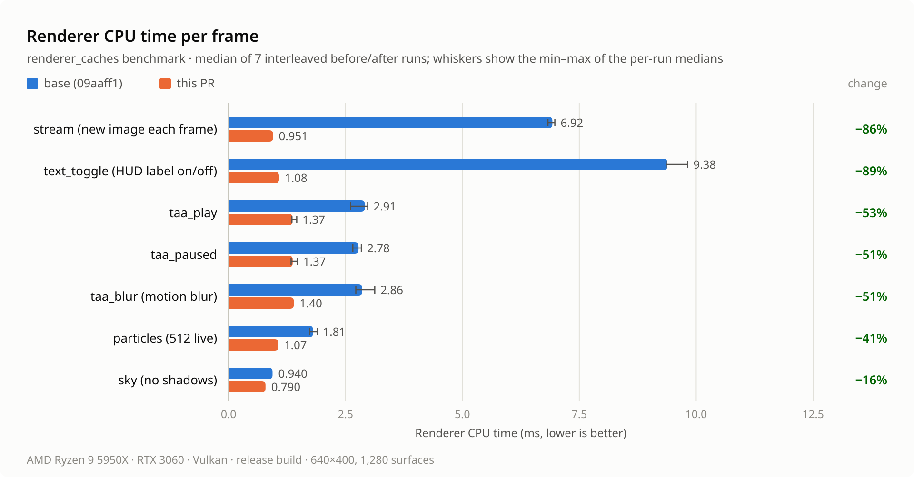
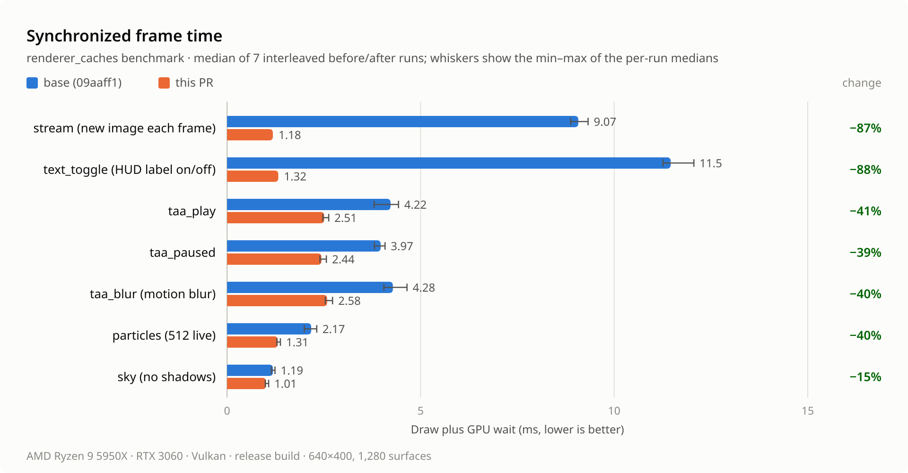
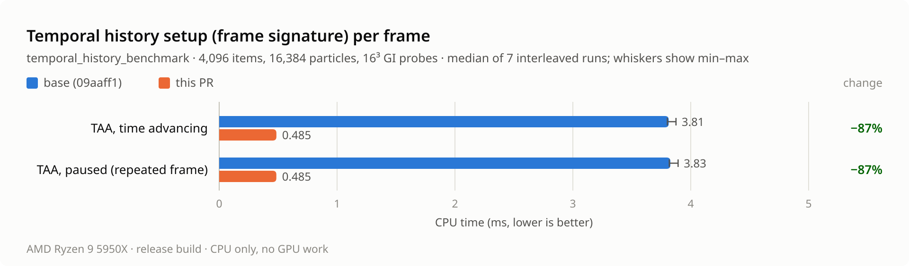

# Renderer cache measurements

Before/after measurements for the renderer cache pass (PR #60).
The base is `09aaff1`, which adds only the benchmarks. The branch is `bc7237f`.
The changes and the invalidation rules are described in
[batch renderer optimizations](../batch-renderer-optimizations.md#renderer-caches-across-asset-and-text-changes).
These are local renderer measurements on one machine, not windowed FPS.

## Machine and method

- AMD Ryzen 9 5950X; NVIDIA GeForce RTX 3060, driver 615.78.08; Vulkan through wgpu
  30.0.1; Arch Linux, kernel 7.2.9; Rust 1.95.0, release profile (thin LTO, one
  codegen unit). October 10, 2026.
- CPU frequency was not fixed: `amd-pstate-epp` with the `powersave` governor. The
  1-minute load average was 1.42 at the start. No builds ran during the measurement,
  and the desktop session stayed open.
- Each commit's test executables were built once with `cargo test --release --no-run`
  and run directly. [`machine.txt`](renderer-caches/machine.txt) records their
  checksums. The branch binaries were built from `7a3352b`, which differs from
  `bc7237f` only in commit email fields; both have tree `491e14e`.
- **Interleaving.** One untimed warm-up of each binary ran first. Then seven pairs
  ran. Within each pair, every benchmark ran base and then branch, each as a
  separate process, before moving to the next benchmark. The 42 timed processes
  took 48 s.
- **Statistics.** Each process reports medians over its own measured frames. The
  tables give the median of the seven per-run medians, the minimum–maximum of
  those medians, and the range of the seven per-pair branch/base ratios.

## Renderer cache workloads

`renderer_cache_benchmark` (`crates/bozzard-render/tests/renderer_caches.rs`) renders
1,280 lit cubes over 160 uploaded meshes. The scene has sun shadows and a sky and
draws into a 640×400 `Rgba8Unorm` offscreen target. Each workload uses a new
renderer and draws 90 frames; the first 10 are warm-up. **CPU** is
`FrameStats::cpu_ms`: renderer work including command submission, excluding GPU
execution. **Synchronized** is the draw call plus a device wait. **Encode** is
`FrameStats::encode_ms`.

| Workload | Per-frame change |
| --- | --- |
| `stream` | Publishes a 16×16 image under a new ID and evicts the previous one; nothing draws them |
| `text_toggle` | Adds a screen HUD label on even frames and removes it on odd frames |
| `taa_play` | TAA, bloom, auto exposure and depth of field, plus 4,096 particles and an 8³ GI volume; time advances |
| `taa_paused` | As `taa_play`, with time stopped |
| `taa_blur` | As `taa_play`, plus motion blur |
| `particles` | 512 live particles; time advances |
| `sky` | Shadows off; a camera-facing wall of the cubes covers most of the sky. No asset, text, particle or temporal work |

<picture>
  <source media="(prefers-color-scheme: dark)" srcset="../images/renderer-caches/cpu-dark.png">
  
</picture>

<picture>
  <source media="(prefers-color-scheme: dark)" srcset="../images/renderer-caches/synchronized-dark.png">
  
</picture>

| Workload | Metric | Base median (range) | Branch median (range) | Branch / base (pair range) |
| --- | --- | ---: | ---: | ---: |
| `stream` | CPU | 6.925 ms (6.830–6.978) | 0.951 ms (0.933–0.983) | 0.137 (0.135–0.141) |
| | Synchronized | 9.073 ms (8.876–9.326) | 1.183 ms (1.158–1.217) | 0.130 (0.125–0.134) |
| | Encode | 0.552 ms (0.541–0.565) | 0.109 ms (0.101–0.113) | 0.197 (0.179–0.205) |
| `text_toggle` | CPU | 9.383 ms (9.357–9.817) | 1.078 ms (1.066–1.091) | 0.115 (0.110–0.116) |
| | Synchronized | 11.459 ms (11.263–12.059) | 1.323 ms (1.305–1.325) | 0.115 (0.109–0.117) |
| | Encode | 1.600 ms (1.574–1.687) | 0.120 ms (0.118–0.125) | 0.075 (0.071–0.079) |
| `taa_play` | CPU | 2.914 ms (2.611–2.976) | 1.366 ms (1.354–1.458) | 0.469 (0.459–0.534) |
| | Synchronized | 4.223 ms (3.798–4.429) | 2.509 ms (2.474–2.626) | 0.594 (0.566–0.683) |
| | Encode | 0.272 ms (0.258–0.281) | 0.126 ms (0.121–0.133) | 0.463 (0.431–0.496) |
| `taa_paused` | CPU | 2.779 ms (2.658–2.840) | 1.371 ms (1.337–1.473) | 0.493 (0.471–0.543) |
| | Synchronized | 3.968 ms (3.806–4.081) | 2.438 ms (2.398–2.565) | 0.614 (0.595–0.658) |
| | Encode | 0.280 ms (0.271–0.291) | 0.126 ms (0.124–0.135) | 0.450 (0.441–0.482) |
| `taa_blur` | CPU | 2.859 ms (2.722–3.127) | 1.395 ms (1.376–1.429) | 0.488 (0.457–0.509) |
| | Synchronized | 4.283 ms (4.051–4.648) | 2.585 ms (2.537–2.725) | 0.604 (0.571–0.635) |
| | Encode | 0.277 ms (0.272–0.304) | 0.127 ms (0.122–0.129) | 0.458 (0.421–0.467) |
| `particles` | CPU | 1.806 ms (1.734–1.897) | 1.066 ms (1.051–1.077) | 0.590 (0.562–0.618) |
| | Synchronized | 2.173 ms (1.995–2.317) | 1.310 ms (1.286–1.378) | 0.603 (0.570–0.664) |
| | Encode | 0.274 ms (0.267–0.363) | 0.121 ms (0.116–0.122) | 0.442 (0.336–0.454) |
| `sky` | CPU | 0.940 ms (0.930–0.972) | 0.790 ms (0.784–0.821) | 0.840 (0.825–0.883) |
| | Synchronized | 1.185 ms (1.144–1.238) | 1.007 ms (0.987–1.074) | 0.850 (0.813–0.939) |
| | Encode | 0.079 ms (0.078–0.083) | 0.077 ms (0.076–0.085) | 0.975 (0.962–1.090) |

The CPU and synchronized ranges never overlap, and in every pair the branch is faster on
both in every workload. `sky` encoding is unchanged: both builds replay the same render
bundle.

### Counters

The counters were identical in all seven runs of each build. They are given per
measured frame (the raw data holds totals over 80 frames).

| Workloads | Work per frame | Base | Branch |
| --- | --- | ---: | ---: |
| `stream`, `text_toggle` | Sun shadow maps rendered | 1 | 0 |
| | Shadow draws | 160 | 0 |
| | Object uniform buffers allocated | 1,198 | 0 |
| | Surface records rebuilt | 1,280 | 0 |
| | Render bundle compilations | 1 | 0 |
| TAA workloads, `particles` | Opaque pass replayed from a render bundle | never | every frame |
| | Opaque pass encoded draw by draw | every frame | never |
| `taa_play`, `taa_paused` | Post-processing bind groups created | 8 \* | 0 |
| `taa_blur` | Post-processing bind groups created | 2 \* | 0 |
| All | String-keyed mesh lookups | 3,758 (`sky` 3,360) † | 1,280 † |

\* The base benchmark has no `post_bind_groups` counter. These counts are taken from
the code, as described in `5ad9316`. The branch counter reads 0 after the first two
frames.
† Counted with temporary instrumentation while developing `bc7237f`, not in this run.

- **`stream` and `text_toggle`.** In the base, every publication, every eviction
  and every appearance or disappearance of text called a full invalidation. Each
  frame therefore re-rendered the sun shadow map, reallocated an individual uniform
  buffer for each surface, re-prepared every surface and recompiled the render
  bundle. In the branch, the new IDs were never drawn, so nothing is invalidated.
  The text renderer outlives the one-frame gaps, and text atlas changes rebind only
  text users (`0e41dd6`).
- **TAA workloads.** Four changes act together here, and the run does not separate
  them:
  - the opaque bundle is kept while particles are live (`94d6114`);
  - TAA consumers reuse their ping-pong bind groups (`5ad9316`);
  - the frame signature is cheaper (`a20860a`); here it covers 1,280 items, 4,096
    particles and 512 probes;
  - meshes are resolved once per surface (`bc7237f`).
- **`particles`.** The opaque pass is retained while particles are live (`94d6114`),
  and meshes are resolved once per surface (`bc7237f`).
- **`sky`.** This workload has no asset churn, text, particles or temporal effects.
  Its 0.15 ms matches the per-frame mesh resolution in `bc7237f`, which applies to
  every workload. While developing that commit, temporary phase timers put the
  visibility step at 0.23–0.31 ms before and 0.10–0.15 ms after.

## Mip chains and frame signature

`mipmap_upload_benchmark` uploads one model with eight 1024² images (11 mip levels
each) through the synchronous path, 12 times; the first two uploads are warm-up.
`temporal_history_benchmark` is a CPU-only library test. It times
`MotionHistory::begin`, which computes the temporal frame signature, for 4,096 items,
16,384 particles and a 16³ GI volume (4,096 probes). It measures 60 of 70 frames.

<picture>
  <source media="(prefers-color-scheme: dark)" srcset="../images/renderer-caches/signature-dark.png">
  
</picture>

| Benchmark | Metric | Base median (range) | Branch median (range) | Branch / base (pair range) |
| --- | --- | ---: | ---: | ---: |
| Mipmapped model upload | Upload CPU | 6.029 ms (5.841–6.570) | 4.730 ms (4.657–5.322) | 0.785 (0.713–0.910) |
| | Synchronized | 6.038 ms (5.857–6.579) | 4.746 ms (4.672–5.364) | 0.786 (0.714–0.916) |
| Temporal history, play | Per frame | 3.8131 ms (3.8018–3.8749) | 0.4853 ms (0.4837–0.4864) | 0.127 (0.125–0.128) |
| Temporal history, paused | Per frame | 3.8273 ms (3.8180–3.8927) | 0.4848 ms (0.4835–0.4870) | 0.127 (0.125–0.127) |

On the upload path, the branch differs from the base mainly in `2fe122f`: it
submits one command buffer per texture rather than one per mip level. That saves
about 1.3 ms per eight-image upload here. The earlier, preliminary Apple M2 Pro /
Metal run showed no clear change. The signature falls by 87% (`a20860a`). The
benchmark checks the same repeat decisions in both modes: frames repeat only when
time is paused.

## Pixel identity

Before the run, the base benchmark wrote 21 captures (three per workload) into a
reference directory. The captures are taken after each workload's timed frames, so
the TAA ones include accumulated history. Every `renderer_cache_benchmark` process
compared its 21 captures with them byte for byte, and any difference fails the
test. All 14 timed processes and both warm-ups (`sky` only) passed. That is 147
branch comparisons, plus 147 base comparisons that confirm the captures are
deterministic. The captures are 21 MiB of raw RGBA and are not committed.

## Caveats

- **Scope.** One desktop GPU, one driver and one backend were measured. Metal,
  DX12 and integrated GPUs were not measured in this run. The preliminary M2 Pro
  numbers in the PR draft were taken while builds were running and are superseded.
- **Synthetic scene.** The scene is synthetic and small (640×400). Synchronized
  time includes a device wait after every frame; it is not presentation time or
  FPS. No GPU timestamps were recorded.
- **Steady state only.** `stream` and `text_toggle` measure unrelated churn.
  Replacing or evicting an asset that the last frame drew still rebuilds surface
  preparation; for shadow inputs, it also rebuilds the shadow caches. That cold
  frame is not measured here.
- **Text and HUD retention.** `text_toggle` relies on the text and HUD renderers
  living for 60 idle frames. A label that returns after a longer gap rebuilds them
  as before.
- **Attribution.** The commits overlap in several workloads and were not timed
  separately. The counters show which mechanism changed.
- **Shared GI allocation.** The signature benchmark reuses one GI allocation, so
  the cached probe hash is hit every frame. A scene that allocates new probe data
  every frame rehashes it, with the faster hasher.
- **Synchronous uploads only.** The mip benchmark times synchronous uploads. Staged
  upload slices also record their passes into one command buffer, but they are not
  timed.

## Reproduce

Write the reference captures at `09aaff1` into an empty directory. Then run the same
command at the branch head, which compares against them:

```sh
BOZZARD_CACHE_REFERENCE_DIR=/tmp/renderer-cache-refs cargo test --release -p bozzard-render \
  --test renderer_caches renderer_cache_benchmark -- --ignored --exact --nocapture --test-threads=1
cargo test --release -p bozzard-render --test renderer_caches mipmap_upload_benchmark \
  -- --ignored --exact --nocapture --test-threads=1
cargo test --release -p bozzard-render --lib scene::geometry::tests::temporal_history_benchmark \
  -- --ignored --exact --nocapture --test-threads=1
```

`BOZZARD_CACHE_WORKLOADS=stream,sky` selects workloads. For interleaved pairs, build
both commits once with `--no-run` and alternate the resulting executables with the
same arguments.

Raw data, in [`renderer-caches/`](renderer-caches/):

- [`machine.txt`](renderer-caches/machine.txt) records the start time, load, governor,
  GPU state and binary checksums. Its paths are shortened.
- [`runs.log`](renderer-caches/runs.log) holds the output of every process, in run order.
- [`summary.tsv`](renderer-caches/summary.tsv) holds the parsed per-run values and
  the medians.
