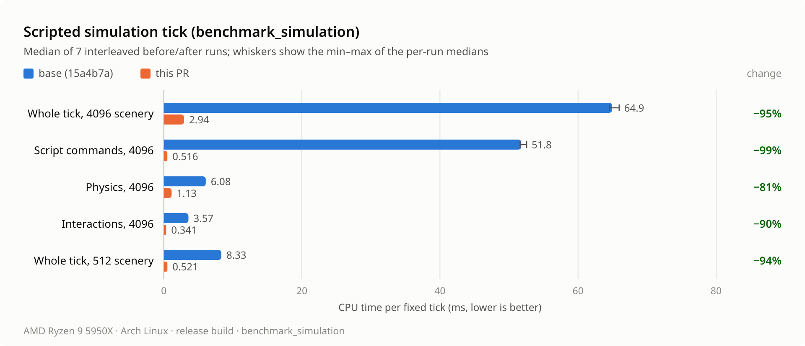
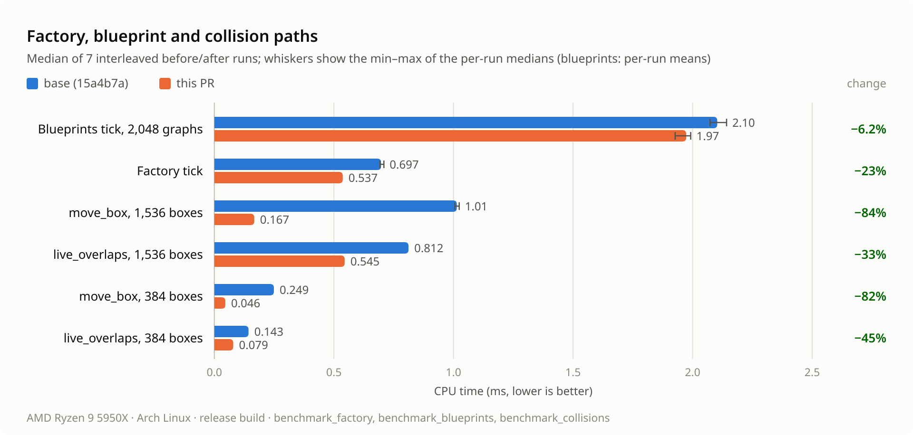
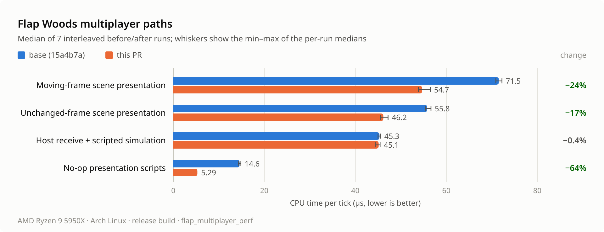

# Runtime transform, collision and script tick measurements

These measurements compare `perf/runtime-transforms` at `bbbded9` with its base, `15a4b7a`.
The base is the merge-base with main (`59dfe95`) plus one commit that adds
`benchmark_simulation`, so both sides can run the same five benchmarks. Main has since
gained #55, which changes only editor crates that none of these benchmarks link.

All numbers are headless CPU time in release builds. They do not measure rendering, GPU
work or frame rate.

## Machine and build

- AMD Ryzen 9 5950X, 16 cores with SMT, 32 GB RAM.
- Arch Linux, kernel 7.2.9-arch1-1, x86_64.
- `amd-pstate-epp` in active mode, governor `powersave`, energy preference
  `balance_performance`. These were not changed for the run. The cpufreq `boost` flag
  read 0 when checked afterwards.
- Rust 1.95.0 (LLVM 22.1.2), the workspace release profile (thin LTO, one codegen unit),
  `--locked --offline`.
- Each side was built in its own worktree with its own target directory. A shared target
  directory makes the second build reuse the first one's artifacts, because the workspace
  path is not part of Cargo's metadata hash.

## Method

- 7 pairs, run in ABAB order. Each pair runs every benchmark once on the base binary and
  then once on the final binary, one process each, before moving to the next benchmark.
- Processes were not pinned to a core.
- Nothing else was building or benchmarking. The one-minute load average was 1.18–1.39
  when each process started.
- Each process reports one value: the median of its timed ticks. The tables show the
  median of the 7 per-run values, with their range in parentheses. `benchmark_blueprints`
  is the exception: it reports the mean over its 300 ticks, not a median.
- Stage values are the median of each profiler span across ticks. They do not add up
  exactly to the tick median.

| Benchmark | Workload | Warmup + timed ticks |
| --- | --- | --- |
| `benchmark_simulation N` | 16 Rapier bodies with Gravity and a Player Controller with scripted input. A driver script calls `move_with_collision` on 16 box movers and, for each of 8 parented rigs, rotates the rig and moves one of its arms. N parented scenery objects in groups of 32, half with box colliders. 604 objects at N = 512, 4,300 at N = 4096. | 60 + 300 |
| `benchmark_collisions N` | N rotated boxes on a sparse grid. `live_overlaps` moves one box and builds the full collision snapshot. `move_box` resets that box and moves it once. | 10 + 100 per path |
| `benchmark_factory` | Earth factory scene in an empty creative world with a fixed seed. | 60 + 180 |
| `benchmark_blueprints` | 256 owners with 8 spinning graphs each (2,048 attachments, 614,400 actions). | 10 + 300 |
| `flap_multiplayer_perf` | Flap Woods with four in-process peers; see [multiplayer](../multiplayer.md#cpu-performance-benchmark). | 6,000 per path |

Both sides were built and run with:

```sh
cargo build --release --locked --offline -p bozzard-runtime \
  --example benchmark_simulation --example benchmark_factory --example benchmark_blueprints
cargo build --release --locked --offline -p bozzard-scene --example benchmark_collisions
cargo build --release --locked --offline -p bozzard-network --example flap_multiplayer_perf
target/release/examples/benchmark_simulation 512
target/release/examples/benchmark_simulation 4096
target/release/examples/benchmark_collisions 384
target/release/examples/benchmark_collisions 1536
target/release/examples/benchmark_factory
target/release/examples/benchmark_blueprints
target/release/examples/flap_multiplayer_perf
```

## Results







The charts use the same medians and ranges as the table below. Dark-theme versions are
next to them in `docs/images/runtime-transforms/`.

| Benchmark | Base | Final | Change |
| --- | ---: | ---: | ---: |
| Simulation, 512 scenery, tick (ms) | 8.332 (8.308–8.397) | 0.521 (0.517–0.529) | −93.7% |
| Simulation, 4096 scenery, tick (ms) | 64.931 (64.560–65.955) | 2.937 (2.915–2.988) | −95.5% |
| Collisions, 384 boxes, `move_box` (ms) | 0.249 (0.247–0.254) | 0.046 (0.045–0.049) | −81.5% |
| Collisions, 1,536 boxes, `move_box` (ms) | 1.014 (1.005–1.024) | 0.167 (0.165–0.170) | −83.6% |
| Collisions, 384 boxes, `live_overlaps` (ms) | 0.143 (0.142–0.146) | 0.079 (0.074–0.080) | −44.7% |
| Collisions, 1,536 boxes, `live_overlaps` (ms) | 0.812 (0.808–0.815) | 0.545 (0.543–0.548) | −32.9% |
| Factory, tick (ms) | 0.697 (0.693–0.709) | 0.537 (0.534–0.540) | −23.0% |
| Blueprints, tick (ms, mean) | 2.103 (2.073–2.142) | 1.973 (1.927–1.992) | −6.2% |
| Flap Woods, no-op presentation scripts (µs) | 14.570 (14.290–14.850) | 5.290 (5.240–5.400) | −63.7% |
| Flap Woods, moving-frame scene presentation (µs) | 71.541 (70.890–72.230) | 54.690 (53.850–56.480) | −23.6% |
| Flap Woods, unchanged-frame scene presentation (µs) | 55.750 (55.371–56.630) | 46.161 (45.531–47.200) | −17.2% |
| Flap Woods, host receive and scripted simulation (µs) | 45.310 (44.990–45.550) | 45.130 (44.390–45.450) | −0.4% |
| Flap Woods, replica prediction and snapshot replay (µs) | 8.010 (7.945–8.260) | 7.800 (7.645–8.030) | −2.6% |
| Flap Woods, replica snapshot apply and replay (µs) | 1.170 (1.140–1.190) | 1.170 (1.140–1.210) | 0.0% |
| Flap Woods, scripted presentation accessors (µs) | 0.130 (0.120–0.140) | 0.120 (0.120–0.120) | −7.7% |

The last four Flap Woods rows have overlapping ranges, so they show no change. The
accessor path is at the timer's 0.01 µs resolution.

### Simulation stages

| Stage (ms) | 512 base | 512 final | 4096 base | 4096 final |
| --- | ---: | ---: | ---: | ---: |
| Script commands | 6.405 | 0.146 | 51.777 | 0.516 |
| Physics | 0.744 | 0.161 | 6.080 | 1.131 |
| Interactions | 0.546 | 0.040 | 3.569 | 0.341 |
| Script read view | 0.227 | 0.036 | 1.520 | 0.252 |
| Script hooks | 0.057 | 0.051 | 0.064 | 0.055 |
| Scripts, other | 0.336 | 0.080 | 1.828 | 0.630 |
| Scripts, total | 7.025 | 0.313 | 55.184 | 1.452 |
| Fixed tick | 8.332 | 0.520 | 64.930 | 2.937 |

"Scripts, other" is the Scripts stage minus its three sub-stages, computed per run. It
covers collision geometry, solid contacts and overlap pairs for the script tick. Stages
below 0.01 ms (Spin, Blueprints, Audio and others) are at the timer's resolution and
are left out. [`report.txt`](runtime-transforms/report.txt) lists every stage.

### Factory stages

| Stage (ms) | Base | Final | Change |
| --- | ---: | ---: | ---: |
| Script hooks | 0.487 | 0.483 | −0.8% |
| Script read view | 0.158 | 0.023 | −85.4% |
| Physics | 0.019 | 0.005 | −73.7% |
| Script commands | 0.007 | 0.006 | — |
| Scripts, total | 0.669 | 0.527 | −21.2% |
| Fixed tick | 0.696 | 0.537 | −22.8% |

Rhai hook execution takes most of the factory tick, and this branch does not change it.
The gain is the read view and physics.

### Final poses

The final pose digest covers every world matrix after the last tick. It was the same on
both sides in all 7 runs:

| Scenery | Base | Final |
| --- | --- | --- |
| 512 | `090639c8cbe7926b` | `090639c8cbe7926b` |
| 4096 | `f8b7c97a503c0a6b` | `f8b7c97a503c0a6b` |

## What each commit changes

Per-commit timings were not taken on this machine. The table attributes each result to
the commits that change the code inside the profiler stage or benchmark path where it
shows. Where several commits act on the same stage, their shares are not separated.

| Commit | Change | Where it shows |
| --- | --- | --- |
| `15a4b7a` | Adds `benchmark_simulation` | Base for every measurement |
| `1b94371` | ECS type and entity keys skip SipHash | Every `World` lookup and entity-to-index map; no single stage |
| `5343257` | Spin writes through per-entity guards | The transform cache stops recomposing every world matrix each tick; every stage that reads matrices gains |
| `e68ada8` | Systems share the live world-matrix cache; hierarchy writes recompose one subtree; the Player Controller builds only its own colliders | Script commands (`rotate`, `set_position`), Physics, Interactions, `live_overlaps` |
| `6a31d09` | Consecutive moves share one geometry snapshot; obstacles are pruned by bounds | Script commands (16 `move_with_collision` calls per tick), `move_box` |
| `3fd8fe5` | Overlap pairs and contacts only for scripts that listen | "Scripts, other", with `e68ada8`'s shared geometry |
| `9139e95` | The script read view is updated in place | Script read view in the simulation and the factory; the Flap Woods presentation paths |
| `403e304` | Physics reuses body shapes while their inputs are unchanged | Physics, with `e68ada8` in the simulation and `bbbded9` in the factory |
| `038b3ea` | Script modules list their function arities once | No measurable change in these benchmarks |
| `bbbded9` | Per-tick blueprint and component bookkeeping stops allocating | Blueprints tick, with `1b94371`; factory Physics |

`benchmark_collisions` resets the mover with a direct ECS write before each move. That
write invalidates the shared move geometry, so `move_box` measures one move on its own.
Its gain comes from building geometry once, validating only the mover and pruning
obstacles. In `benchmark_simulation`, the 16 consecutive moves in a tick also share one
geometry snapshot.

## Validation

Run on the tree measured here:

- `cargo fmt --all -- --check` passed.
- `cargo clippy --workspace --all-targets --locked --offline -- -D warnings` passed with
  no warnings.
- `cargo test --locked --offline -p bozzard-ecs -p bozzard-app -p bozzard-scene
  -p bozzard-runtime -p bozzard-network`: 562 passed, 4 ignored.
- `cargo test --workspace --locked --offline --no-fail-fast`: 1,264 passed, none failed,
  57 ignored. The ignored tests are marked manual, GPU or long-running.

## Limits

- One machine and one OS. Absolute times depend on the `powersave` governor and other
  frequency settings; the ratios are the comparison.
- The earlier figures in the PR #57 draft came from single runs on an Apple M2 Pro that
  was busy with builds. This run replaces them.
- Benchmarks were not pinned, so the scheduler could move a process between cores.
  Ranges show how much that varied.
- `move_box` and `live_overlaps` measure single-object queries on regular grids. Dense,
  overlapping bounds still make the broad phase and obstacle pruning check most pairs.
- Physics shape reuse helps static and resting bodies. Bodies that the solver moves, and
  Player Controllers, rebuild their shapes every step, as before.
- The factory co-op replication diff was not attempted. No benchmark covers co-op
  replication, and the fix would change serialized types.

## Files

- [`environment.txt`](runtime-transforms/environment.txt): host, governor, revisions and
  SHA-256 of every benchmark binary. It records the final revision as `60dbdf2`, which
  is `bbbded9` before a committer-email correction. The two commits have the same tree,
  `43bf778`.
- [`summary.tsv`](runtime-transforms/summary.tsv): every parsed value from every run.
- [`report.txt`](runtime-transforms/report.txt): medians and ranges for every metric,
  including all stages.
