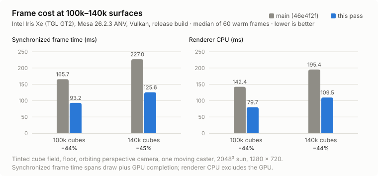
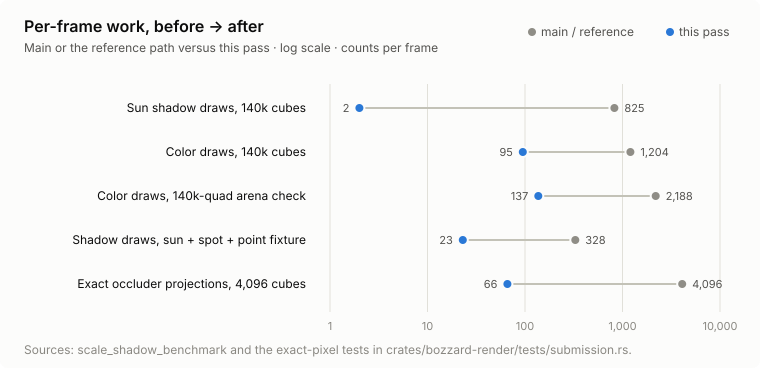
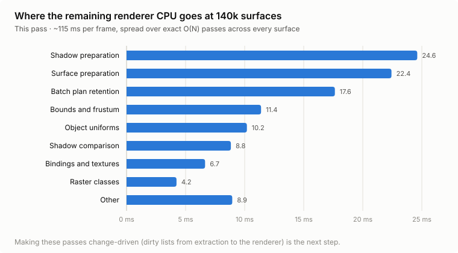

# Performance measurements

See [the detailed October follow-up](further-optimizations.md) for per-change rationale,
charts, raw samples, dense-world simulation results, packed exports and validation.

## Large editor panels

Earth Factory's 782 authored objects exposed an editor UI bottleneck on an RTX 3060:
the hierarchy constructed every expanded object/surface row, and the asset browser
constructed every tile, including offscreen thumbnails. Native development Play
measured 127.6 ms median editor CPU and 138.4 ms median frame interval (about 7 FPS).
The renderer itself took about 2 ms. A second instrumented run attributed 70.8 ms
to Hierarchy and 31.8 ms to Assets.

Both panels now construct widgets only for visible scroll rows. Hierarchy keeps the
full object order for range selection, collapse/search, imported surfaces and reparenting;
asset tiles retain IDs while scrolling, and thumbnails are generated on demand. egui
and epaint also use optimization level 2 in development, retaining debug information.
The Debug profiler exposes editor stage and pane timings separately from simulation.

Local native runs on October 1, 2026, RTX 3060 / Vulkan, after thirty ready-frame
warmups. The original/virtualization-only runs were exploratory and had changing
viewport sizes; optimized development and release used 336 × 518. These are
observations across configurations, not an exact same-viewport FPS A/B comparison:

| Build / scene | Median editor CPU | Median frame interval | Approximate FPS |
| --- | ---: | ---: | ---: |
| Previous development / title | 127.6 ms | 138.4 ms | 7 |
| Virtualized panels, original UI optimization / title | 17.4 ms | 27.7 ms | 36 |
| Virtualized panels, optimized UI dependencies / title | 13.2 ms | 20.8 ms | 48 |
| Release / title | 2.2 ms | 6.9 ms | 144 |
| Release / seeded production demo | 3.9 ms | 6.9 ms | 144 |

These runs captured 120–180 frames. The final 180-frame production-demo run used seed 4
with no concurrent compilation. These are measurements of these fixtures and
editor layout, not a guarantee for larger viewports, built factories or other
hardware. Gameplay effects and quality are unchanged.

```sh
cargo build --release --locked --offline -p bozzard-editor-app -p bozzard-player
target/release/bozzard-editor --scene examples/earth-factory/scenes/earth.json \
  --hardware --benchmark-play --benchmark-frames 180
```

`--benchmark-frames 1..240` records native editor frames, prints JSON with CPU,
interval, pane, simulation and GPU data, and exits. Omit `--benchmark-play` to measure
authoring. Use the same layout/profile for comparisons; startup and upload frames
are excluded. Existing ordinary editor arguments still apply.

For the September 2026 optimization pass, including shadow reuse, idle editor drawing, CPU caches, and before/after results, see [the optimization review](optimization-results.md). For the subsequent live collision, per-light shadow, shader pipeline, render attachment, and editor document work, see [the follow-up review](optimization-followup.md). The recorded measurements below describe an earlier pass.

The benchmarks below separate factory simulation, editor CPU work, and synchronized rendering. Their elapsed CPU or synchronized wall times are not windowed FPS measurements.

For local motion smoothness at 60/120/144 Hz, interpolation overhead, and native
pixel comparisons, see [render interpolation](render-interpolation.md).

For native frame ownership, incremental drawable/material/surface preparation,
paired full-path profiles and exact factory pixel comparisons, see
[retained render scenes](retained-render-scenes.md).

## Factory simulation

Run the real factory scene in an empty creative world with a fixed seed, including its normal HUD and production updates:

```sh
cargo run -p bozzard-demo --example benchmark_factory --locked --offline
```

An optional scene path selects a copy of the factory for before/after comparisons. The benchmark warms up for 60 ticks, then reports median/p95 timings for 180 ticks and the recorded CPU stages. Script timings separate read-view preparation, Rhai hooks, and command application. It does not open a window or measure GPU work.

Debug builds optimize Rhai and the `bozzard-scene`/`bozzard-render` engine packages at level 2, retaining debug information and assertions. Player, editor and demo application code remain unoptimized. This applies to ordinary `cargo run` and tests; the first build after changing the profile recompiles those packages. For instruction-by-instruction engine debugging, override the relevant package's optimization level to zero. Release settings are unchanged. Compare the same profile and workload: when a fixed simulation tick exceeds its 16.7 ms budget, repeated catch-up ticks can turn a modest overrun into a much larger frame stall.

## Editor CPU paths

Run the editor example against a scene file. A release build is the intended comparison point:

```sh
cargo run --release -p bozzard-editor --example benchmark_editor --locked --offline -- \
  examples/sponza/scene.json 200
```

The final argument is the number of samples (10–2000; the default is 200). Scene opening is printed as one `load_ms` measurement. Each repeated path performs 10 untimed warm-up iterations, then records wall-clock CPU elapsed time for `render_extract`, collision extraction, selected-surface bounds, center picking, and a grid of pick queries. The output reports the median and p95 in milliseconds. These spans include the Rust work executed by the operation and exclude GPU submission or presentation. The example checks that the scene, dirty state, and undo history are unchanged.

## Synchronized renderer benchmark

The player benchmark requires smoke mode and a scene. `N` is restricted to 1–1000:

```sh
cargo run --release -p bozzard-player --locked --offline -- \
  --smoke --scene examples/sponza/scene.json \
  --hardware --backend metal --benchmark-frames 30 \
  --output work/sponza/performance
```

The benchmark first renders reference, culling, and full state-cache configurations and requires exact pixel equality. It then runs three warm-up iterations and interleaves the configurations for `N` measured frames. For every frame, `cpu_ms`, `prepare_ms`, `encode_ms`, and `submit_ms` come from renderer CPU statistics. `synchronized_wall_median_ms` is an `Instant` span around draw plus an explicit device wait, so it includes CPU work, GPU completion, and wait overhead. It is useful for comparing the same device and workload; it is not FPS or a GPU timestamp.

Keep device, backend, scene, render size, shadow settings, and build mode fixed when comparing runs. Record the printed medians together with surface, visibility, triangle, shadow, and pipeline-bind counts. Those counts are reported from the last measured frame for each mode; the timing fields are medians across the measured frames.

The benchmark’s reference/culling/cache comparison is a diagnostic for renderer correctness and CPU-side cost. It does not establish image quality, power use, GPU occupancy, or a windowed presentation rate. For Sponza setup and the ignored dataset location, see [the Sponza reproduction](sponza.md).

## Scene-wide opaque batching

The scene renderer groups visible repeated meshes across intervening model parts,
using the same mesh, texture, lighting eligibility, host flavor and shader-graph
content hash (or the stock shader). Each indexed draw packs up
to 64 instances within the portable 16 KiB uniform limit. Shared frame constants
leave each instance with a 256-byte record; changed records upload independently.
A cached plan also retains grouping through modest movement and orthographic
camera changes when conservative ordering checks remain valid. Hidden-surface
supersets keep a plan through frustum churn: orthographic ones when filtering
matches the visible-only schedule, perspective ones when source order is kept.
Other visibility, geometry or grouping changes and uncertain projections
rebuild the plan.
Packed instances reuse their buffers; individual uniform uploads are deferred
until a color or shadow draw needs them.

Conservative projected bounds and depth intervals retain ordering dependencies
for potentially coincident samples. Orthographic views also check world bounds,
expanded by the inverse camera's projection-roundoff footprint, so physically
separate objects need not retain false projected overlaps. This preserves
coplanar winners. Transparent objects keep their back-to-front individual draws;
Opaque shader graphs share the same instance-record path; deformed meshes, text
and sprites remain individual. Shadow maps group compatible
opaque, lit casters independently of camera visibility, including offscreen
objects. Partial light frusta draw contiguous accepted instance ranges without
repacking the shared buffer or submitting rejected triangles.
Occlusion tests enclose every member of a potentially nonconsecutive batch.

See [shader-graph batching](shader-graph-batching.md) for eligibility counters,
exact parity tests and three paired 400-build factory measurements. The graph
optimization reduces that fixture's active color commands from 401 to 63.

Compare the previous consecutive batcher with scene-wide grouping using real game
assets in six loaded regions, including 324 multipart machine prefabs:

```sh
cargo test --release --offline -p bozzard-editor --test earth_factory \
  profile_earth_factory_scene_batching -- --ignored --exact --nocapture
```

The benchmark interleaves both modes on the same simulated frames, warms up for
12 frames, then reports 60 CPU and synchronized wall samples at 1280 × 800. Four
camera headings must produce exact matching pixels and triangle counts. These
renderer times exclude simulation and window presentation.

For an interleaved-mesh stress test, including all-moving instances:

```sh
cargo test --release --offline -p bozzard-render --test instancing \
  scale_benchmark -- --ignored --exact --nocapture
```

September 30 local release measurements, before the shared-uniform pass and with
32-instance batches, on Intel Iris Xe / Vulkan, using the
six-region fixture above (419 visible items / 1,430 visible surfaces):

| Batching | Color draw commands | Renderer CPU median / p95 | Synchronized wall median |
| --- | ---: | ---: | ---: |
| Previous consecutive runs | 1,356 | 9.665 / 13.086 ms | 23.474 ms |
| Scene-wide grouping | 80 | 3.762 / 6.248 ms | 10.844 ms |

The measurements preserve triangle counts and exact pixels at all four camera
headings. Four indoor/outdoor/window/door captures also remain pixel-identical to
the earlier foundation previews. Native 180-frame runs of the same fixture at
1024 × 640 reduced median whole-frame CPU from **8.201 to 5.459 ms**, and median
presentation interval from **18.239 to 16.740 ms** (about 55 to 60 FPS). Presentation
p95 changed from **36.507 to 33.701 ms**; startup outliers remain. GPU-pass medians
were similar (**8.165 / 8.047 ms**). These are local measurements of this fixture,
not a frame-rate guarantee for other saves, hardware or resolutions.

For the October 1 shared-uniform, batch-capacity and partial-upload work, including
incremental ordering checks, conservative local-light masks, and repeatable benchmarks, see
[batch renderer optimizations](batch-renderer-optimizations.md).

## Independent shadow batching

The October 1 follow-up batches sun, spot, and point shadow casters independently
of color-pass ordering. Cached shadow maps still skip unchanged work. The
400-build release fixture exercises updated maps during an active wind gust,
using the ordinary simulation hook budget and real factory assets. Three paired
runs at 1280 × 800 on Intel Iris Xe / Vulkan compare the former fallback with the
new groups; each run uses twelve warm-up frames and sixty interleaved samples.
Exact pixels and submitted triangle counts match at all four camera headings.

| Shadow mode | Shadow draws | Renderer CPU median | Synchronized median | GPU pass median |
| --- | ---: | ---: | ---: | ---: |
| Former individual fallback | 1,702 | 11.110 ms | 26.167 ms | 13.138 ms |
| Independent batches | 710 | 9.856 ms | 24.083 ms | 13.148 ms |

These are medians of three run medians. Shadow draws fall by 58%, CPU time by 11%,
and synchronized time by 8%; GPU pass time is essentially unchanged. Both modes
retain 401 color draws, 780 visible items, and 1,590 visible surfaces. GPU values
sum render/compute pass timestamps; synchronized values include a device wait.
Neither measures windowed FPS. Separate shadow instance buffers add 16 KiB per
active group and retain at most eight spare buffers. See the
[implementation and validation notes](batch-renderer-optimizations.md#independent-shadow-batches)
for eligibility, caching, and measurement limits.

```sh
cargo test --release --offline -p bozzard-editor --test earth_factory \
  profile_earth_factory_shadow_batching -- --ignored --exact --nocapture
```

## Early frustum acceptance

Camera and local-shadow culling now accept a bound after its first corner when
that corner is accepted by all six homogeneous planes. Other bounds retain the
original plane-major rejection checks over the remaining corners, with exact
distances and tolerance. A separate fallback keeps its scratch storage out of
the small acceptance path. A diagnostic restores the original predicate.

Three paired release runs of the same 400-build, active-gust factory at
1280 × 800 on Intel Iris Xe / Vulkan report medians of run medians:

| Predicate | Renderer CPU median / p95 | Preparation median | Synchronized median | GPU pass median |
| --- | ---: | ---: | ---: | ---: |
| Original eight-corner scan | 9.724 / 12.223 ms | 7.323 ms | 24.219 ms | 13.099 ms |
| First-corner acceptance | 9.244 / 12.604 ms | 6.571 ms | 23.900 ms | 13.148 ms |

CPU median improves by 5% and preparation by 10%; GPU time is essentially
unchanged. p95 is slightly higher, so no tail-latency gain is established.
Both modes retain 401 color draws and 710 shadow draws, and match exact captures
and triangles at all four camera headings. A 50,000-case regression checks the
original predicate; the full native renderer suite passes 56 tests. See
[the frustum methods and measurements](batch-renderer-optimizations.md#early-frustum-acceptance)
for individual runs, isolated inside/outside/near-plane workloads, and reproduction.

## Cached static sun depth

The factory's moving wind cubes now render over a copied depth layer for unchanged
geometry. Reuse requires exact static caster state, fitted sun uniform bytes and
target identity; asset publication and failed frames invalidate affected state.
Smaller scenes retain full depth rendering. Local maps also avoid repeated scans
when opaque inputs and their light projection/settings are unchanged.

Three paired release runs of the same 400-build active-gust factory, 1280 × 800,
2048² sun map, Intel Iris Xe / Vulkan, report medians of run medians:

| Preparation | Sun draws | Renderer CPU median / p95 | Synchronized median | GPU pass median |
| --- | ---: | ---: | ---: | ---: |
| Full sun depth | 710 | 9.738 / 11.858 ms | 24.082 ms | 13.059 ms |
| Static copy plus moving casters | 2 | 9.372 / 12.653 ms | 21.662 ms | 11.248 ms |

GPU pass time improves by 14%, synchronized time by 10%, and CPU median by 4%.
Preparation and CPU p95 rise by 9% and 7%, respectively. The extra depth texture
costs 16 MiB at this resolution (64 MiB at 4096²). Every run matches exact color
captures at four headings, retains 401 color draws, and includes the depth-copy
cost in GPU timestamps. The fixture has no active local shadow maps, so this
factory timing measures the sun cache. The full native suite passes 59 tests.
See [cache guards, individual runs and reproduction](batch-renderer-optimizations.md#static-sun-depth-and-shadow-preparation).

## Retained sun-fitting bounds

The sun fitter retains per-surface light-space extrema keyed by exact model,
local-bound and sun-view bits. Changed bounds use the original corner/transform
order; non-finite corners fall back to the complete reference reduction.

Three paired release runs of the same 400-build factory report median-of-run medians:

| Fitter | Direct fitting CPU | Renderer CPU median / p95 | Synchronized median | GPU pass median |
| --- | ---: | ---: | ---: | ---: |
| Original loop | 0.185437 ms | 9.251 / 12.209 ms | 21.649 ms | 11.284 ms |
| Cached extrema | 0.056986 ms | 8.251 / 12.705 ms | 21.434 ms | 11.186 ms |

The directly measured fitting stage improves 69%, or about 0.13 ms, recomputing
8 bounds instead of 2,891. Allocation is about 328 KiB. Submitted geometry and
exact captures match. Larger total CPU/preparation differences vary between
runs; GPU time is essentially unchanged, synchronized time improves about 1%,
and CPU p95 is slightly higher. See [fit guards, exact tests, individual runs,
and preliminary timing variation](batch-renderer-optimizations.md#retained-sun-fit-bounds).

## Retained shadow metadata

Direct comparison with the successful snapshot now supplies shadow-cache and
static-membership decisions in one traversal. Unchanged rows keep their keys;
changed scalar fields refresh after submission. Failure and asset-publication
guards preserve complete revalidation.

Three paired release runs of the same active-gust factory report medians of run medians:

| State preparation | Direct state CPU | Renderer CPU median / p95 | Synchronized median | GPU pass median |
| --- | ---: | ---: | ---: | ---: |
| Rebuild snapshot | 0.575732 ms | 8.435 / 13.016 ms | 21.286 ms | 11.078 ms |
| Retain rows and classify directly | 0.193701 ms | 7.728 / 11.547 ms | 20.630 ms | 11.241 ms |

Direct state work improves 66%, total CPU median 8%, and synchronized time 3%.
Measured frames build no new caster records, refresh eight and reuse 2,883;
mesh/texture clone calls fall from 5,782 to zero. Submitted geometry and captures
match. GPU time is about 1.5% higher; no GPU speedup is established. The full
native suite passes 61 tests. See [classification guards, individual runs and
reproduction](batch-renderer-optimizations.md#retained-shadow-metadata-and-direct-classification).

## Large-scene batching on Iris Xe / Vulkan

A follow-up pass targets scenes past one hundred thousand surfaces with a
perspective camera, where several retained paths previously fell back:

- **Native arena capacity.** Devices are requested with the adapter's storage
  binding and buffer sizes (capped at 1 GiB / 2 GiB, with a baseline retry), and
  arena admission has hysteresis. The former 128 MiB downlevel binding sent
  scenes above ~129k surfaces to 64-record portable batches.
- **Perspective supersets.** Source-ordered hidden-surface plans are certified
  for every camera, so a perspective camera keeps one plan through frustum churn
  instead of rebuilding whenever a surface enters or leaves view.
- **Native shadow lists.** Keyed depth groups draw from one storage table of
  compact caster records through per-pass instance-ID streams, one draw per
  group, with same-state runs merged into `multi_draw_indexed_indirect`.
- **Static shadow certificates.** Static sun and local depth sources are
  certified by per-draw change serials and a one-bit-per-draw member set rather
  than per-caster keys, so the 16,384-key cap is gone.
- **Smaller per-frame costs.** Occluder selection rejects surfaces by a
  conservative screen bound before projecting them, motion history keeps poses
  by draw position, shadow masks and indirect arguments reuse storage, and
  transparent receivers only extend the sun fit's far plane (drifting
  translucent geometry no longer refits the sun and discards its static depth).

`scale_shadow_benchmark` (in `crates/bozzard-render/tests/submission.rs`)
renders a Morton-ordered field of tinted cubes with a floor, an orbiting
perspective camera, one orbiting caster and a 2048² sun at 1280 × 720,
interleaving three modes per frame after an exact-pixel check between them. The
`main` column runs an API-equivalent twin of the benchmark at `46e4f2f`. Medians
of 60 warm frames, Intel Iris Xe (TGL GT2), Mesa 26.2.3 ANV, release build:

| Cubes | Build | Color draws | Sun shadow draws | Plan reused | Static sun reused | Renderer CPU | Synchronized | GPU shadow passes |
| ---: | --- | ---: | ---: | ---: | ---: | ---: | ---: | ---: |
| 100k | `main` | 56 | 590 | 0/60 | 0/60 | 142.4 ms | 165.7 ms | 10.74 ms |
| 100k | this pass | 71 | 2 | 60/60 | 60/60 | 79.7 ms | 93.2 ms | 0.89 ms |
| 140k | `main` | 1,204 | 825 | 0/60 | 0/60 | 195.4 ms | 227.0 ms | 6.88 ms |
| 140k | this pass | 95 | 2 | 60/60 | 60/60 | 109.6 ms | 125.6 ms | 0.93 ms |





The static sun reuse is new at this scale: `main` refused the cache above 16,384
casters, so the moving caster re-rendered every static caster each frame. The
perspective superset trades a few partially visible native chunks (71 versus 56
color draws at 100k) for skipping plan rebuilds (73 → 8 ms of planning).

With static depth disabled (`BOZZARD_SCALE_NO_STATIC=1`) every frame re-renders
all casters, isolating depth submission. At 140k, portable depth batches submit
825 sun draws; native shadow lists submit the same depth in one indirect run of 2
draws with identical pixels. CPU encoding moves from 5.25 to 5.10 ms and GPU
shadow time is unchanged (7.4–7.5 ms): this single-mesh field is bound by
vertex work, not command count. Native lists matter most for many distinct
groups and local maps; `native_shadow_lists_match_portable_depth_and_collapse_draws`
reduces a sun/spot/point fixture with 10,097 casters from 328 to 23 shadow draws.

The remaining renderer CPU at 140k (~110 ms) is spread across exact O(N)
per-frame passes: surface preparation (~22 ms), shadow preparation (~25 ms),
plan retention (~12 ms), bounds and visibility (~11 ms), object uniforms
(~10 ms) and the shadow comparison (~9 ms). Making those passes change-driven
is the next step; it needs dirty lists from extraction through the renderer.



The recorded values live in
[`measurements/large-scene-batching/summary.json`](measurements/large-scene-batching/summary.json);
`python3 tools/chart_large_scene_batching.py` rebuilds the charts (standard
library only; `--check` verifies them). The
[Pagoda Garden](../examples/pagoda-garden/README.md) example is the matching
real scene: in editor Play it draws 1,072 surfaces in ~190 color draws, keeps a
perspective superset plan and the static sun depth on every frame, and renders
in 6.0 ms of GPU time at a steady 60 Hz.

Reproduce, choosing the cube count and optional static-depth bypass:

```sh
BOZZARD_SCALE_CUBES=140000 cargo test --release -p bozzard-render --test submission scale_shadow_benchmark -- --ignored --nocapture
BOZZARD_SCALE_NO_STATIC=1 BOZZARD_SCALE_STAGES=1 cargo test --release -p bozzard-render --test submission scale_shadow_benchmark -- --ignored --nocapture
cargo test --release -p bozzard-render --test submission native_arena_stays_native_past_former_128_mib_cliff -- --ignored --nocapture
```

`BOZZARD_SCALE_ONLY=optimized` restricts the run to one mode. Exact-pixel
proofs run in the ordinary suite: `occlusion_bound_prepass_*` (4,096 → 66 exact
projections), `native_perspective_orbit_*` (10/10 plans reused), the 140k
arena capacity check (137 instead of 2,188 draws), native shadow lists and
`static_sun_certificate_reuses_beyond_16384_casters`.

## Recorded Sponza measurements

The editor picking comparison used 200 same-process samples, alternating BVH and linear traversal order for each paired measurement. The reported values use midpoint medians in milliseconds; p95 values, when printed by the example, use nearest-rank selection. The wider 1,681-ray checks were untimed and compared object and surface identities against the linear oracle.

| View | Center BVH | Center linear | Grid BVH | Grid linear |
| --- | ---: | ---: | ---: | ---: |
| Corridor | 0.006667 | 1.309292 | 0.009834 | 1.295583 |
| Atrium | 0.006646 | 1.330771 | 0.011355 | 1.321001 |
| Overview | 0.005750 | 1.316250 | 0.009708 | 1.290750 |

The wider checks recorded exact object/surface identity agreement for 1,681 corridor hits, 1,675 atrium hits, and 1,661 overview hits (5,043 rays total). The BVH contains 262,267 triangles, 65,781 nodes, and 3,154,060 resident bytes; construction took 35.4–36.6 ms. A successful mesh replacement builds its index once; catalog clones, undo/redo, and duplicates reuse it. A failed reload keeps the matching last-good index. Picking is an interaction path, so these measurements do not imply a viewport frame-rate improvement. The original ECS-cache hypothesis was rejected because the measured editor operation baseline was about 0.003 ms outside picking.

For context, an Apple M2 Pro/Metal release renderer run at 800×500 with a 4096 shadow map and 100 frames reported these medians:

| Mode | CPU | Synchronized wall | Prepare | Encode | Submit |
| --- | ---: | ---: | ---: | ---: | ---: |
| Reference | 0.678 ms | 3.286 ms | 0.378 ms | 0.275 ms | 0.018 ms |
| Optimized | 0.644 ms | 3.319 ms | 0.368 ms | 0.249 ms | 0.019 ms |

The optimized mode retained 89 of 103 color surfaces and one pipeline bind while retaining all 103 shadow draws. The close synchronized wall medians do not establish a renderer timing gain. Editor CPU paths and the renderer loop are measured separately; full viewport UI cost and GPU timestamp data are outside this report.

The documented results were validated locally on the Mac test host with workspace tests, formatting, all-target Clippy with warnings denied, headless checks, release native editor smoke, and the release native player graphics suite plus Sponza benchmark. Sixteen before/after PPM diagnostics, including loaded Sponza output, were byte-identical. These are local validations for the unpushed work and do not represent CI results.
