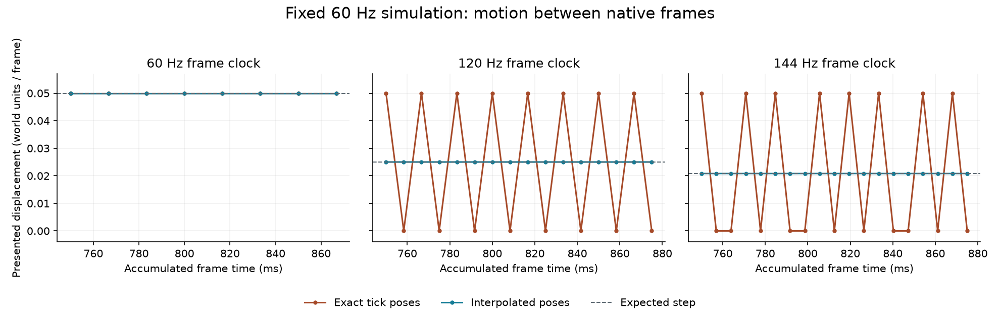
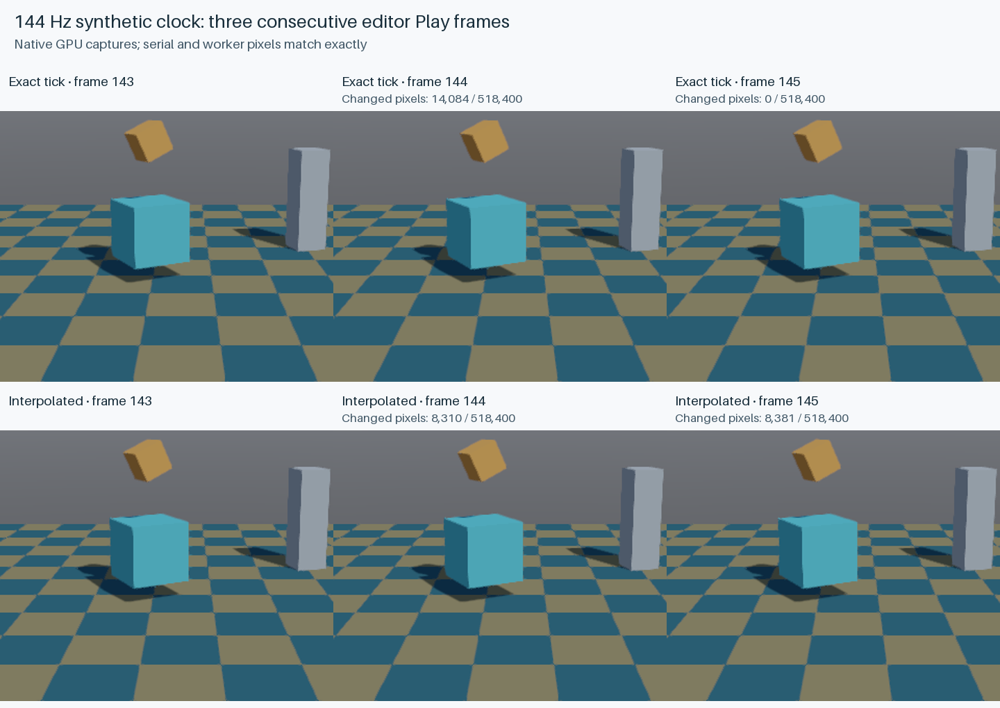

# Native render interpolation

Player and editor Play now interpolate local scene transforms between the last two
completed 60 Hz simulation ticks. At 120 or 144 Hz, moving objects and cameras advance
on frames where no new simulation tick is due. Gameplay and physics keep using the
current ECS transforms.

Run the moving-camera fixture in the player or open it in the editor and press Play:

```sh
cargo run --release -p bozzard-player --locked --offline -- \
  --scene examples/demo/scenes/interpolation-lab.json
```

`--no-interpolation` selects exact tick poses in either native application.
`--single-threaded` selects serial simulation with the same frame ordering. These
flags can be combined for comparisons.

## Timing and scope

The rendered timeline trails the accumulated simulation clock by one fixed tick
(about 16.7 ms at 60 Hz). This can add visual input delay relative to exact tick
rendering. The 60 Hz input-pulse test observes one extra presentation frame; it
also verifies that the input and resulting gameplay state are preserved. The
existing prepared-frame worker pipeline has its own presentation delay.

Local translation and scale blend linearly; rotations use shortest-arc quaternion
interpolation. Local poses compose before their parents, preserving nonuniform
scale and shear. Meshes, sprites, tilemaps, world text, lights, and gameplay cameras
use the same hierarchy. Projected UI labels use the presentation camera pose.
Inspection-camera overrides remain exact. Skeletal palettes, sprite animation
frame indices, particles, and gameplay UI values retain their existing sampling.

Paused worlds, debugger stepping, stopped game sessions, and active multiplayer
use their existing presentation paths. Local interpolation is disabled during
multiplayer to avoid adding a second blend to network presentation.

## Discontinuous motion

Respawns, active-camera changes, timeline/tween seeks or explicit restarts, and scale-sign
changes snap to the current world pose. New objects start at their spawn pose;
removed or recycled entities cannot inherit old presentation samples. Scene
replacement and checkpoint restoration rebuild history. History is never saved
into authored scenes, checkpoints, or network snapshots.

If valid endpoints produce a non-invertible floating-point blend, that subtree
uses its current world pose. Projected UI follows the same fallback; unrelated
objects continue interpolating.

Ordinary position/rotation writes remain continuous. After a teleport in a Rhai
hook, explicitly reset its presentation history:

```rhai
set_position(me, [50.0, 0.0, 0.0]);
reset_interpolation(me);
```

Blueprints have the equivalent **Reset Interpolation** action with an Object
**Target**. A reset snaps the object and its descendants, including its current
ancestor transforms, without snapping unrelated siblings. The next continuous
tick resumes smoothing.

## Host integration and cost

`App::add_tick_observer` runs after the final system and deferred commands. It never
captures a partial debugger tick, and compiled-module shutdown removes registered
observers. `SceneRuntime` captures presentation transforms there and enables history
only when a native host opts in.

Native hosts call `SceneRuntime::set_render_interpolation` before preparing each frame,
then extract through `render_view`. This also synchronizes host edits made between
ticks, before simulation can overwrite their transform change stamp. Low-level
scene hosts use `set_render_interpolation`, `capture_render_transforms`, and
`view_interpolated_from_camera`; publish the frame fraction with
`set_render_interpolation_fraction` when extracting projected UI.

History is indexed by scene membership and generational entity identity. It reindexes
only on membership changes. Capture scans the dense Transform change stamps and
copies changed poses; collapsing the preceding sample visits only moving objects.
Static local matrices stay cached. Live and presentation composition have separate
caches, and a world with no moving samples reuses the exact-transform path.

## Recorded measurements

Measured on an Apple M2 Pro, macOS 26.6, Rust 1.95.0, using release builds with
thin LTO and one codegen unit. Three runs cover 72 cases: both scene sizes, three
frame clocks, both execution modes, and interpolation on/off. Every case finishes
at 120 ticks with identical scene and checkpoint state for its workload.

| Frame clock | Exact-pose motion-step RMS error | Interpolated error |
| --- | ---: | ---: |
| 60 Hz | <0.001% | <0.001% |
| 120 Hz | 100.000% | 0.00037% |
| 144 Hz | 118.322% | 0.00038% |

These percentages describe variation in per-frame displacement, normalized to the
expected step. They are not dropped-frame or FPS measurements.



At 144 Hz, median frame preparation costs the following. Each cell is the median
of three run medians, with 216 measured frames per case per run. Preparation includes
history synchronization and scene extraction; GPU work and UI extraction are excluded.

| Scene objects | Execution | Exact poses | Interpolated | Added time |
| --- | --- | ---: | ---: | ---: |
| 5 | Serial | 1.625 µs | 2.166 µs | 0.541 µs |
| 5 | Worker | 1.916 µs | 2.375 µs | 0.459 µs |
| 1,029 | Serial | 385.208 µs | 391.542 µs | 6.334 µs |
| 1,029 | Worker | 398.000 µs | 400.375 µs | 2.375 µs |

The optimization/review pass keeps static samples out of pose copies and quaternion
interpolation, collapses only moving samples, and preserves the exact extraction
cache. Raw distributions, simulation timings, and join waits are recorded in
[benchmarks.json](measurements/render-interpolation/benchmarks.json); the plotted
positions are in [motion.csv](measurements/render-interpolation/motion.csv).

Native Metal captures also show the removed repetition. Exact frames 144 and 145
are identical (zero changed pixels), while both adjacent interpolated frames advance
(8,310 and 8,381 changed pixels out of 518,400). All 18 serial/worker capture pairs
match byte for byte across 60, 120, and 144 Hz. The independent player midpoint
pixel test passes on the same device.



The montage uses the same crop and scale for every frame. The
[original 960 × 540 frame](images/render-interpolation-native.png),
[pixel counts](measurements/render-interpolation/pixel-changes.json), and
[capture log](measurements/render-interpolation/native-capture.log) are included.

Four real-window runs of 240 frames have median presentation intervals between
10.014 and 10.041 ms, with interpolation on/off and serial/worker execution. These
short, startup-inclusive runs establish no FPS improvement; window pacing and
GPU timing distributions are in
[windows.json](measurements/render-interpolation/windows.json).
Its `player_cpu_frame` field measures elapsed time in the frame handler, including
surface acquisition, presentation pacing, and worker joins; it is not pure CPU time.

## Reproduce the evidence

```sh
cargo run --release -p bozzard-runtime --example benchmark_interpolation \
  --locked --offline -- work/interpolation
cargo run --release -p bozzard-editor --example capture_interpolation \
  --locked --offline -- work/interpolation/native
cargo test -p bozzard-player \
  interpolated_player_pixels_match_an_independently_authored_midpoint \
  --locked --offline -- --ignored
python3 tools/plot_interpolation.py work/interpolation \
  --captures work/interpolation/native --out work/interpolation/proof
```

The plot script needs Matplotlib and Pillow in the Python environment. The benchmark
uses synthetic 60/120/144 Hz frame clocks, the real scene script, serial and worker
execution, and both five-object and 1,029-object scenes. It measures CPU frame
preparation, simulation batches, and worker join waits after a half-second warm-up.
Every comparison requires 120 completed ticks and identical serialized scene and
checkpoint state across refresh clocks, interpolation settings, and worker modes.

Motion-step error is RMS deviation from the expected per-frame displacement,
normalized to that displacement. It measures uneven movement, not FPS. The native
capture tool uses editor Play's prepared-frame pipeline and requires byte-identical
serial/worker pixels at each refresh clock. The separate player GPU test compares
the midpoint against an independently authored camera/object scene.

Actual windowed measurements require a native desktop and can be reproduced with:

```sh
target/release/bozzard-player --scene examples/demo/scenes/interpolation-lab.json \
  --frames 240 --hardware --backend metal
```

Repeat with `--no-interpolation` and `--single-threaded`, keeping the backend, device,
window size, and scene fixed. Synthetic clocks and offscreen captures do not establish
a hardware 144 Hz presentation rate or a GPU performance improvement.
