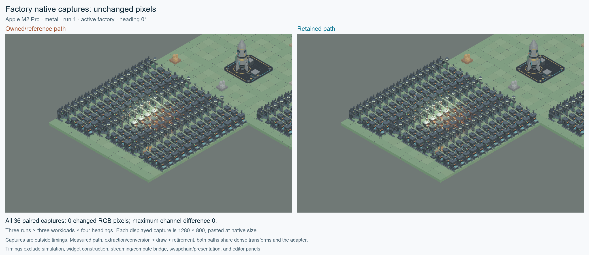

# Retained render scenes

Native player and editor frames reuse unchanged drawable, shader and material
payloads, then refresh transforms, animation bounds and camera depth. The renderer
retains expanded model surfaces and their ordering between successful frames.
Simulation, authoring documents and saved checkpoints remain authoritative.

## Ownership and invalidation

`SceneInstance::view_shared_from_camera` and its interpolated counterpart return
`SharedSceneView` with immutable `Arc<Drawable>` payloads. The existing `SceneView`
alias and owned view methods keep their value ownership and public behavior.
Both use dense, document-indexed transform storage internally; callers requesting
`global_transforms` still receive the original ID map.

The shared extraction cache compares actual component values, including float
bits. Same-tick writes and writes that bypass ECS change tracking remain visible.
Shader editor metadata is included in equality. Entity generations distinguish
removed and replacement objects. Membership sorts run when their inputs change;
LOD selection, visibility, lights, sprites, text and presentation clocks still
resolve for the current frame. Cloned scene instances start with independent
caches, preserving Edit/Play isolation.

`bozzard-render-assets::RenderSceneCache` converts shared views into owned
`RenderFrame` values. Dropping a frame returns its immutable drawable prefix to
the host's pool; transient sprite, text and HUD items are discarded. Reused rows
update model and motion ID without cloning mesh IDs, texture IDs or material
overrides. Material conversion runs again when its drawable, graph, binding,
generated texture or asset inputs change. The shared conversion also serves the
existing owned editor/player APIs.

A frame does not borrow the world. Holding it through later edits preserves its
original records and settings. Controlled methods append overlays or adjust
dynamic frame settings without exposing mutable cached materials. `into_scene`
allows unrestricted mutation and opts that frame out of recycling.

The frame holds only a `Weak` link to its host cache. Dropping the host releases
unused pooled buffers and the cache's published asset-data Arcs even while a
frozen frame survives. That frame's owned records and settings remain readable;
its later drop releases its storage without reviving the closed host's pool.

The adapter retains actual published asset-data Arcs alongside their IDs. This
distinguishes divergent cloned/replacement stores even when numeric revisions
match. Successful publication clears pooled material records; failed reloads
keep the last good data. Frames from an older asset/cache epoch cannot return to
the current pool. Each layer keeps at most two free buffers, and current workload
size limits discard oversized older buffers. Scene membership and transform
storage compact after large unloads. In-flight frames remain owned by their
callers until dropped. Edit/Play transitions explicitly clear the host pool.

The renderer compares static mesh/material keys exactly, expands only changed
source items and refreshes model matrices, skin deformation and projected depth
separately. Matrix operations retain their original order. Transparent draws
resort when depth changes; explicit source/surface tie breakers preserve the
original stable order after previous camera sorts. Asset publication and failed
draws discard retained preparation so retry fully validates current resources.

## Diagnostics and reference paths

`RenderExtractionStats` reports drawable and graph reuse/rebuilds for the last
shared layer query. `RenderSceneStats` separates adapter, asset scan and material
preparation time. `FrameStats` adds direct surface-preparation time, source checks,
built/reused surface records, model/depth updates and ordering reuse.

`surface_preparation_bytes` estimates retained vector capacity only. It excludes
string heaps, shared Arc allocations and GPU memory. Work counters are not
allocator counts. Exact comparisons still scan current inputs; this optimization
removes repeated payload construction and sorting, not all per-frame CPU work.

`Editor::set_render_scene_caching_enabled(false)` selects owned extraction and
conversion for native editor frames. Existing `render`/`render_from_camera` calls
always provide that cache-free owned reference. Set
`SceneRenderer::set_surface_preparation_caching_enabled(false)` to restore full
surface expansion. Disabling general renderer state caching also selects it.

## Local release measurements

October 2 measurements on Apple M2 Pro / Metal at 1280 × 800 compare the
owned/reference and retained paths in the same release build. Each workload has
three independent paired runs, twelve warm-up frames and sixty measured frames
per path per run, with alternating mode order. Values below are medians of the
three run medians, p95 values or p99 values, rather than percentiles pooled across
all runs. The [complete reports and counters](measurements/retained-render-scenes/benchmarks.json)
preserve all nine source reports and their file hashes.

| Workload | Owned/reference CPU median / p95 / p99 (ms) | Retained CPU median / p95 / p99 (ms) | Median reduction |
| --- | ---: | ---: | ---: |
| Active factory | 5.420 / 6.534 / 16.472 | 4.896 / 5.826 / 15.022 | 9.65% |
| Frozen factory | 2.998 / 3.307 / 4.866 | 2.413 / 2.797 / 3.007 | 19.50% |
| Camera only | 5.923 / 6.499 / 7.200 | 5.236 / 5.771 / 6.943 | 11.61% |

CPU totals include scene extraction/conversion, renderer CPU work and frame
retirement, excluding explicit GPU waits. They exclude simulation, widget
construction, streaming/compute bridge work, swapchain/presentation and editor
panels. Both paths already use dense transform storage and the common adapter
implementation; these results measure retained payload/surface reuse against the
owned/reference path, not all branch changes against an older main commit.

| Workload | Extraction median: reference → retained (ms) | Surface preparation median: reference → retained (ms) |
| --- | ---: | ---: |
| Active factory | 0.965 → 0.860 | 0.634 → 0.070 |
| Frozen factory | 0.929 → 0.811 | 0.631 → 0.068 |
| Camera only | 0.972 → 0.834 | 0.640 → 0.091 |

Extraction medians decrease by 10.91–14.11%; surface-preparation medians decrease
by 85.75–89.21%. Camera-only extraction p99 rises from **1.273 to 1.991 ms**,
while its total CPU p99 falls from **7.200 to 6.943 ms**. The median improvements
therefore do not imply improvement in every stage's tail. Median frame retirement
falls from 0.030–0.032 ms to about 0.001 ms. Stage medians are calculated
independently and need not sum to the total CPU median.

Submitted work matches between paths on every measured frame. Last-frame
counters agree across all three runs: both paths contain 1,424 source items and
2,891 expanded surfaces. The reference rebuilds all 1,424 items and 2,891 surface
records; the retained adapter reuses 1,424 pooled materials with zero material
rebuilds, and the renderer checks 1,424 sources and reuses all 2,891 surface
records with zero record rebuilds. Retained surface ordering is reused in each
workload's last measured frame.

| Workload | Retained model / depth updates | Equal color draws / triangles | Equal shadow draws / triangles |
| --- | ---: | ---: | ---: |
| Active factory | 8 / 8 | 401 / 359,444 | 2 / 97 |
| Frozen factory | 0 / 0 | 401 / 359,444 | 0 / 0 |
| Camera only | 0 / 2,891 | 453 / 425,476 | 0 / 0 |

The retained renderer reports **3,214,112 bytes (3.07 MiB)** of vector capacity
for this fixture in every run. This is a bounded retained-capacity estimate,
excluding key-string heaps, shared Arc storage, adapter frame buffers and GPU
memory; it is not total memory use or an allocator measurement. The adapter's
separate pool permits at most two free buffers per layer and rejects older
buffers exceeding the current workload's size.

Synchronized medians, including device waits, change from 9.741 → 9.186 ms for
active, 7.167 → 6.508 ms for frozen and 10.530 → 9.754 ms for camera-only frames.
GPU timestamp summaries have only **3–13 valid samples per run/path**, despite
sixty CPU samples. Their raw sample counts and timings are preserved, but these
sparse samples do not establish a GPU speedup. Neither CPU nor synchronized
timings establish windowed FPS.

All 36 reference/retained PPM pairs match exactly across the three workloads,
three runs and four inspection-camera headings: zero changed RGB pixels and
zero channel difference. The native harness also compares complete RGBA captures
and checks that rendering/capture preserve scene data and saved checkpoints.
The [native comparison figure](images/retained-render-native.png) pastes one pair
at its original dimensions without cropping, resizing or filtering.



## Reproduction and acceptance

The CPU suites cover frozen ownership, same-tick/bypass edits, signed zero,
component removal and generation reuse, material/shader/LOD changes, asset
replacement and failed reload, interpolation reset, hierarchy repair and large
additive unloads. Native renderer comparisons cover surface/material edits,
resource publication, sprites/text, skinning, transparent order, temporal effects,
and failed-frame recovery. Native CI also runs the dense factory through motion,
edits, prefab replacement and four inspection-camera headings, checking exact
RGBA, submitted work, scene data and saved checkpoints.

```sh
cargo test -p bozzard-scene --locked --offline
cargo test -p bozzard-render-assets --test retained_frames --locked --offline
cargo test -p bozzard-render --test preparation --locked --offline
cargo test -p bozzard-editor --test retained_render --locked --offline \
  retained_factory_pixels_and_checkpoints_match_reference -- --ignored --exact
```

The paired release profiles use the real dense factory at 1280 × 800 with twelve
warm-up frames and sixty measured frames per mode. Reference and retained paths
alternate first position, sharing the same authoritative simulation state.
Active, frozen and camera-only workloads report extraction, retirement, renderer
CPU stages, synchronized wall time and available GPU pass timestamps. Captures
and gameplay/checkpoint assertions run outside measured spans. Timing tests are
manual hardware profiles; CI correctness has no absolute timing threshold.
The measured path covers scene extraction/conversion, draw and frame retirement.
It excludes simulation, UI widget construction, streaming/compute bridge work,
window presentation and editor panels.

```sh
evidence_root=/tmp/bozzard-retained-render
for run in 1 2 3; do
  BOZZARD_RETAINED_RENDER_OUTPUT="$evidence_root/run$run" \
  cargo test --release -p bozzard-editor --test retained_render --locked --offline \
    profile_earth_factory_retained -- --ignored --nocapture --test-threads=1
done
python3 tools/collect_retained_render_evidence.py "$evidence_root"
```

The collector requires Python with Pillow and NumPy. Each `run1`–`run3` folder
contains the active, frozen and camera-only JSON reports and reference/retained
PPM captures at four headings. The collector rejects missing reports or captures,
mismatched run metadata, differing submitted counts and changed pixels before
writing any output. It records the median of three run medians and the median of
three run p95/p99 values in
`docs/measurements/retained-render-scenes/benchmarks.json`, preserving all nine
complete reports, their counters and source-file hashes for review. Unavailable
timings stay unavailable. `docs/images/retained-render-native.png` places a
validated capture pair at native size without cropping, resizing or filtering;
the report records exact RGB comparison results for all 36 pairs.

These compare the owned/reference and retained paths in the same build. Both
benefit from dense transform storage and the shared adapter refactor, so the
comparison does not measure those common improvements against an older commit.
Synchronized timings include explicit device waits; GPU totals sum timestamped
passes and exclude gaps. Neither measurement establishes windowed FPS.
