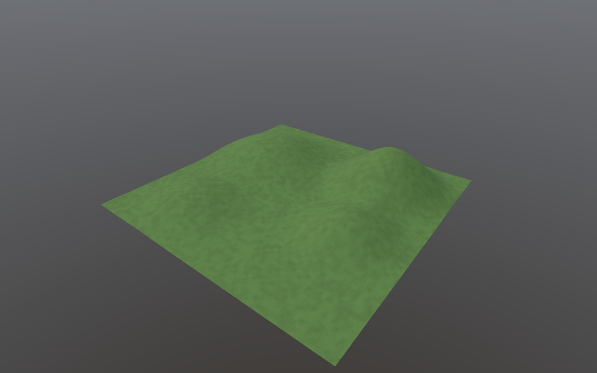
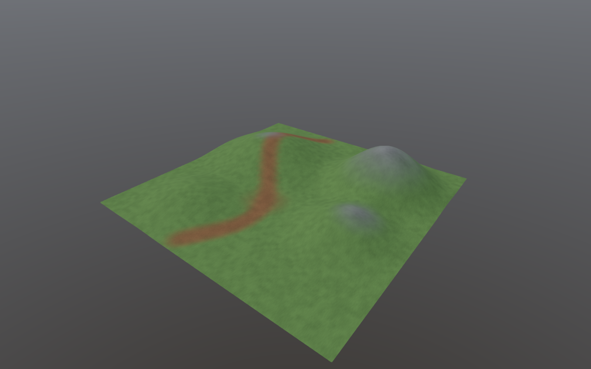
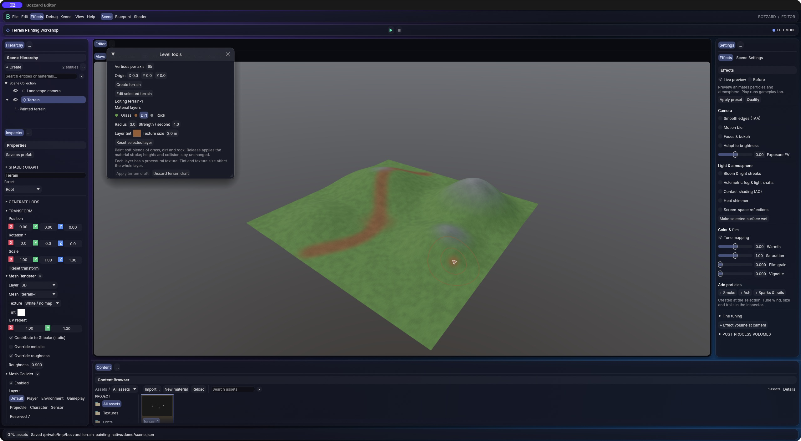

# Terrain material painting

Paint Grass, Dirt and Rock onto editable terrain with soft blends. Each material
has a color and a repeat size in terrain-local units. Painting changes the terrain
surface appearance while keeping its heights, mesh positions and collision intact.





## Authoring

1. Open **View → Level tools** or the viewport's **Build** button.
2. Create a terrain, or select a terrain object and choose **Edit selected terrain**.
3. Choose **Paint materials**, then Grass, Dirt or Rock. Set the brush radius and
   strength. Strength is applied per second while the primary mouse button is held.
4. Drag over the terrain and release to publish one stroke as one Undo step.
   The brush contour follows the terrain; its color identifies the active material.

Use Grass to paint over an existing Dirt or Rock region. Color and repeat-size
changes affect that material wherever it is used on the current terrain. The
**Apply terrain draft** and **Discard terrain draft** actions apply or abandon
uncommitted changes.
Preparation runs in a cancellable worker. A failed or cancelled publication leaves
the last accepted terrain active.



Undo/Redo restores both the material settings and paint weights. Saving, reopening,
Play and export use the accepted material revision. Previously saved scenes and
prefabs retain their immutable terrain source instead of changing when another
document paints the same original terrain.

## Scope and representation

This first version provides three procedural built-in materials. It does not yet
import arbitrary layer images or author normal/displacement maps. Generated detail
is deterministic and blended into one embedded 512×512 RGBA texture on one ordinary
mesh surface. This uses the existing renderer, asset cooker and runtime package
paths; it does not add one draw per material layer.

`.terrain.json` retains schema version 1 and adds an optional `paint` object. Legacy
heightfields without it keep their existing appearance. A valid first material
stroke initializes Grass outside the painted region. The paint object stores three
layer definitions and one `[grass, dirt, rock]` weight triple per height vertex.
Each triple sums exactly to 255. Weights are interpolated over the same two
triangles used by terrain sampling and rendering, then baked into the embedded map.

The terrain remains bounded to 2–129 vertices per axis. Material colors are linear
RGB in 0–1, and repeat size is 0.01–100,000 local units. Small brushes are limited
by the heightfield's paint grid; very large landscapes may need separate terrain
tiles for more material detail. The existing 4 MiB terrain source limit still
applies. Sculpting after painting preserves the paint weights and rebuilds the
terrain geometry and collider as usual.

## Reproduce the workshop and native proof

The workshop uses editor terrain jobs to create a rolling 65×65 landscape, save an
all-Grass baseline, then paint a winding Dirt trail and Rock outcrops into a second
immutable revision. Both scenes use the same camera and geometry.

```sh
cargo run -p bozzard-editor --example terrain_painting -- /tmp/bozzard-terrain-painting
cargo run -p bozzard-editor-app -- --scene /tmp/bozzard-terrain-painting/scene.json
```

Choose a fresh output directory. Capture actual production-renderer pixels from
the saved baseline and painted scenes:

```sh
cargo run -p bozzard-editor --example capture_scene -- \
  /tmp/bozzard-terrain-painting/before.json /tmp/terrain-before.ppm 1600 1000
cargo run -p bozzard-editor --example capture_scene -- \
  /tmp/bozzard-terrain-painting/scene.json /tmp/terrain-painted.ppm 1600 1000
```

PPM outputs contain the unmodified captured RGB pixels. The workshop also includes
`game.bozzard.json`, which selects the painted scene and universal cooking. Export
with the regular [native export workflow](exporting.md).

Run the GPU proof on a machine with an adapter for its native graphics backend:

```sh
cargo test -p bozzard-editor --test terrain_painting -- --nocapture
```

The 128×128 proof requires a visible painted change while asserting unchanged mesh
vertices, indices and collider. It checks exact RGBA after Undo, Redo and scene
save/reopen, then losslessly cooks and relocates the terrain and removes all
authoring source revisions before checking exact cooked/raw RGBA. The test also
runs in the normal workspace test suite. See the [verification and optimization
measurements](measurements/terrain-material-painting.md) for the additional review
and reproducible paint benchmarks.
